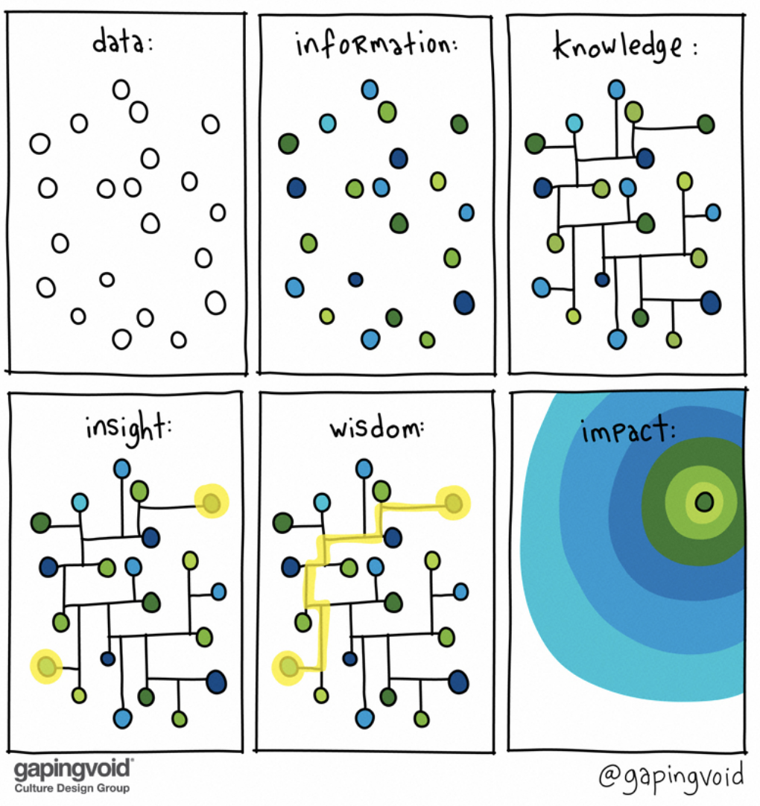

# Welcome to Module 102 of Digital DNA!

### !callout-info
## Congratulations!
You are a quarter of the way through your Digital DNA journey. You are continuing on your learning journey to be a more effective and innovative software acquisition professional.
### !end-callout

**Module 102: DevSecOps Foundations** is the second part of a deeper dive into the processes and technology that have so heavily influenced modern software development and technological innovation.   

For those who don’t love technology and want to learn more about acquisition strategy, contract strategy, and management: bear with us. **Modules 103 and 104** will focus on those topics, but the information in _this_ Module will directly influence your ability to excel in those sections, and in turn will allow you to be a more effective acquisitions professional.

<!-- >>>>>>>>>>>>>>>>>>>>>> BEGIN CHALLENGE >>>>>>>>>>>>>>>>>>>>>> -->
<!-- Replace everything in square brackets [] and remove brackets  -->

### !challenge

* type: multiple-choice
* id: d4e72198-2174-4abf-91fe-2b56be00b40c
* title: Digital DNA Structure
<!-- * points: [1] (optional, the number of points for scoring as a checkpoint) -->
<!-- * topics: [python, pandas] (optional the topics for analyzing points) -->

##### !question

I understand there are a total of four (4) modules to Digital DNA and I am in the 2nd of 4 modules.  

##### !end-question

##### !options

* Yes
* No

##### !end-options

##### !answer

* Yes

##### !end-answer

<!-- other optional sections -->
<!-- !hint - !end-hint (markdown, hidden, students click to view) -->
<!-- !rubric - !end-rubric (markdown, instructors can see while scoring a checkpoint) -->
<!-- !explanation - !end-explanation (markdown, students can see after answering correctly) -->

### !end-challenge

<!-- ======================= END CHALLENGE ======================= -->

## Module 102 Course Structure

Below outlines the course content, identifying the lessons associated with each block:

|**Section**|**Number of Lessons**|**Assessments/Checkpoints**|
|:---:|:---:|:---:|
| Welcome | 1 | Pre-Assessment | 
| Phase A | 7 | Phase A Checkpoint |
| Phase B | 6 | Phase B Checkpoint |
| Wrap-up | 1 | Post-Assessment | 

### Welcome (1 Lesson and Pre-Assessment)

|**Lessons:**| Welcome to Module 102 of Digital DNA |
| :--- | :--- |
|**Assessments/Checkpoints:**| Pre-Asssesment|

### !callout-info
## Pre-Assessment Availability
Remember, the Pre-Assessment:
* Must be completed *prior* to starting Phase A **and** 
* Must be completed prior to COB Monday, June 21st. _If you do not complete before you will be deferred to the next offering of 102 DevSecOps Foundations._
### !end-callout

### Phase A (7 Lessons and Phase A Checkpoint)

|**Lessons:**| The DevOps Story   CALMS, the Three Ways of DevSecOps, and the Seven Principles and Wastes   The DoD Landscape   Establishing DevSecOps Organizations in the DoD   Greenfield and Brownfield   Software Architecture--Microservices, Strangler Pattern, and MOSA   Understanding Technology’s Role |
| :--- | :--- |
|**Assessments/Checkpoints:**|  Phase A Checkpoint|

### !callout-info
## Phasing Content
We will send reminders throughout the course to complete content and to ensure you are progressing. This recommended phasing is beneficial because it: 
Allows for you to get maximum interaction with learning guides and feedback on your answers, and
Prevents you from having to cram all the content in last minute 
### !end-callout

### Phase B (6 Lessons and Phase B Checkpoint)

|**Lessons:**| The Five Thieves of Timey   Benefits to Making Work Visible   Outcomes over Outputs   Metrics--What are They?   How to Navigate the Sea of Metrics   Dev\*Ops Workflow within the DoD|
| :--- | :--- |
|**Assessments/Checkpoints:**|  Phase B Checkpoint|

### !callout-info
## Course Completion
Remember that all content must be completed prior to Thursday, July 1st. 
### !end-callout

### Wrap-up (1 Lesson and Post-Assessment)

|**Lessons:**| Conclusion |
| :--- | :--- |
|**Assessments/Checkpoints:**| Post-Asssesment|

### !callout-info
## Post-Assessment and Survey
To continue on to Module 103, you must receive an 80% or greater on the post assessment. Don’t forget about the _survey_ this is how we continue to improve the course! 
### !end-callout

## Updates

A few changes you may notice as you are working through:

* **Grading:** In order to continue with the next Module of Digital DNA, you must receive **80% or greater on the post-assessment.**

* **Key Takeaways:** For each individual lesson we have created three (3) key takeaways. We will also provide the entire list of key takeaways and resources as a PDF provided with course certificate. 

* **Resource Section:** 
   * We are only able to scratch the surface with these topics, but we do not want to prevent anyone from continuing to learn. 
   * Within most sections resources will include articles, books, videos, and presentations that you are able to dive into if you want to get lost in learning.  

* **Bonus Sections:** These are not required but are available if the topic is interesting, directly impacting you, or like the learning guides just love soaking up as much information as possible.  

* **Office Hours:** We will continue to host office hours where you can drop in and speak with the learning guides about the material or ask program specific questions.  
  * You will be receiving calendar invites for Office Hours throughout the two-week period when Module 102 is offered. **These are optional.**  

* Also, we have created personalized Course Completion with Continuous Learning Point (CLP) equivalent information that we will send to all those that complete all self-paced material + virtual session!

 We hope that you enjoy the course, and as always do not hesitate to reach out to Tory or Christina if you have any questions!

 <!-- >>>>>>>>>>>>>>>>>>>>>> BEGIN CHALLENGE >>>>>>>>>>>>>>>>>>>>>> -->
 <!-- Replace everything in square brackets [] and remove brackets  -->

 ### !challenge

 * type: multiple-choice
 * id: deb3acb4-4cb4-4344-9925-7d0afe4f6ab0
 * title: Digital DNA Structure
 <!-- * points: [1] (optional, the number of points for scoring as a checkpoint) -->
 <!-- * topics: [python, pandas] (optional the topics for analyzing points) -->

 ##### !question

I understand that all information within this course will need to be completed by Thursday, July 1st **and receive 80% or greater on the Post-Assessment** to receive my Digital DNA Module 102 certificate of completion:

 ##### !end-question

 ##### !options

 * Yes
 * No

 ##### !end-options

 ##### !answer

 * Yes

 ##### !end-answer

 <!-- other optional sections -->
 <!-- !hint - !end-hint (markdown, hidden, students click to view) -->
 <!-- !rubric - !end-rubric (markdown, instructors can see while scoring a checkpoint) -->
 <!-- !explanation - !end-explanation (markdown, students can see after answering correctly) -->

 ### !end-challenge
