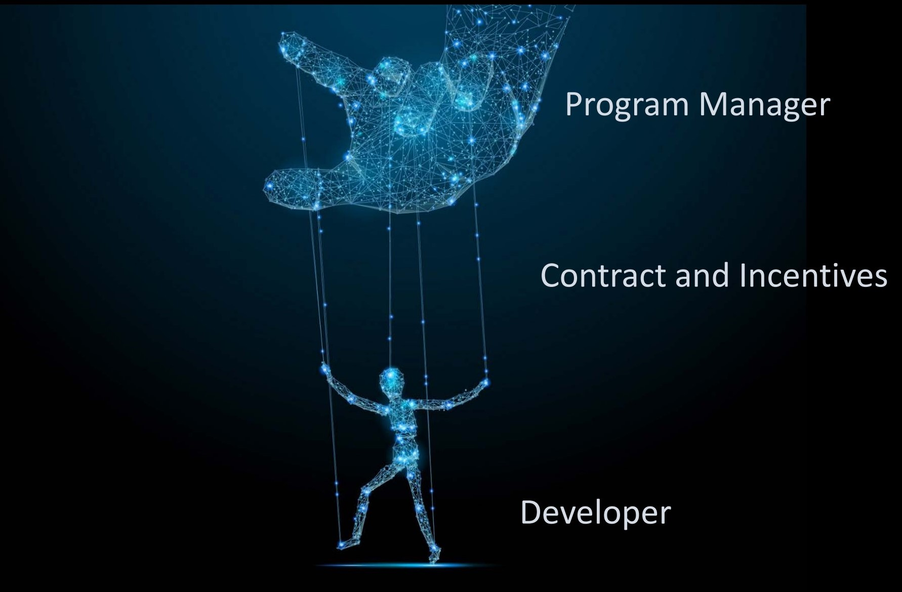

# An Intro: Incorporating DevSecOps within the DoD

## Learning Objectives

By the end of this lesson you will be able to:

* Understand the DoD workflow complexity supporting DevSecOps
* Contrast the responsibilities of Software Acquisition Professionals versus software practitioners

## DoD Decisions: An Intro

Hopefully at this point many of you are:

* Gravitating toward the practices, principles, and values of DevSecOps and Agile
* Realizing working this way allows you to deliver **valuable capability** at the speed of need or faster--think minutes, days, weeks, or months.

### !callout-success

##From Tory’s Perspective
The best part of this style of working? Realizing that your work is in the hands of users, and you can watch it happen! In a small way, you contribute to improving capability, and you get to watch code deploy the same day -- a gratifying experience, and why I love this job! We really do have the best mission.

### !end-callout

Knowing these are proven best practices in many other industries, why is it so difficult to implement these proven practices within the DoD?

To answer this question, we need to take a step back and look at the big picture. How is capability delivered within the DoD? Who is involved?

##Delivery Capability Process
_NOTE: For the purposes of the following example, when thinking about how this applies to you and your team, please think of the roles described as the entire team instead:_
* **Program Manager = Program Management Office (PMO)**
* **Developer = Government Contractor**

The following concepts are an excerpt from a presentation given by Dr. Jeff Boleng, Senior Advisor of Software Acquisitions to HON Ellen Lord, Secretary of Defense for Acquisitions and Sustainment (A&S):

>_...A marionette is a way to visualize the relationship between a Program Manager (PM), the Contract and a Developer. _

In this scenario, the PMO is contracting, hence the developer is outsourced to a contractor. Therefore, in order to deliver capability a PMO establishes the contract(s) and **incentivizes**.

### !callout-info

## Incentives
Incentives can be established with **any** contract type. Release 3 further explores the ways contract incentives can be incorporated, not only with incentive contracts (as defined in FAR 16.4), but also with modular contracting, short periods of performance on base, optional Contract Line Item Numbers (CLINs), and Quality Assurance Surveillance Plans (QASPs). 

### !end-callout

But, this isn’t a complete picture.

A PMO is a role within an organization, and reports to a Program Executive Officer (PEO). All major decisions regarding acquisition strategy and contracts (new or existing) must be approved by the PEO or designated approval authority, and is often referred to as a Milestone Decision Authority (MDA); even if your MDA is delegated, a PEO is still responsible for the portfolio of programs that make up the entirety of the PEO. Therefore, they still have influence on your programs and overall strategies. 

But wait! There’s more!

PEO is also a role within an organization, reporting to a Service Acquisition Executive (SAE) or Component Acquisition Executive (CAE). Just like the previous example, whether or not the SAE (or CAE) is your MDA, they are responsible for all programs within their service or component portfolio.

Finally, there is this:

Since the DoD is composed of multiple services and components, the collective first reports to OSD, then ultimately reports to Congress together- this adds another two layers of complexity. Congress controls DoD funding, which in turn is responsible for driving new statutes, laws, regulations, and policies. Even if your program does not report at the joint level, is not receiving Congressional inquiries, or is not a pilot program within the National Defense Authorization Act (NDAA) -- the decisions of these organizations **do** impact you.

While this example has gotten complex, something is missing - something we have been emphasizing throughout this course, critical to developing valuable capability:

Sadly, in many cases the operational user is not included in this picture. 

### !callout-warning

## Coming Soon!
In Release 3, we discuss the reason(s) why the Software Acquisition Pathway includes a User Agreement.

### !end-callout

This is a simplified example- you may notice other important stakeholders are not present. The point we are emphasizing is that the complexity of the DoD as a large organization functions by working across Services and Components.

The last point using the marionette example:

Feedback loops can be lengthy, numerous...and manual.

When Dr. Boleng gave this briefing, there was a pause here-- this graphic is a comically complicated (and incomplete) picture, and many stakeholders are not even represented. That being said, do not get overwhelmed or disheartened.

Use the feedback loop timelines to your advantage! As you continue moving up the chain of command, the frequency of information flow and/or briefings decreases. While PMOs work with contractors on a daily or monthly basis, we receive an NDAA or Appropriations Bill annually, which is informed by portfolios and programs within the DoD. Make good use of this time difference by collecting metrics and data to inform decision briefings.

We highlight this for two reasons:

1. **A shared understanding.** Before introducing new concepts or roles, it is important that we all are moving forward with a shared understanding of how decisions impacting programs and delivery capability are made.
1. **Starting with the familiar process.** Since this course is geared towards acquisition professionals, we addressed only one portion of the decision workflow, using the roles you are most familiar with. 

<!-- >>>>>>>>>>>>>>>>>>>>>> BEGIN CHALLENGE >>>>>>>>>>>>>>>>>>>>>> -->
<!-- Replace everything in square brackets [] and remove brackets  -->

### !challenge

* type: multiple-choice
* id: 960156df-c1b7-44d7-be32-308c56f49008
* title: Feedback loops
<!-- * points: [1] (optional, the number of points for scoring as a checkpoint) -->
<!-- * topics: [python, pandas] (optional the topics for analyzing points) -->

##### !question

The mismatch of feedback loops for decisions is why DoD is struggling to adopt DevSecOps.

##### !end-question

##### !options

* True
* False

##### !end-options

##### !answer

* False

##### !end-answer

<!-- other optional sections -->
<!-- !hint - !end-hint (markdown, hidden, students click to view) -->
<!-- !rubric - !end-rubric (markdown, instructors can see while scoring a checkpoint) -->
<!-- !explanation - !end-explanation (markdown, students can see after answering correctly) -->

### !explanation-correct:
The mismatch of feedback loops for decisions occurs in every organization. DevSecOps emphasizes the mismatch because of the increased speed of delivery that is available with adoption of processes, practices and tools. This creates a greater importance in a shared understanding and common lexicon.

### !end-explanation
### !explanation-incorrect:
The mismatch of feedback loops for decisions occurs in every organization. DevSecOps emphasizes the mismatch because of the increased speed of delivery that is available with adoption of processes, practices and tools. This creates a greater importance in a shared understanding and common lexicon.

### !end-explanation

### !end-challenge

<!-- ======================= END CHALLENGE ======================= -->

Later sections will discuss metrics aiming to improve communication with leadership and stakeholders, but in the meantime, ask yourself- what changes when you apply DevSecOps methodologies? What new roles are introduced? Does it change acquisition roles?

##Defining Software Acquisition Professionals and Software Practitioners

The DoD delivers software via a complex system. The visual below helps demonstrate how organizations within the Defense Acquisition System (DAS) deliver capability: 

This is not a comprehensive view, but does begin to show the communities that support capability delivery. Jez Humble’s video Principles of Lean Product Management explains what makes digital services different by outlining distinct differences using the example of bridges versus digital products:

_Note: To view the video in its entirety, check out the resources at the end of this lesson. The video is 50 minutes long - if you have the opportunity, it’s well worth the time!_

|**PROJECT MANAGEMENT** Example: Bridges|**PRODUCT MANAGEMENT** Example: Digital Products|
|---|---|
|Once built, it does NOT change much|SHOULD change over time|
|Significant initial planning IS required|Initial planning ONLY requires framework of initial assumptions and design|
|Does NOT discover significant information while building/developing|Significant information IS discovered while building/developing|
|MUST be completed before using|CAN be used prior to completion|

Because these differences require a different perspective and approach for individuals supporting/performing management-level Acquisitions responsibilities within the DAS, moving forward we will refer to this group as **Software Acquisition Professionals**. Likewise, for those building the capabilities, we will refer to them as **Software Practitioners**.

* **Software Acquisition Professionals** are SMART buyers and managers. To do this, they understand the benefits of technology that is purchased (don’t worry- we aren’t expecting you to configure and operate the technology).
* **Software Practitioners** are technicians that operate and maintain acquired product(s).

This is depicted within the  graphic below:

A few key points:
* Software Practitioners exist in multiple communities simultaneously. Regardless of whether they work within Science and Technology (S&T) or Acquisitions, Software Practitioners must be familiar with current practices, processes, and tools supporting software capability delivery- that is, they not only advise but also provide hands-on support (coding or technical decisions).
* Acquisitions roles are still needed when adopting DevSecOps methodologies, and should be an integrated part of the team

We emphasize software to clearly articulate the differences in software-intensive systems, but it is still about the _**team**_ effort--Software Practitioners and Software Acquisition Professionals work together to deliver valuable capability at the speed of relevance within the DoD. 

_Interaction occurs constantly due to the speed of software development and deployment._ Examples of collaboration include (but are not limited to):
* Supporting new requirements in development and contracting processes as required
* Providing feedback on existing contracts (services and products)
* Supporting technical direction and incorporation of acquisition strategies
* Supporting funding, and obligation actions and strategies

To finish, let’s more formally define Software Acquisition Professionals and Software Practitioners:
* **Software Acquisition Professionals**: A Software Acquisition Professional is a member of the DoD acquisition workforce who provides expertise in the procurement, management and/or development of software intensive processes and systems such as business systems, weapons systems, supplies, or services to satisfy DoD needs and support military operations.
  * Example software acquisition roles are: Program Managers, Financial Managers, Contracting Officers, Cost Estimators, Lifecycle Logisticians, etc.
  * The roles above represent team members who are **not** directly supporting product delivery, and instead support valuable capability delivery through navigation and leveraging of the DoD 5000.02 Adaptive Acquisition Framework (AAF), Federal Acquisition Regulation (FAR), DoD 5000.74, Financial Management Regulation (FMR) and other policies and regulations DoD- and service-specific that guide the acquisitions workforce.
  * Leadership that supports Software Acquisition Professionals include Program Executive Officers (PEOs), Service Acquisition Executives (SAEs), and the military department chief information officers (CIOs) providing technical leadership
* **Software Practitioners**: Software practitioners are defined as individuals actually implementing software and delivering capability to users, in conjunction with the Defense Industrial Base.
  * Example software practitioner roles are: Software Developers, Software Engineers, Product Managers, Cloud Architects, User Experience Specialists, etc.  
  * Software practitioners can also be Software Acquisition Professionals (see Figure 2). The explicit distinction emphasizes the recommendation that technical advisors should be aware of and have knowledge of current software practices, mandated by the speed of technology.
  * Leadership that supports software practitioners include the military department, CIOs, their cybersecurity accreditation authority, PEOs, SAEs, policy staffs, etc.  

Remember, the DoD needs both!

> The DoD **cannot compete and dominate** in defense software without a technical and design workforce within the Department that **can build software natively and effectively manage vendors** to do the same.[1](#quoteref)

<!-- >>>>>>>>>>>>>>>>>>>>>> BEGIN CHALLENGE >>>>>>>>>>>>>>>>>>>>>> -->
<!-- Replace everything in square brackets [] and remove brackets  -->

### !challenge

* type: checkbox
* id: 5d98142b-b948-4bcb-8f55-16745ab71408
* title: Shared Understanding
<!-- * points: [1] (optional, the number of points for scoring as a checkpoint) -->
<!-- * topics: [python, pandas] (optional the topics for analyzing points) -->

##### !question

Why is a shared understanding and common lexicon so critical?

##### !end-question

##### !options

* Provides the foundation to be able to communicate
* Prevents lost time from team members speaking past each other
* Is annoying for team members that already understand
* Although may take some time in the beginning, will allow for better teamwork and create shared purpose

##### !end-options

##### !answer

* Provides the foundation to be able to communicate
* Prevents lost time from team members speaking past each other
* Although may take some time in the beginning, will allow for better teamwork and create shared purpose

##### !end-answer

### !hint
Look for one answer that does not fit
### !end-hint

### !explanation-correct:
Even if you understand the concepts, teaching others helps you to improve your understanding!
### !end-explanation
### !explanation: Is annoying for team members that already understand
Even if you understand the concepts, teaching others helps you to improve your understanding!
### !end-explanation

<!-- other optional sections -->
<!-- !hint - !end-hint (markdown, hidden, students click to view) -->
<!-- !rubric - !end-rubric (markdown, instructors can see while scoring a checkpoint) -->
<!-- !explanation - !end-explanation (markdown, students can see after answering correctly) -->

### !end-challenge

<!-- ======================= END CHALLENGE ======================= -->

<!-- >>>>>>>>>>>>>>>>>>>>>> BEGIN CHALLENGE >>>>>>>>>>>>>>>>>>>>>> -->
<!-- Replace everything in square brackets [] and remove brackets  -->

### !challenge

* type: paragraph
* id: 4bdb1051-6717-4b1b-aee9-4957eb2885bf
* title: Changes
<!-- * points: [1] (optional, the number of points for scoring as a checkpoint) -->
<!-- * topics: [python, pandas] (optional the topics for analyzing points) -->

##### !question

Define how DevSecOps (and Agile) change your current role.

##### !end-question

##### !placeholder

Please identify your current role

##### !end-placeholder

<!-- other optional sections -->
<!-- !hint - !end-hint (markdown, hidden, students click to view) -->
<!-- !rubric - !end-rubric (markdown, instructors can see while scoring a checkpoint) -->
<!-- !explanation - !end-explanation (markdown, students can see after answering correctly) -->

### !end-challenge

<!-- ======================= END CHALLENGE ======================= -->

1.  https://media.defense.gov/2019/Apr/30/2002124828/-1/-1/0/SOFTWAREISNEVERDONE_REFACTORINGTHEACQUISITIONCODEFORCOMPETITIVEADVANTAGE_FINAL.SWAP.REPORT.PDF
1. VIDEO: Referenced in the lesson a 50 minute video by Jez Humble Principles of Lean Product Management <https://www.youtube.com/watch?v=cH6bnQzJojo>
1. PRESENTATION:  Dr. Jeff Boleng, Senior Advisor Software Acquisitions https://www.dhs.gov/sites/default/files/publications/2019_sw_it-cast_proceedings_0.pdf

