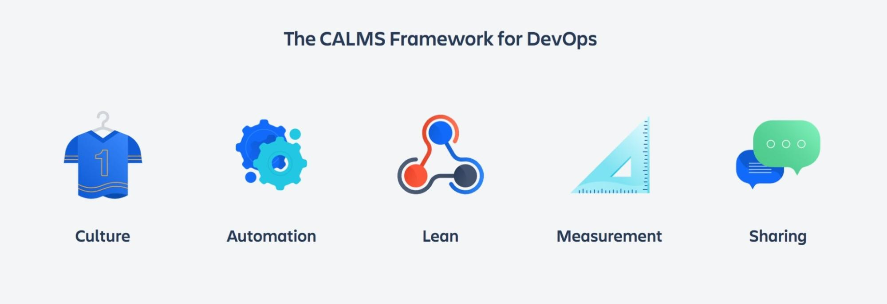
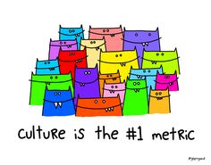
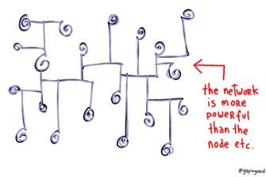
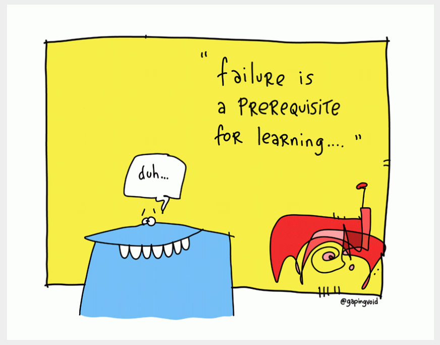
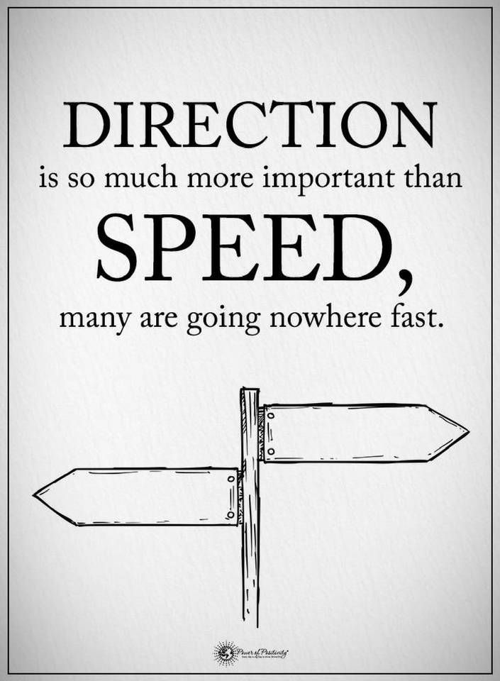
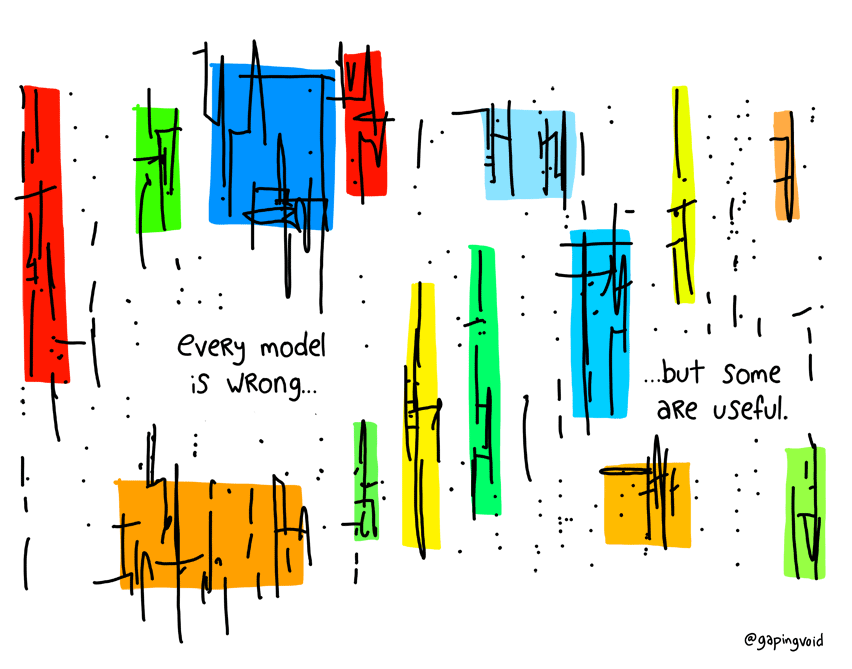

# CALMS, the Three Ways of DevOps, and the Seven Principles of Wastes

## Learning Objectives

By the end of this lesson you will be able to:

* Describe the CALMS model in DevOps
* Define the Three Ways of DevOps
* Define the Seven Principles and Wastes

## Introduction
Throughout this lesson, we define different methodologies and approaches associated with DevOps. Revisiting this section or the videos referenced on a quarterly or bi-annual basis will provide overall understanding, and identify ways to improve your organization.

### !callout-info
## Note:
This lesson defines different methodologies and approaches for DevOps -- don’t think of it as needing to memorize all three. Instead, think of them as options to help you understand. Look for themes that underscore the concepts discussed.  

Notice: Since we are pulling content from industry the use of ‘DevOps’. **_Remember_ this information extends to DevSecOps.**
### !end-callout

**Course Note:** To supplement this module, we use a portion of Coursera’s Agile Software Training program via a DAU/Coursera Partnership. **Current** DoD acquisition professionals, both civilian and military, may gain access to _additional_ Agile Software Training and other training such as Data Science. 

Not ready or eligible to sign up? All videos referenced in this section are accessible **without** a Coursera account. Ready to get started? Contact [Mr. Dave Pearson (mailto:david.pearson@dau.edu). 

## CALMS

In the previous lesson, we explored what is **not** considered DevOps. Now let's put the spotlight on understanding what **is** considered DevOps, and the underlying frameworks employed by organizations both inside and outside the DoD.

### !callout-warning
## Watch This!
As part of this lesson, take a few moments to watch the following video:   

[DevOps Culture and Mindset: University of California, Davis](https://www.coursera.org/lecture/devops-culture-and-mindset/defining-devops-FauMQ?utm_source=link&utm_medium=in_course_lecture&utm_content=page_share&utm_campaign=overlay_button)   

**NOTE:** This and future videos in the lesson are part of the course content. This lesson is *not* designed to repeat what's been covered in the videos. Instead, we provide context for implementing the video's curriculum knowledge within the DoD. 
### !end-callout

Recall the CALMS framework from the video you just watched, shown below: 

### C.  Culture

DevOps isn’t simply a process, or a different approach to development -- ***it’s a culture change.*** With that being said, this quote is also true:

> “You **can’t** directly change culture. But you **can** change behavior, and behavior becomes culture”.  
> --Lloyd Taylor VP Infrastructure, Ngmoco 

Remember- processes, practices, and tools not only _influence_ but also _drive_ behavior.

As an example, the DoD creates functional alignments by placing value on individuals and their functional areas rather than the team as a whole. The DoD needs to eliminate function-based teams, and create capability- or product-based teams to successfully implement DevOps.

Several teams must come together and work collaboratively:
* Development
* Quality
* Acquisitions
* Product Management
* Requirements
* Design
* Operations
* Etc.

By doing so, they aim toward the shared purpose of delivering valuable capability to the user.

DevSecOps isn’t the responsibility of just one person, or one team, or one specific mission...it’s EVERYONE’S!

### A. Automation

_Automation helps eliminate repetitive manual work, yields repeatable processes, and creates reliable systems._

### !callout-caution
## Automation and Tooling Require People

Before we discuss automation further, we wanted to address the elephant in the room: automation and tooling does **not** replace people.   

“Tools can only _hope_ to support skills, culture, and flow, and _at best_ encourage them. **They cannot replace them.** As Patrick Debois, godfather of the DevOps movement, has often state, _’DevOps is a human problem.’” [Sooner Safer Happier: Antipatterns and Patterns for Business Agility](https://soonersaferhappier.com/purchase/) 

### !end-callout 

Automation promotes a system benefiting all functional components of a team, not just developers- the ability to build, test, deploy and provision automation is necessary. Teams new to DevSecOps should run all code changes through a gauntlet of automated tests as part of their practice.

Why is this important?

How often do mistakes happen when you are writing in a Word document or entering data in an Excel spreadsheet (or if you can code, when you are coding)? Human errors like these are normal- _automated tests help reduce risk._ 

Testing code changes during development catches bugs and security flaws earlier, eliminating rework and increasing the likelihood of delivering continuously working software, thereby reducing risk!

Time delay like what we described above is not solely a project management issue. However, **it is our responsibility** to mitigate risk in our ability to meet the mission. The DoD provides military forces with support in deterring war and ensuring our nation's security- the software and technology you support directly impacts our ability to achieve that mission.

<!-- >>>>>>>>>>>>>>>>>>>>>> BEGIN CHALLENGE >>>>>>>>>>>>>>>>>>>>>> -->
<!-- Replace everything in square brackets [] and remove brackets  -->

### !challenge

* type: checkbox
* id: 74f5c17a-2541-11ec-9621-0242ac130002
* title: Automated Testing
<!-- * points: [1] (optional, the number of points for scoring as a checkpoint) -->
<!-- * topics: [python, pandas] (optional the topics for analyzing points) -->

##### !question

Which of the following are **benefits** of automated testing in a DevSecOps environment?

##### !end-question

##### !options
* Bugs and security flaws are caught earlier.
* Automated testing is expensive to implement. 
* Increased likelihood of continuously delivering working software within operational systems and minimizing rework.
* Reduced risk to the overall cost, schedule and performance of the system and mission.
##### !end-options

##### !answer
* Bugs and security flaws are caught earlier.
* Increased likelihood of continuously delivering working software within operational systems and minimizing rework.
* Reduced risk to the overall cost, schedule and performance of the system and mission.
##### !end-answer

### !explanation
Automated testing does have an upfront investment cost, but has potential significant benefits and long-term cost-savings both. There are many examples in commercial industry that have shown value for those who choose to implement the use  of automated testing upfront.
### !end-explanation

<!-- other optional sections -->
<!-- !hint - !end-hint (markdown, hidden, students click to view) -->
<!-- !rubric - !end-rubric (markdown, instructors can see while scoring a checkpoint) -->
<!-- !explanation - !end-explanation (markdown, students can see after answering correctly) -->

### !end-challenge

<!-- ======================= END CHALLENGE ======================= -->

### L. Lean

### !callout-info
## Recall
From Module 101, the seven (7) key areas that support successful incorporation of lean processes for your program are:
* Eliminate Waste
* Amplify Learning
* Deliver as late as possible 
* Deliver as fast as possible
* Empower the Team
* Build Quality In
* Understand the entire system 

### !end-callout

 _A DevSecOps mindset in conjunction with Lean principles recognizes opportunities for continuous improvement everywhere._

Continuous improvement occurs when **entire** teams make use of Lean principles to eliminate waste and optimize value streams by:
* minimizing Work in Progress (WIP)
* making work visible, and
* reducing hand-off and complexity wait times.

The only true failure is not learning from mistakes made. To avoid this, we must acknowledge our failures, discuss and study them, then learn from them. We must understand the goal, process, and success metrics, and constantly conduct and document experiments.

#### !callout-warning

## Reminder
Keep something in mind- an important aspect of these experiments is success, and any failures (real or perceived) occur to the ENTIRE team.   

Failure is expected and should be normalized as part of DevOps implementation.
#### !end-callout

**Bottlenecks occur in every workflow.** A learning organization cannot be established when threats of blame or finger-pointing (private or public) are practiced. Google (and other groups) have extensively researched this. [Project Aristotle](https://rework.withgoogle.com/print/guides/5721312655835136/) provides more details.

### M. Measurement

_Metrics are key to organizational improvement._

Without data, any attempt at improvement is fruitless, and like any tool, metrics to secure that data must be used correctly to drive needed improvements. Some metrics that help inform software delivery and performance include: 
* How long does it take to go from development to deployment?
* How often do recurring bugs or failures happen?
* How long does it take to recover after a system failure?
* How many people are using your product right now?
* How many users did you gain / lose this week?

**Proceed with caution when selecting metrics.** Be sure to avoid "vanity metrics" that may sound impressive, but do not actually provide meaningful insight on the current status or future trajectory of the work. 

### !callout-info
## Metrics: Further Discussion

Don’t worry, later in Module 103 there are two lessons that will discuss metrics – we will dive into much greater detail! 

### !end-callout

Remember, the goal is not merely moving fast:

Direction is informed by data, which allows for speed to VALUE. We need data and metrics to LEARN FAST. The primary reason for collecting a metric is to learn something - either about the **current state of the work** (status metrics, which are generally lagging indicators) or about the **projected results** (predictive metrics, aka leading indicators)

### S. Sharing

_Responsibility and success go a long way toward bridging the Dev and Ops divide._

> Development and operations work more efficiently when they are considered **two halves of a whole, not separate entities**. Because both are necessary to improve the resource chain between business goals and deployment, complete cooperation between the two is necessary (#2 Key Takeaway Phoenix Project).
>
> Source: Kim, Gene. Phoenix Project, 5th Anniversary Edition: a Novel about IT, DevOps, and
Helping Your Business Win. IT Revolution Press, 2018.

The DoD has an opportunity to yield significant benefits by undergoing a DevSecOps transformation. However, this is no small task. As discussed in 2.1.1, there is no one set of philosophies that comprise DevSecOps.

DevSecOps is a blend of practices, cultural philosophies, and tools. Breaking down our functional silos will skyrocket the mission value we collectively aim to deliver by increasing trust, faster (but smaller) software releases, and a tight feedback loop within and across DevSecOps teams and the users/mission they serve.

## The Three Ways

### !callout-warning
## Watch This!
As part of this lesson, take a few moments to watch the following video:   

[DevOps Principles: The Three Ways - Introducing DevOps Concepts](https://www.coursera.org/lecture/devops-culture-and-mindset/devops-principles-the-three-ways-oVpus)   

**NOTE:** This is part of the course content.

### !end-callout

<!-- >>>>>>>>>>>>>>>>>>>>>> BEGIN CHALLENGE >>>>>>>>>>>>>>>>>>>>>> -->
<!-- Replace everything in square brackets [] and remove brackets  -->

### !challenge

* type: multiple-choice
* id: 81132e8c-fbb2-4fba-8f41-8a27496db9f1
* title: Three Ways
<!-- * points: [1] (optional, the number of points for scoring as a checkpoint) -->
<!-- * topics: [python, pandas] (optional the topics for analyzing points) -->

##### !question

What are the Three Ways of DevOps?

##### !end-question

##### !options

* The Principles of Flow, The Principles of Feedback, and The Principles of Partially Done Work
* The Principles of Flow, The Principles of Feedback, and The Principles of Continuous Learning
* The Principles of Feedback, The Principles of Defects, and The Principles of Continuous Learning
* The Principles of Flow, The Principles of Feedback and The Principles of Lean

##### !end-options

##### !answer

* The Principles of Flow, The Principles of Feedback, and The Principles of Continuous Learning

##### !end-answer

<!-- other optional sections -->
<!-- !hint - !end-hint (markdown, hidden, students click to view) -->
<!-- !rubric - !end-rubric (markdown, instructors can see while scoring a checkpoint) -->
<!-- !explanation - !end-explanation (markdown, students can see after answering correctly) -->

### !end-challenge

<!-- ======================= END CHALLENGE ======================= -->

## The Seven Principles and Wastes

### !callout-warning
## Watch This!
As part of this lesson, take a few moments to watch the following video:   

[DevOps Principles: The Seven Principles and Seven Wastes of Lean - Introducing DevOps Concepts](https://www.coursera.org/lecture/devops-culture-and-mindset/devops-principles-the-seven-principles-and-seven-wastes-of-lean-YAy6g)   

**NOTE:** This is part of the course content.
### !end-callout

Now that you know the Three ways and the Seven Principles and Wastes, we address how DevOps can help address each of the following areas of waste: 

#### 1. Partially Done Work
   * **DevOps solution**: Work is not considered ‘done’ until it reaches the hands of the user. By shifting our mindset to this concept, we ensure capabilities and team structures are enabling teams to finish what they start. This in turn reduces dependencies and boosts autonomy within teams, and addresses partial work completion in a powerful way. 

#### 2. Extra Unnecessary Features
   * **DevOps solution**: An iterative approach to value delivery is fundamental to success in the digital economy. Releasing updates and new features on a ‘small and often’ basis, then making further improvements based on customer feedback as required will ensure product development is closely aligned with actual user needs.

#### 3. Relearning and Refactoring
   * **DevOps solution**: Making work visible is a core tenet of DevSecOps, and one of the most effective ways to reduce relearning waste. Conversations about work are more focused and effective, as are review and approval procedures. [Dominica DeGrandis’ Making Work Visible](https://www.amazon.co.uk/dp/B076BYZ6VN/ref=dp-kindle-redirect?_encoding=UTF8&btkr=1) is a great source of guidance for this.

#### 4. Handoffs
   * **DevOps solution**: Small, multiskilled, product-centric teams are central to DevSecOps ways of working. This eradicates siloed structures that necessitate multiple handoffs, and fosters better communication and collaboration between the people responsible for different parts of the process.

#### 5. Delays
   * **DevOps solution**: Organizations often have complex webs of interdependencies between various teams and departments, making it difficult to predict (or control) how long any given task will take to complete. Mapping those dependencies and taking steps to streamline and simplify processes wherever possible delivers significant improvements to the overall timeline.

#### 6. Task Switching
   * **DevOps solution**: Delays and unplanned work are two of the worst culprits for generating this type of waste. Taking a more sophisticated approach to operations helps here, via developer self-service, automation, reusable templates, and [InnerSource models](https://www.devopsgroup.com/blog/modern-operations-five-foundational-pillars/).

#### 7. Defects
   * **DevOps solution**: With DevSecOps ways of working, a known defect is never passed downstream. This is central to the systems-thinking ethos advocated by DevSecOps pioneers such as Gene Kim. All problems are tackled as they arise, not hidden or passed to others, which results in lengthy handoffs, delays, and unplanned work.

### !callout-info
## How This Applies to Procurement
Strategically acquiring knowledge about how DevOps works, especially what it is and what it is not, enables us to develop different acquisition strategies to better serve the user and mission. If you do not currently have any of these methods employed in your acquisition strategy, consider how you might partner with the vendor to begin adopting DevOps methodologies. 

### !end-callout

<!-- >>>>>>>>>>>>>>>>>>>>>> BEGIN CHALLENGE >>>>>>>>>>>>>>>>>>>>>> -->
<!-- Replace everything in square brackets [] and remove brackets  -->

### !challenge

* type: multiple-choice
* id: f81aa1c6-846c-11ec-a8a3-0242ac120002
* title: Multitasking and Task Switching
<!-- * points: [1] (optional, the number of points for scoring as a checkpoint) -->
<!-- * topics: [python, pandas] (optional the topics for analyzing points) -->

##### !question
**True or False.** Multitasking and/or Task Switching _reduces_ the time to deliver.
##### !end-question

##### !options
* True
* False 
##### !end-options

##### !answer
* False
##### !end-answer

##### !explanation
Multitasking/Task Switching actually _slows down_ task completion. Each time a person switches to a new task, he/she must spin up on the task (typically 15-30 minutes) before being able to become productive on it again. 

Multitasking/Task Switching is actually a _myth_, as people's brains are only able to concentrate well on one task at a time.
##### !end-explanation

<!-- other optional sections -->
<!-- !hint - !end-hint (markdown, hidden, students click to view) -->
<!-- !rubric - !end-rubric (markdown, instructors can see while scoring a checkpoint) -->
<!-- !explanation - !end-explanation (markdown, students can see after answering correctly) -->
### !end-challenge
<!-- ======================= END CHALLENGE ======================= -->

<!-- >>>>>>>>>>>>>>>>>>>>>> BEGIN CHALLENGE >>>>>>>>>>>>>>>>>>>>>> -->
<!-- Replace everything in square brackets [] and remove brackets  -->

### !challenge
* type: multiple-choice
* id: 45e6121c-cde5-11eb-b8bc-0242ac130003
* title: !Topics Discussed
<!-- * points: [1] (optional, the number of points for scoring as a checkpoint) -->
<!-- * topics: [python, pandas] (optional the topics for analyzing points) -->

##### !question

Of the concepts discussed in the lesson: CALMS, The Three Ways, and The Seven Principles and Waste, please select which **one** concept was **most valuable** as a tool for your organization to use when evaluating the organization’s integration of DevSecOps and identifying areas of improvement. 

_There is no correct answer, this is your opinion._ 

##### !end-question

##### !options

* CALMS
* The Three Ways
* The Seven Principles and Wastes

##### !end-options

##### !answer

* * 

##### !end-answer

<!-- other optional sections -->
<!-- !hint - !end-hint (markdown, hidden, students click to view) -->
<!-- !rubric - !end-rubric (markdown, instructors can see while scoring a checkpoint) -->
<!-- !explanation - !end-explanation (markdown, students can see after answering correctly) -->

### !end-challenge
<!-- ======================= END CHALLENGE ======================= -->

### !callout-success
## Key Takeaways: 
1. CALMS provides an alternative way to approach DevSecOps by highlighting key attributes that should be foundational to your organization, namely: 
   * Culture 
   * Automation 
   * Lean 
   * Measurement, and 
   * Sharing
2. The Three Ways define the principles that underpin DevSecOps: 
   * Principle of Flow
   * Principles of Feedback, and
   * Principle of Continuous Learning.
3. Think of the Seven Wastes as the _Seven Pitfalls to Avoid._ We intentionally teach proven mitigation strategies as potential options when addressing any issues. Just don’t forget to apply the Three Ways and continually improve and adjust!
### !end-callout

<!-- >>>>>>>>>>>>>>>>>>>>>> BEGIN CHALLENGE >>>>>>>>>>>>>>>>>>>>>> -->
<!-- Replace everything in square brackets [] and remove brackets -->

### !challenge

* type: paragraph
* id: 63bb2d4c-faa2-11eb-9a03-0242ac130003
* title: !Opt. Lesson Feedback: CALMS, 3 Ways, & 7 Principles
<!-- * points: [1] (optional, the number of points for scoring as a checkpoint) -->
<!-- * topics: [python, pandas] (optional the topics for analyzing points) -->

##### !question

Do you have any specific feedback, positive or constructive, regarding the content of this lesson? 

##### !end-question

##### !placeholder

Remember, this is optional - this is a way for you to provide input while working through the lesson content. 

##### !end-placeholder

### !end-challenge

<!-- ======================= END CHALLENGE ======================= -->

## Resources

* **Book:** [The Phoenix Project: a Novel about IT, DevOps, and Helping Your Business Win](https://www.amazon.com/Phoenix-Project-DevOps-Helping-Business/dp/0988262592) by Gene Kim
* **Website:** [Google re:Work](https://rework.withgoogle.com/print/guides/5721312655835136/) provides more details.
* **Online Course:** Coursera: [DevOps Culture and Mindset: University of California, Davis](https://www.coursera.org/lecture/devops-culture-and-mindset/defining-devops-FauMQ?utm_source=link&utm_medium=in_course_lecture&utm_content=page_share&utm_campaign=overlay_button)
