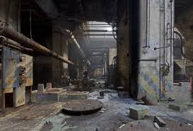
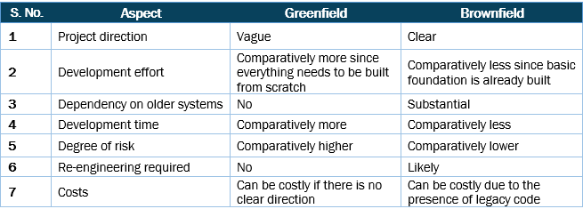

# Greenfield and Brownfield

## Learning Objectives

By the end of this lesson you will be able to:

* Differentiate between greenfield and brownfield projects
* Understand greenfield projects within the industry
* Describe the applicability of greenfield and brownfield projects within the DoD

## Defining Greenfield and Brownfield

Everyone in the acquisitions community needs to understand and if applicable, contribute to technology decisions.  Given the breadth of options and the pace by which technology evolves, this can seem daunting yet another reason your learning guides believe these foundational modules should be cross-functional. Our goal is to provide approaches by looking for key characteristics and patterns.

The first way is to define a system as either greenfield or brownfield.

### 1. Greenfield

The terms greenfield and brownfield also apply to the construction industry, so we will use construction as our analogy.

Greenfield means the land in question has never been developed.

What can be built on an empty plot of land? The opportunities are endless- a cabin, a tiny house, a McMansion, an office complex, a factory...you decide!

>In technology, a greenfield project is a new software project or initiative, likely in the early stages of planning or implementation, where we build our applications and infrastructure anew.
>
>- Gene Kim, Jez Humble, Patrick Debois [DevOps Handbook](https://itrevolution.com/book/the-devops-handbook/) 
>
>&nbsp;

There are appealing aspects to building using greenfield, in both construction and technology. Using our construction example, since the land has not been developed, builders have freedom in implementation- you are not limited by any existing structural choices, like electrical, plumbing, foundation, etc.

Recall the example we referenced in Module 101. Netflix is an example of a greenfield software project- that is, Netflix as a new idea that transformed the movie rental market it was built without any reference or existing framework. In the tech industry, greenfield software projects are often geared towards new markets for maximum profit opportunity. Other such examples we discussed in Module 101 include Uber and AirBnB.

Companies also use greenfield applications and systems to explore new ways to solve problems that are unencumbered by existing software or dependencies. Which leads us to greenfield’s alternative: brownfield.

### 2. Brownfield

Back to our construction analogy. What if you are updating an existing industrial complex, potentially contaminated with hazardous waste or pollution? (Fun fact: this is the original definition of brownfield.)

What if your historic home needs to be renovated, modernized, and brought “up to code”?  These are both examples of brownfield construction--yet they are very different from one another.

Similarly, brownfield software projects take many shapes and sizes. To understand how to approach a brownfield project, we can begin with a few questions:

* Is this a system that is developed and operational, and needs to be maintained?
  * **NOTE:** There is always the option with this transition to change over who is managing the software.
* Does an existing operational system need to be modernized?
  * Do new features (functionality) need to be incorporated?
  * Does the application (or system) need to be re-architected or re-factored to optimize functionality and/or lower overall sustainment?
  * Does the current system leverage other applications or data sources, that is, do we need to ensure integrations (Application Programming Interfaces (APIs)) remain intact?

You may be thinking, “Why would we want to take on a brownfield project? Greenfield projects sound so much better.” But the goal is to have operational capabilities, and new is not always better (or even an option). The technological landscape is constantly evolving, and even the aforementioned efforts that started as greenfield are now brownfield. Netflix, AirBnB and Uber are now constantly evolving their current software projects and systems.

<!-- >>>>>>>>>>>>>>>>>>>>>> BEGIN CHALLENGE >>>>>>>>>>>>>>>>>>>>>> -->
<!-- Replace everything in square brackets [] and remove brackets  -->

### !challenge

* type: checkbox
* id: c5a0bd9f-1df6-424c-82e7-5e2e9d9ce9e8
* title: Which field?
<!-- * points: [1] (optional, the number of points for scoring as a checkpoint) -->
<!-- * topics: [python, pandas] (optional the topics for analyzing points) -->

##### !question

Select the following statements that are true regarding DevSecOps.

##### !end-question

##### !options

* Your program will greatly influence your approach: greenfield and brownfield
* Greenfield approach can better address deep-rooted issues
* Greenfield and brownfield can both support DevSecOps implementation
* Brownfield approach can better address deep-rooted issues

##### !end-options

##### !answer

* Your program will greatly influence your approach: greenfield and brownfield
* Greenfield approach can better address deep-rooted issues
* Greenfield and brownfield can both support DevSecOps implementation

##### !end-answer

<!-- other optional sections -->
<!-- !hint - !end-hint (markdown, hidden, students click to view) -->
<!-- !rubric - !end-rubric (markdown, instructors can see while scoring a checkpoint) -->
<!-- !explanation - !end-explanation (markdown, students can see after answering correctly) -->

### !end-challenge

<!-- ======================= END CHALLENGE ======================= -->

### !callout-success
## Key Takeaway: 
Great software can be built whether it starts as greenfield or brownfield.
### !end-callout

### Industry Examples: Greenfield Beginnings
We have all heard that we need to adopt best commercial and/or industry practices. When deciding which commercial and/or industry practices to apply, it may be frustrating to hear this again, but it depends. All practices are not always applicable!

Some additional industry greenfield examples include: LinkedIn, Spotify, Pinterest, SpaceX, and Dropbox.

These examples are start-ups- they identified an untapped opportunity in the market and quickly expanded to become a household name. These companies are also referred to as unicorns. [In 2019, the failure rate of startups was around 90%.](https://www.investopedia.com/articles/personal-finance/040915/how-many-startups-fail-and-why.asp)

### Industry Examples: Brownfield Beginnings

Brownfield projects are prolific in industry. Examples of brownfields are not just start-ups that have been successful and must maintain their business, but also companies and industries that are also trying to digitally transform to remain competitive in their respective fields. Banking, healthcare, insurance and education all have decades of technology to contend with, and unicorn startups have become household names- to remain competitive they must constantly modernize.

In 2018, a major U.S. health insurance corporation flew to Washington to meet with the IRS.  The topic of conversation? Sharing war stories, and discussing approaches for dealing with 50+ years of technology, layers of tech debt, lessons learned from failed modernizations, and how to quickly learn about taking pragmatic approaches with new capabilities.

Similar situations, similar policy constraints, similar acquisition challenges, similar technology evolutions do exist in other industries. Though not identical, there are brownfield examples in other industries where existing capabilities underwent modernization, or were knitted together and are enduring, just like DoD.

Sometimes we think that everything in the DoD is brownfield; that’s not far from the truth!  Most of what we do in the DoD is modernize systems that may have _already been modernized multiple times_ over the decades.  The challenge is to provide mechanisms for sustainable technology insertion without a complete rewrite.

To close out the first part of the discussion of greenfield and brownfield tech, let’s do a quick comparison. The results may surprise you!

[Source](https://synoptek.com/insights/it-blogs/greenfield-vs-brownfield-software-development/#:~:text=Some%20examples%20of%20Greenfield%20software,implementing%20a%20new%20rules%20engine)

It may not surprise you that brownfield has substantial dependencies on other, older systems, but were you surprised to see the risk is actually higher for greenfield?

Hopefully it is clear there are advantages and disadvantages to both. Also, many times you do not have the luxury of choice. You are assigned to a program and depending on the mission you may inherit a legacy system that you are tasked to modernize. In the next section, we will talk through more of these efforts within the DoD.

<!-- >>>>>>>>>>>>>>>>>>>>>> BEGIN CHALLENGE >>>>>>>>>>>>>>>>>>>>>> -->
<!-- Replace everything in square brackets [] and remove brackets  -->

### !challenge

* type: checkbox
* id: c36da0e7-bc20-4ba6-a0f2-6cc594f927b1
* title: Rewriting Brownfield
<!-- * points: [1] (optional, the number of points for scoring as a checkpoint) -->
<!-- * topics: [python, pandas] (optional the topics for analyzing points) -->

##### !question

In April of 2000,  Joel Spolsky, future CEO of StackOverflow, called rewriting a software system from scratch “the single worst strategic mistake that any software company can make.” (https://www.joelonsoftware.com/2000/04/06/things-you-should-never-do-part-i/)

Select the following answers that would support his argument:

##### !end-question

##### !options

* Greenfield projects have a higher degree of risk
* Brownfield projects have a clearer project direction
* Greenfield projects require a more significant development effort
* Brownfield projects allow for more freedom to design the system

##### !end-options

##### !answer

* Greenfield projects have a higher degree of risk
* Brownfield projects have a clearer project direction
* Greenfield projects require a more significant development effort

##### !end-answer

#### !explanation
Although greenfield projects allow for more freedom to design the system that does not support the argument above.
#### !end-explanation
<!-- other optional sections -->
<!-- !hint - !end-hint (markdown, hidden, students click to view) -->
<!-- !rubric - !end-rubric (markdown, instructors can see while scoring a checkpoint) -->
<!-- !explanation - !end-explanation (markdown, students can see after answering correctly) -->

### !end-challenge

<!-- ======================= END CHALLENGE ======================= -->

<!-- >>>>>>>>>>>>>>>>>>>>>> BEGIN CHALLENGE >>>>>>>>>>>>>>>>>>>>>> -->
<!-- Replace everything in square brackets [] and remove brackets  -->

### !challenge

* type: checkbox
* id: 1d84fce8-ce08-11eb-b8bc-0242ac130003
* title: !Barriers to DevSecOps
<!-- * points: [1] (optional, the number of points for scoring as a checkpoint) -->
<!-- * topics: [python, pandas] (optional the topics for analyzing points) -->

##### !question

What difficulties do you face in implementing DevSecOps in your organization?

_There is no right answer, this is an opportunity for us to learn from you!_  Select all that apply.

##### !end-question

##### !options

* The value of DevSecOps is not understood across our organization
* The value of DevSecOps is not understood by our leadership
* Do not have tools in place
* Not enough talent on your team to implement DevSecOps
* Do not have support to be successful
* It's too expensive
* It's too risky
* Lack of Manager or Team Buy-In
* We are not facing any difficulties in implementing DevSecOps

##### !end-options

##### !answer

* *

##### !end-answer

<!-- other optional sections -->
<!-- !hint - !end-hint (markdown, hidden, students click to view) -->
<!-- !rubric - !end-rubric (markdown, instructors can see while scoring a checkpoint) -->
<!-- !explanation - !end-explanation (markdown, students can see after answering correctly) -->

### !end-challenge
<!-- ======================= END CHALLENGE ======================= -->

### !callout-success
## Key Takeaways: 
* Your mission, existing capabilities and existing contractual agreements all impact your decision when selecting a greenfield or brownfield approach. _Don’t forget to reevaluate each time you move programs - this decision should be tailored to the context of each program’s unique needs._
* When evaluating greenfield vs. brownfield, you shouldn’t think of one as better than the other - they each have their own advantages and drawbacks. 
* It’s important to note that the brownfield approach is what you will encounter most often in the Department - _remember, it actually reduces your risk!_ 
### !end-callout

<!-- >>>>>>>>>>>>>>>>>>>>>> BEGIN CHALLENGE >>>>>>>>>>>>>>>>>>>>>> -->
<!-- Replace everything in square brackets [] and remove brackets -->

### !challenge

* type: paragraph
* id: b6cb9fd4-faa3-11eb-9a03-0242ac130003
* title: !Opt. Lesson Feedback: Greenfield and Brownfield 
<!-- * points: [1] (optional, the number of points for scoring as a checkpoint) -->
<!-- * topics: [python, pandas] (optional the topics for analyzing points) -->

##### !question

Do you have any specific feedback, positive or constructive, regarding the content of this lesson? 

##### !end-question

##### !placeholder

Remember, this is optional - this is a way for you to provide input while working through the lesson content. 

##### !end-placeholder

### !end-challenge

<!-- ======================= END CHALLENGE ======================= -->

## Resources:
These resources are used throughout the lesson and are provided for you to continue learning on your own time. 
* **Book:** [_DevOps Handbook_](https://itrevolution.com/book/the-devops-handbook/)

