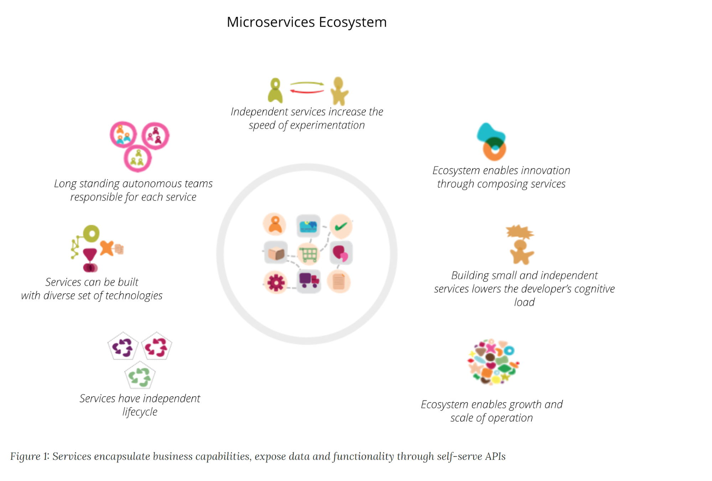
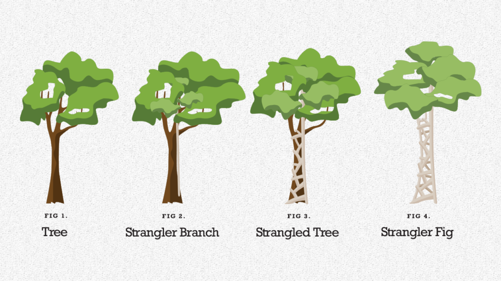
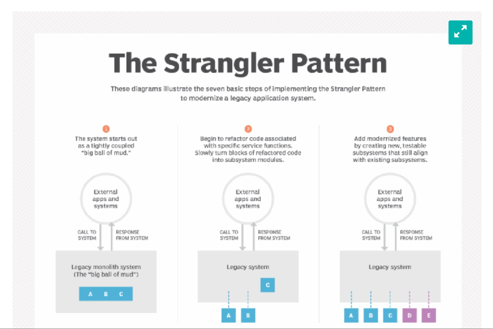

# Software Architecture--Microservices, Strangler Pattern and MOSA

## Learning Objectives

By the end of this lesson you will be able to:

* Define microservices and microservice architectural style
* Define monoliths and the Strangler Pattern, and know applicable scenarios within the DoD
* Know and understand modernization and design patterns
* Understand how MOSA might positively impact your team goals
* **BONUS:** Define APIs

## Microservices

Because there are common approaches for implementing the Strangler Pattern and Modular Open Systems Architecture (MOSA), we are starting this module with microservices.

The writers of the book [_Team Topologies_](https://teamtopologies.com/book) spoke at the DevOps Enterprise Summit in 2019, stating:

"Many organizations are starting to deploy their applications using microservices, but even with that, you have many debates about what is the right way to do so." For example:

>"Start with [a] monolith and extract microservices."
> - Tammer Saleh
>
>&nbsp;
>"Don’t start with a monolith when your goal is a microservices architecture."
> - Stefan Tilkov
>
>&nbsp;
>"If you can’t build a monolith, what makes you think microservices are the answer?"
> - Simon Brown
>
>&nbsp;

Source: [Monoliths vs Microservices is Missing the Point - Start with Team Cognitive Load - DOES EUR 2019](https://teamtopologies.com/videos-slides/2019/07/10/monoliths-vs-microservices-is-missing-the-point-start-with-team-cognitive-load-does-eur-2019) 

The point here isn’t to confuse you. Many of you might be asking yourselves, “If these are the words of leaders in the industry, where am I supposed to focus?” It starts by creating a shared understanding of important terms within your acquisition team, the contracts you award, and the development teams you support.

Again, the right approach is dependent on your scenario -- there is no magic pill, one-size-fits-all, specified play or playbook, etc.

For those who may not be as familiar with a microservice, let us provide some examples. The following article not only uses example companies you are familiar with and how they implement microservices, it also details shifting from a monolithic architecture to a microservice architecture. Read at least the [**Netflix** example](https://blog.dreamfactory.com/microservices-examples/#:~:text=Some%20of%20the%20most%20innovative,to%20the%20adoption%20of%20microservices):

<!-- >>>>>>>>>>>>>>>>>>>>>> BEGIN CHALLENGE >>>>>>>>>>>>>>>>>>>>>> -->
<!-- Replace everything in square brackets [] and remove brackets  -->

### !challenge

* type: checkbox
* id: ecc453b4-fd36-461d-913a-38abf24c40a7
* title: Microservices
<!-- * points: [1] (optional, the number of points for scoring as a checkpoint) -->
<!-- * topics: [python, pandas] (optional the topics for analyzing points) -->

##### !question

In the article, Netflix transitioned to a microservice architecture. Select all that are true with respect to their journey:

##### !end-question

##### !options

* The shift from monolithic to microservice architecture took multiple years
* Netflix started with the non-customer facing applications
* Microservices increased efficiency in workload and created cost reduction
* The initiative was instigated by an event (loss of ability to send DVDs) that showed the single points of failure with a monolithic architecture

##### !end-options

##### !answer

* The shift from monolithic to microservice architecture took multiple years
* Netflix started with the non-customer facing applications
* Microservices increased efficiency in workload and created cost reduction
* The initiative was instigated by an event (loss of ability to send DVDs) that showed the single points of failure with a monolithic architecture

##### !end-answer

#### !hint
Do all of these look like reasons that Netflix wanted to change their architecture approach?
#### !end-hint
<!-- other optional sections -->
<!-- !hint - !end-hint (markdown, hidden, students click to view) -->
<!-- !rubric - !end-rubric (markdown, instructors can see while scoring a checkpoint) -->
<!-- !explanation - !end-explanation (markdown, students can see after answering correctly) -->

### !end-challenge

<!-- ======================= END CHALLENGE ======================= -->

### Microservice Architecture Style

In 2014, Martin Fowler and James Lewis published a [definition of the term microservices](https://martinfowler.com/articles/microservices.html) because, like Cloud, Agile, and DevSecOps, there is tremendous variation and understanding of what the term microservices means.

Here is what they said.

>“In short, the microservice architectural style is an approach to developing a single application as a suite of small services, each running in its own process and communicating with lightweight mechanisms, often an HTTP resource API.
>
>These services are built around business capabilities and independently deployable by fully automated deployment machinery. There is a bare minimum of centralized management of these services, which may be written in different programming languages and use different data storage technologies.”  

Source: [Microservices](https://martinfowler.com/articles/microservices.html) 

Applications built using Cloud services may benefit from microservices, though there are benefits and tradeoffs.

|Microservices provide benefits…|…but can come with costs|
|---|---|
|[Strong Module Boundaries](https://martinfowler.com/articles/microservice-trade-offs.html#boundaries): Microservices reinforce modular structure, which is particularly important for larger teams.|[Distribution](https://martinfowler.com/articles/microservice-trade-offs.html#distribution): Distributed systems are harder to program, since remote calls are slow and are always at risk of failure.|
|[Independent Deployment](https://martinfowler.com/articles/microservice-trade-offs.html#deployment): Simple services are easier to deploy, and since they are autonomous, are less likely to cause system failures when they go wrong.|[Eventual Consistency](https://martinfowler.com/articles/microservice-trade-offs.html#consistency): Maintaining strong consistency is extremely difficult for a distributed system, which means everyone has to manage eventual consistency|
|[Technology Diversity](https://martinfowler.com/articles/microservice-trade-offs.html#diversity): With microservices you can mix multiple languages, development frameworks and data-storage technologies.|[Operational Complexity](https://martinfowler.com/articles/microservice-trade-offs.html#ops): You need a mature operations team to manage lots of services, which are being redeployed regularly.|
_Source: Martinfowler.com - [Microservice Trade-Offs](https://martinfowler.com/articles/microservice-trade-offs.html)_ 
&nbsp;

Microservices are tremendously helpful with [loose coupling](https://en.wikipedia.org/wiki/Loose_coupling), and building systems designed to evolve over time while changing to include new technologies and features.

### !callout-info
## How this applies to acquisition: 
If your team is procuring a system and adopting a microservices approach, two best practices are:
1. Have well-defined (hopefully standardized) and well-documented Application Programming Interfaces (APIs), **and**
2. Document utilized open-source and vendor-specific services.
### !end-callout

This architectural style covers many different patterns, and is not right for every situation. If you want to dive deeper into microservices, please visit the ‘Additional Resources’ section at the end of this module.

<!-- >>>>>>>>>>>>>>>>>>>>>> BEGIN CHALLENGE >>>>>>>>>>>>>>>>>>>>>> -->
<!-- Replace everything in square brackets [] and remove brackets  -->

### !challenge

* type: checkbox
* id: a37c9129-27bd-44c2-98aa-f7129eb3de33
* title: Acquisition and Microservices
<!-- * points: [1] (optional, the number of points for scoring as a checkpoint) -->
<!-- * topics: [python, pandas] (optional the topics for analyzing points) -->

##### !question

Which of the following would be ways to ensure microservices architecture is supported in your acquisition activities, by including the following requirements in your contract documentation?

##### !end-question

##### !options

* Application Programming Interfaces (APIs) are well-defined
* Preference over standard (commercially accepted) APIs over unique APIs
* Document vendor specific tools utilized
* Supports risk reduction by distributing dependencies

##### !end-options

##### !answer

* Application Programming Interfaces (APIs) are well-defined
* Preference over standard (commercially accepted) APIs over unique APIs
* Document vendor specific tools utilized

##### !end-answer

### !explanation
Although microservices architecture supports risk reduction by distributing dependencies it is a statement as written, not a specific requirement in the contract.  
### !end-explanation
<!-- other optional sections -->
<!-- !hint - !end-hint (markdown, hidden, students click to view) -->
<!-- !rubric - !end-rubric (markdown, instructors can see while scoring a checkpoint) -->
<!-- !explanation - !end-explanation (markdown, students can see after answering correctly) -->

### !end-challenge

<!-- ======================= END CHALLENGE ======================= -->
## Monoliths and the Strangler Pattern

Let’s look at a way we can achieve microservices architecture when we live in a monolithic world.

For those of you embarking upon a modernization effort, you may have heard of the Strangler Pattern approach. Simply stated, teams using the Strangler Pattern slowly replace existing systems (typically monoliths) by replacing their various components, functions, applications, and microservices, gradually shutting off capability in the existing system and eventually completely replacing it. Visually, it looks something like this:

Modernizing a system doesn’t have to mean taking it offline and rewriting the entire codebase- systems can be updated piece by piece, slowly deprecating the old pieces. This approach, coined by Martin Fowler, gradually updates monolithic application systems -- known as a "big ball of mud" -- while still keeping them running in production (operations).

_Source: [What is the strangler pattern and how does it work?](https://searchapparchitecture.techtarget.com/tip/A-detailed-intro-to-the-strangler-pattern)_ 
&nbsp;

<!-- >>>>>>>>>>>>>>>>>>>>>> BEGIN CHALLENGE >>>>>>>>>>>>>>>>>>>>>> -->
<!-- Replace everything in square brackets [] and remove brackets  -->

### !challenge

* type: multiple-choice
* id: 0ea6d948-3c32-41be-baa9-4046f16d1416
* title: Scenario
<!-- * points: [1] (optional, the number of points for scoring as a checkpoint) -->
<!-- * topics: [python, pandas] (optional the topics for analyzing points) -->

##### !question

Let’s look at a case from a non-software point of view.  Which of these do you believe represents that definition of the Strangler Pattern?

You own a classic car that could stand to be updated and upgraded.  Here are some options you are faced with:

##### !end-question

##### !options

* You could buy a brand new fully functioning car.
* You could take it apart piece by piece to restore it and hope it still works once you put it back together.
* You could take it apart one piece at a time, restore and replace that portion and test to ensure the car still runs.
##### !end-options

##### !answer

* You could take it apart one piece at a time, restore and replace that portion and test to ensure the car still runs.

##### !end-answer

#### !explanation
This  gives us two benefits:
1. You can still run the car while you are incrementally restoring it
1. If a fix is completed piece by piece, you have an easier time identifying the source of the problem

#### !end-explanation
<!-- other optional sections -->
<!-- !hint - !end-hint (markdown, hidden, students click to view) -->
<!-- !rubric - !end-rubric (markdown, instructors can see while scoring a checkpoint) -->
<!-- !explanation - !end-explanation (markdown, students can see after answering correctly) -->

### !end-challenge

<!-- ======================= END CHALLENGE ======================= -->

**FUN FACT**: The modernization of the Defense Travel System (DTS) is an example of utilizing the Strangler Pattern to modernize a system while it’s still running.

As a software acquisition professional, it’s important to understand the value these methods and solutions can provide you.  This knowledge enables you to make a decision most suitable for your program, system, and user/capability. How does this help?

**Risk Reduction!**  By gradually replacing individual features to migrate to a new system,  you avoid needing a complex approach or running two systems in parallel.

>“The most important reason to consider a strangler application over a cut-over rewrite is reduced risk. A strangler can give value steadily and the frequent releases allow you to monitor its progress more carefully. Many people still don’t consider a strangler since they think it will cost more — I’m not convinced about that. Since you can use shorter release cycles with a strangler you can avoid a lot of the unnecessary features that cut over rewrites often generate. “
>
> — Martin Fowler
>
>&nbsp;

**How this can apply to acquisitions**: The Strangler Pattern reduces risk to operational systems by maintaining and funding current operating systems while new capability is fielded. Adopters may receive pushback statements like, “We don’t have the funding to maintain two systems.” But the alternative is risky! The Strangler Pattern approach ensures limited to no impact to operations, and increases cost savings as teams find system redundancies, obsolete functionalities, and replace expensive custom solutions with open-source, vendor-provided, commonly available code.

Teams should try to limit the overlap of two systems- but two systems ensure operational availability for users, and we must fight for our users!

## What about MOSA?

Some of you might have heard of Modular Open Systems Architecture (MOSA) before, and groaned just now. It should be noted that MOSA implements many of the best practices you’ve read about in this and other modules - we will not rehash the debate, nor is it our goal to create frustration. Instead, we want to encourage everyone to rediscover how MOSA can be beneficial to your team, now that you see its alignment with industry best practices. We hope you see MOSA in a new light.

MOSA, or Modular Open System Architecture, is an integrated business and technical strategy for the DoD, guiding the creation of affordable and adaptable systems.

>“Per law, [10 USC 2446](https://www.law.cornell.edu/uscode/text/10/subtitle-A/part-IV/chapter-144B/subchapter-I), A major defense acquisition program that receives Milestone A or Milestone B approval after January 1, 2019, shall be designed and developed, to the maximum extent practicable, with a modular open system approach to enable incremental development and enhance competition, innovation, and interoperability.
>
>Program Managers, with support from the Lead Systems Engineer, are responsible for applying modular approaches in product designs where feasible and cost-effective. They are also responsible for acquiring data and IP that are both appropriate and essential to achieving the expected benefits. Modular designs coupled with an appropriately open business model provide a valuable mechanism for continuing competition and incremental upgrades, and to facilitate reuse across the joint force (Source: DODI 5000.02 Enclosure 3).”

MOSA is about modularity, i.e. designing so that components can be incrementally added, removed, or replaced. Specific to software architecture, this is called evolutionary architecture. This philosophy is focused on loose coupling, and designing with change in mind. The intent here is to completely avoid anything like in the past, where major technology refreshes and upgrades took years of planning and was just as slow to execute.

As an acquisition team employing these methods, consider how MOSA can improve and enhance your overall acquisition strategies.

**Benefits of MOSA** (Source: DASD/SE)
1. **Enhance Competition** – Open architecture with severable modules, allowing elements to be openly competed.
1. **Facilitate Technology Refresh** – Delivery of new capabilities or replacement technology without requiring change to all elements in the entire system.
1. **Incorporate Innovation** – Operational flexibility to configure and reconfigure available assets to meet rapidly changing operational requirements.
1. **Enable Cost Savings/Cost Avoidance** – Reuse of technology, modules, and/or elements from any supplier across the acquisition life cycle.
1. **Improve Interoperability** – Severable software and hardware modules that can be changed independently.

Learn more about MOSA here: [Build a Modular Open Systems Approach (MOSA) | AiDA](https://aida.mitre.org/blog/2019/03/26/build-a-modular-open-systems-approach-mosa/)

<!-- >>>>>>>>>>>>>>>>>>>>>> BEGIN CHALLENGE >>>>>>>>>>>>>>>>>>>>>> -->
<!-- Replace everything in square brackets [] and remove brackets  -->

### !challenge

* type: checkbox
* id: aa460c00-2802-4323-b486-d90ad3666b7e
* title: Using MOSA
<!-- * points: [1] (optional, the number of points for scoring as a checkpoint) -->
<!-- * topics: [python, pandas] (optional the topics for analyzing points) -->

##### !question

Benefits of executing the MOSA strategy as a Program Manager are:

##### !end-question

##### !options

* Increases the opportunity for competition
* Mitigates and supports technology refresh
* MOSA aligns with the concepts behind microservices architecture
* Can mitigate costs

##### !end-options

##### !answer

* Increases the opportunity for competition
* Mitigates and supports technology refresh
* MOSA aligns with the concepts behind microservices architecture
* Can mitigate costs

##### !end-answer

<!-- other optional sections -->
<!-- !hint - !end-hint (markdown, hidden, students click to view) -->
<!-- !rubric - !end-rubric (markdown, instructors can see while scoring a checkpoint) -->
<!-- !explanation - !end-explanation (markdown, students can see after answering correctly) -->

### !end-challenge

<!-- ======================= END CHALLENGE ======================= -->

### !callout-success
## Key Takeaways: 
* Microservices are a foundational aspect of the DevSecOps Revolution. They allow complex systems to be decoupled from dependencies, both from the perspective of supporting teams and within the software architecture itself. _This supports not only the strangler pattern approach, but the Department’s preferred Modular Open System Architecture (MOSA) model as well._
* The “strangler pattern” is a proven approach to brownfield software development. It decreases risk to current operations by maintaining existing capabilities by moving users to new capability over time, replacing one or a few features with each software release.
* As the Department’s preferred approach, MOSA is analogous to proven foundational microservices for successful DevSecOps implementation. 
### !end-callout

## Bonus Section: API Gateway
API stands for Application Programming Interface. It’s an old term, but has been given a totally new life with the explosion of Cloud services, and, you guessed it, microservices.  APIs are like software middlemen- they enable applications, systems, or services to talk to one another. APIs are an effective way to make sure applications are loosely coupled and modular in nature.

This is a great video to learn about APIs: [APIs 101: What Exactly is an API? Part 1](https://www.youtube.com/watch?v=cpRcK4GS068)

<!-- >>>>>>>>>>>>>>>>>>>>>> BEGIN CHALLENGE >>>>>>>>>>>>>>>>>>>>>> -->
<!-- Replace everything in square brackets [] and remove brackets -->

### !challenge

* type: paragraph
* id: b7ef9436-faa5-11eb-9a03-0242ac130003
* title: !Opt. Lesson Feedback: Software Architecture
<!-- * points: [1] (optional, the number of points for scoring as a checkpoint) -->
<!-- * topics: [python, pandas] (optional the topics for analyzing points) -->

##### !question

Do you have any specific feedback, positive or constructive, regarding the content of this lesson? 

##### !end-question

##### !placeholder

Remember, this is optional - this is a way for you to provide input while working through the lesson content. 

##### !end-placeholder

### !end-challenge

<!-- ======================= END CHALLENGE ======================= -->

## Resources

These resources are used throughout the lesson and are provided for you to continue learning on your own time.

* **Articles:**
    * [E. Klotins, M. Unterkalmsteiner and T. Gorschek, "Software Engineering Antipatterns in Start-Ups," in IEEE Software, vol. 36, no. 2, pp. 118-126, March-April 2019, doi: 10.1109/MS.2018.227105530.](https://ieeexplore.ieee.org/document/8356173)
    * [Greenfield Versus Brownfield Software Systems](https://subscription.packtpub.com/book/application_development/9781788624060/5/ch05lvl1sec39/greenfield-versus-brownfield-software-systems#)
    * [Martin Fowler’s Microservices Resource Guide](https://martinfowler.com/microservices/)
    * [Microservices Guide](https://martinfowler.com/microservices/)  
    * [Modular Open Systems Approach – DDR&E(AC) (cto.mil)](https://ac.cto.mil/mosa/)
    * [Periodic Table of DevOps Tools | Digital.ai](https://digital.ai/periodic-table-of-devops-tools)
* **DoD Publications:** * [DoD Enterprise DevSecOps Reference Design](https://dodcio.defense.gov/Portals/0/Documents/DoD%20Enterprise%20DevSecOps%20Reference%20Design%20v1.0_Public%20Release.pdf)
* **Videos**:
    * 2019 DevOps Enterprise Summit [Monoliths vs Microservices is Missing the Point - Start with Team Cognitive Load - DOES EUR 2019](https://teamtopologies.com/videos-slides/2019/07/10/monoliths-vs-microservices-is-missing-the-point-start-with-team-cognitive-load-does-eur-2019)
    * [Microservices vs. Monoliths](https://www.coursera.org/learn/uva-darden-continous-delivery-devops/lecture/tTnKW/microservices-vs-monoliths)
