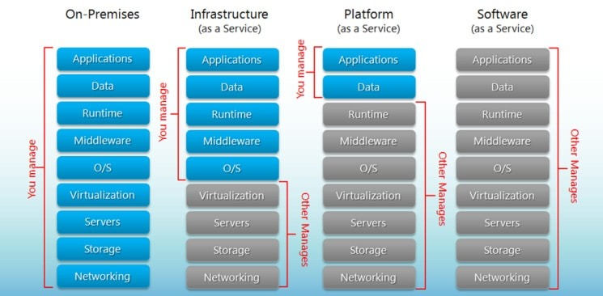
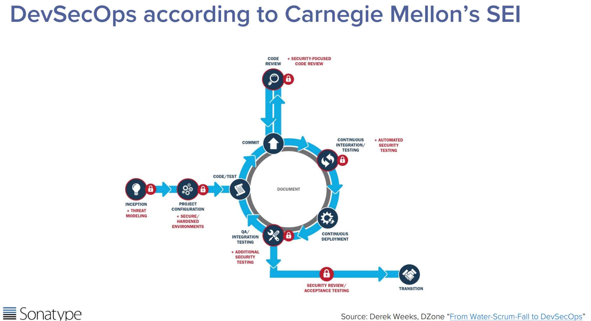
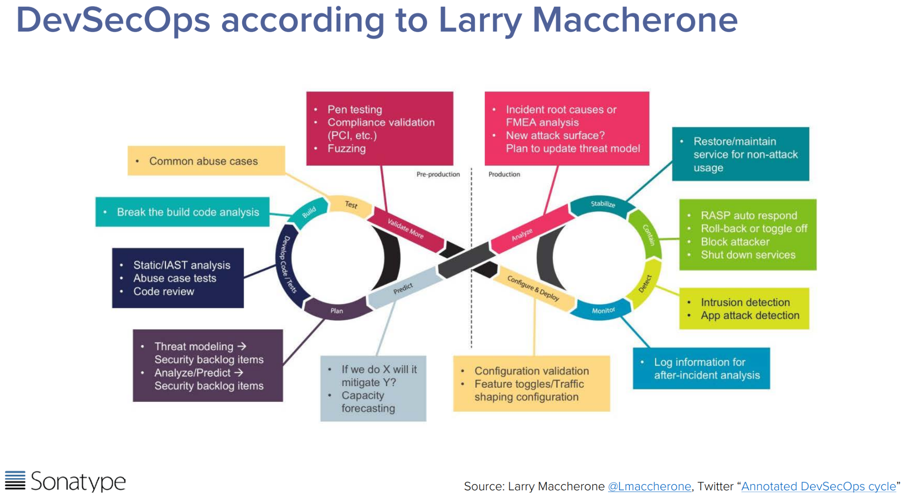
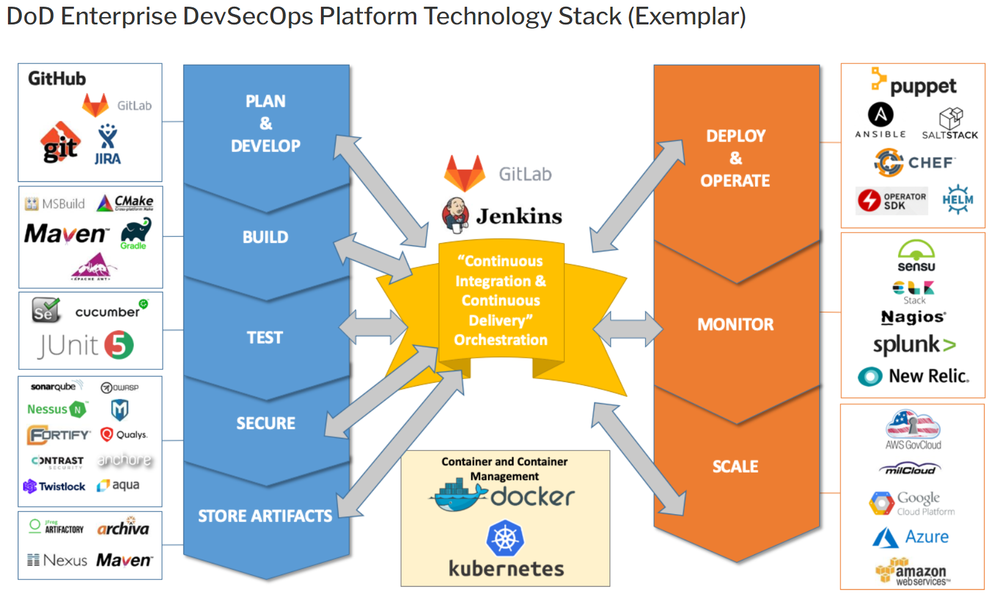
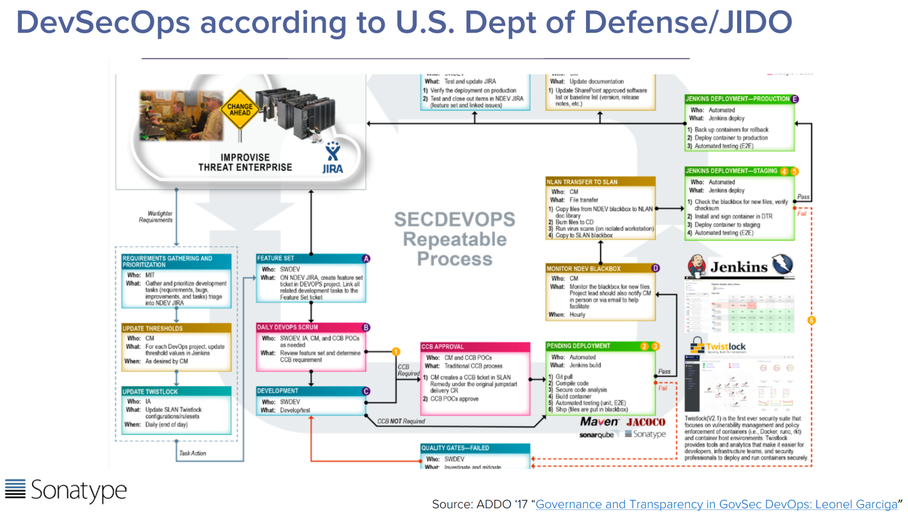

# Understanding Technology’s Role

## Learning Objectives
* Understand technology choices are made to realize architectural and design goals/needs
* Define technical debt and understand its needs
* Understand tech stack diversity, how individual technologies need to complement each other, and different stack pros/cons

## Introduction

As you read through this lesson, don't forget what we previously discussed and the ever prevalent influence of Conway's law. We say this not to dissuade you of the importance of the topics below, but rather to emphasize the multifaceted and tailored approach required when implementing DevSecOps.

### !callout-info
## Recall: Conway’s Law
“Organizations which design systems...are constrained to produce designs which are copies of the communication structures of these organizations.”
### !end-callout

## Acquisitions + Technology

Before continuing this course, or even this module, we need to talk. Perhaps we should have said something a bit earlier, but we decided that posing and answering this question after talking about technology for a while was the best way to go. Why are we focusing so much on technology?  

You may be thinking, “I have specifically never studied technology before - stop making me study it now!” But, advancements in technology and threats from our adversaries **REQUIRE** you to understand this world, so we can meet a need.   

>“the thread that runs through all of our programs and all that we do is software...”  HON Ellen Lord, Undersecretary of Defense for Acquisition and Sustainment

### !callout-secondary
## Disclaimer
This section may be tech heavy for some. If not, you may just have the makings of becoming a software practitioner! Either way, the information included in this module explains how certain concepts influence your role as a software acquisition professional, and their impact. 
### !end-callout

<!-- >>>>>>>>>>>>>>>>>>>>>> BEGIN CHALLENGE >>>>>>>>>>>>>>>>>>>>>> -->
<!-- Replace everything in square brackets [] and remove brackets  -->

### !challenge

* type: multiple-choice
* id: 4d79ae5c-b6f2-43a0-8f29-501ab247ef9a
* title: !Technology understanding
<!-- * points: [1] (optional, the number of points for scoring as a checkpoint) -->
<!-- * topics: [python, pandas] (optional the topics for analyzing points) -->

##### !question

Do you personally believe that understanding the technology landscape can help you create the overall strategies to execute your job?

##### !end-question

##### !options

* Yes
* No

##### !end-options

##### !answer

* *

##### !end-answer

<!-- other optional sections -->
<!-- !hint - !end-hint (markdown, hidden, students click to view) -->
<!-- !rubric - !end-rubric (markdown, instructors can see while scoring a checkpoint) -->
<!-- !explanation - !end-explanation (markdown, students can see after answering correctly) -->

### !end-challenge

<!-- ======================= END CHALLENGE ======================= -->

## Technology Choices Realize Design and Architecture
In the last module, you learned:
* The paramount importance design and architecture play in successful system implementation
* That capability will be either delivered directly, or by hardware and/or software, and
* How to partition capability delivery to different components, whether hardware or software

This is called design.  

Now, the process shifts to assign technologies to system components, in order to fulfill required capabilities. Teams may have already discovered and/or declared several required capabilities in the design process.  

For example, nearly every software-intensive system needs identity and access management (IdAM) capability. IdAM is exactly what it sounds like - it ensures that individuals accessing the system should be accessing the system by creating unique identities, then managing and limiting access based on those identities. While IdAM systems concepts are an entire lesson on their own, you can start learning more here: [IdAM in a Nutshell – DoD Cyber Exchange](https://public.cyber.mil/idam/idam-in-a-nutshell/).

### !callout-info
## How this can apply to acquisition
if procuring a system, a secure IdAM will most likely need to be included as part of the system or developed. That is, how can this be incorporated into your contract?   
### !end-callout

Other than an IdAM, a plethora of other technologies also need to be decided on.   

Do you need to persist data? You’ll need to decide how to do that. Persisting data also requires security, access, encryption at rest, key management, backup, and resilience strategies.   

Your software needs fast, reliable, and secure access to your data. You’ll need to make a choice of database technologies as well. SQL, NoSQL, in memory, row-based, column-based, etc.?  

So many technical details must all work together to meet your system capability needs and key performance parameters!  

* Don’t sweat the small stuff though- instead, [“keep calm and carry on”](https://en.wikipedia.org/wiki/Keep_Calm_and_Carry_On):
* Capture these needs in a backlog
* Prioritize them
* Assign a few quick analysis of alternatives (AoAs) to your technical staff, and
* Make selections based on your analysis   

Don’t be afraid to make choices and move on! Keep in mind, there is rarely a single optimal technology choice to satisfy a need- many options will usually be “good enough”. When choosing technology, it's worthwhile to remember that Voltaire once said, “Perfect is the enemy of good.” Similarly, Robert Watson-Watt, the developer of Britain's early warning radar in WWII said "Give them the third best to go on with; the second best comes too late, the best never comes."   

For those less comfortable with technology decisions, that’s the benefit of a DevSecOps team- other members are there to support you! With that said, it’s important to provide some insight into the different types of technology tradeoff decisions you and your team might make. Module 103 and 104 will go into more detail.  

**Attempting perfection in every choice defers delivery indefinitely.** Instead, have a thorough understanding of the choices you make, and be ready to continuously reevaluate them. Then prepare to potentially exchange underlying technology in your design when more effective or modern alternatives emerge, or if you need capability that you don’t currently have available. These recommendations lead us next to our discussion - technical debt.  

<!-- >>>>>>>>>>>>>>>>>>>>>> BEGIN CHALLENGE >>>>>>>>>>>>>>>>>>>>>> -->
<!-- Replace everything in square brackets [] and remove brackets  -->

### !challenge

* type: checkbox
* id: 79ba0753-4f06-460a-95ad-d349afa64c09
* title: Making tech choices
<!-- * points: [1] (optional, the number of points for scoring as a checkpoint) -->
<!-- * topics: [python, pandas] (optional the topics for analyzing points) -->

##### !question

There are ways you can work to enable quick decisions on tough technical choices. A few of them are listed below, select the ones that **do not** seem to fit:
##### !end-question

##### !options

* Capture these needs in a backlog
* Let the requirements community define them for you
* Prioritize them
* Study the tech problem for an extended period of time before proceeding
* Assign a few quick analysis of alternatives (AoAs) to your technical staff, and make selections based on your analysis

##### !end-options

##### !answer

* Let the requirements community define them for you
* Study the tech problem for an extended period of time before proceeding

##### !end-answer

<!-- other optional sections -->
<!-- !hint - !end-hint (markdown, hidden, students click to view) -->
<!-- !rubric - !end-rubric (markdown, instructors can see while scoring a checkpoint) -->
<!-- !explanation - !end-explanation (markdown, students can see after answering correctly) -->

### !end-challenge

<!-- ======================= END CHALLENGE ======================= -->

## Technical Debt
What exactly is technical debt? Ward Cunningham, one of the original 17 authors of the Agile Manifesto, coined the term. Simply put, technical debt is like credit card interest. Technical debt, like credit card debt, accrues over time. While your project is in development stages, it might seem worthwhile to choose “easy” over “better, but time consuming”. But just like credit card debt, the more you accumulate, the harder it is to “pay off”, or implement any changes.  

Oftentimes we might make compromises in the technical elegance of an implementation in order to save resources (time and/or money), adding to the balance of technical debt. This is not wrong, it is often required for delivery capability within a relevant timeline.   

For more concrete examples, let’s look at tech debt in two ways:

* **Technical debt in code elegance:** Writing a string of code is like writing a sentence: that’s why we call them coding “languages”. Much like writing a clear and concise paragraph, writing clean, elegant code can sometimes be difficult. Because of that initial difficulty, teams often choose an easier, but often more lengthy and “hard-coded” method of execution. As scenarios change, failures occur because the code was written for specificity, not flexibility. A rule to remember: the more code there is, the more expensive it is to maintain, and the greater the risk for failure.

* **Technical debt in aging products or hardware:** Technology is constantly evolving. A new computer today is soon superseded by next year’s more efficient model, featuring larger data storage, greater processing power, improved graphics, etc. Time also creates vulnerabilities often exploited by hackers are attempting to breach its security. The longer your system is available, the greater the likelihood of hackers attempting to breach its security. Just like your personal technology, advantages exist with upgrading an outdated system that is increasingly unreliable or prone to hacking.

This leads us to two critical aspects of technical debt that you need to be mindful of:

### !callout-warning
## 1. It’s not always possible to know technical debt has been created.  
System failures are replete with examples of unrecognized technical debt. However, mindfulness when making design and implementation choices can help projects recognize when technical debt is accruing, and minimize the surprise of technical debt.
### !end-callout

### !callout-warning
## 2. Make paying down technical debt a part of your overall strategy.
Budgeting and planning for paying off technical debt is essential. Dedicating a percentage of each sprint, or allocating a specific sprint for paying off technical debt works best. An example cadence is every 5th or 10th sprint, freeze all new feature development and instead focus on paying down technical debt. Remember: technical debt isn’t about fixing implementation errors or defects- instead, resolving technical debt is more about finding and mitigating choices made in favor of speed or completion over elegance. Implementation errors or defects prevent capability delivery, and are best solved as soon as they are discovered.
### !end-callout

For an in-depth look at technical debt, a good place to start is here [TechnicalDebt](https://martinfowler.com/bliki/TechnicalDebt.html#:~:text=Technical%20Debt%20is%20a%20metaphor,interest%20paid%20on%20the%20debt.) or here [Technical Debt: The Ultimate Guide – BMC Blogs](https://www.bmc.com/blogs/technical-debt-explained-the-complete-guide-to-understanding-and-dealing-with-technical-debt/).  

<!-- >>>>>>>>>>>>>>>>>>>>>> BEGIN CHALLENGE >>>>>>>>>>>>>>>>>>>>>> -->
<!-- Replace everything in square brackets [] and remove brackets  -->

### !challenge

* type: multiple-choice
* id: 8b93baa8-8b38-4e44-bb52-8c6183cb2eef
* title: Responsibility
<!-- * points: [1] (optional, the number of points for scoring as a checkpoint) -->
<!-- * topics: [python, pandas] (optional the topics for analyzing points) -->

##### !question

If you contract out the development of an item you are not responsible for understanding the tech debt that is accrued on the program.

##### !end-question

##### !options

* True
* False

##### !end-options

##### !answer

* False

##### !end-answer

### !explanation
 Technical Debt plays into every aspect of delivering mission capability.  If the flow of work is not gathering an abundance of technical debt you may not be getting what you paid for and it may also be an indicator for a larger problem.
### !end-explanation

<!-- other optional sections -->
<!-- !hint - !end-hint (markdown, hidden, students click to view) -->
<!-- !rubric - !end-rubric (markdown, instructors can see while scoring a checkpoint) -->
<!-- !explanation - !end-explanation (markdown, students can see after answering correctly) -->

### !end-challenge

<!-- ======================= END CHALLENGE ======================= -->
### !callout-info
## How this can apply to acquisition
As shown above, technical debt should be baked into all acquisition and contracting strategies (tech refresh is common in every Work Breakdown Structure). Use the information above to continue to defend this funding.
### !end-callout

## Technology Stacks and Development Pipelines Defined
First, we have to define and understand the differences between a technology stack (commonly known as a “tech stack”) and a development pipeline. Both are necessary and interrelated. First let’s discuss tech stacks.   

### Tech Stacks Defined
To get a better understanding of what a tech stack entails, take a look at this diagram (this should look pretty familiar). See how various technologies are “stacked”, creating a foundation of sorts?

**A tech stack is the collection of tools you choose to build a fully-operational system or application**

In addition to making technology choices for each layer, teams will need to decide if they intend to manage each of those tools, or if they want to outsource to another entity or vendor who offer management “as a service”. Outsourcing is common, but may require accepting whatever the vendor allows. For example, vendors like Oracle, Microsoft Azure, Google Cloud, and Amazon Web Services (AWS) allow some choices at each layer, but choices made at one layer may limit your options at other layers. Likewise, it’s important to consider vendor lock-in when making technology choices at each layer. Many vendors support open standards in their offerings, but also encourage teams to use their proprietary offerings or extensions instead. Making this choice may gain the team greater capability or ease of implementation, but can accrue technical debt later if you decide to change vendors later.  

These are not necessarily bad choices. However, all of these choices must be documented and remembered for future reference. Even when choosing open-standards based components, technology and/or vendor lock-in may still occur. Frankly, every choice results in some kind of lock-in, and the best way to approach it is to acknowledge that fact and plan for an inevitable future where that choice must be reevaluated. Chasing technology is a never ending pursuit.   

### !callout-info
## How this can apply to acquisition
Ensure that your contracts include well-documented use of proprietary software and data storage. Furthermore, require documented, standardized (if applicable) Application Programming Interfaces (APIs) to minimize long-term lock-in. Adhering to these two rules will help your program be better enabled when moving between vendors.
### !end-callout

Another thing to remember: Teams must choose supporting technology products for multiple tech stacks to run:
* Development environments
* Testing environments
* Simulation environments
* Integration & test environments
* Staging environments, and
* Production environments   

Ideally, teams would choose a common solution for all six environments, but this is not always possible. For example, if your system is going to be a Cloud-accessed ERP (Enterprise Resource Planning system (e.g. personnel, supply, financial management), a common tech stack would make a great deal of sense for all environments.   

However, when developing software for an integrated hardware and software embedded weapon system, hosting your development, unit testing, and simulation environments in an appropriately secured cloud can still make a lot of sense- **but your integration/test, staging, and production (operational) environments will all need to be the same.** That is:  

* The integration and test environment is probably a hardware in the loop integration lab
* Staging would be a developmental or operational test platform (e.g. “yellow wire aircraft”), and
* Production environment is the actual weapon system hardware.

### !callout-info
## How this can apply to acquisition
If you are relying on a vendor to support capability development ensure your contracts have the text in bold as a requirement, this is referred to as platform drift and can wreak havoc on the ability to frequently deliver capability to operations.
### !end-callout

<!-- >>>>>>>>>>>>>>>>>>>>>> BEGIN CHALLENGE >>>>>>>>>>>>>>>>>>>>>> -->
<!-- Replace everything in square brackets [] and remove brackets  -->

### !challenge

* type: checkbox
* id: 8259a342-3584-4c9e-ba57-847fe83a5825
* title: Understanding the Tech Stack
<!-- * points: [1] (optional, the number of points for scoring as a checkpoint) -->
<!-- * topics: [python, pandas] (optional the topics for analyzing points) -->

##### !question

When using Platform as a Service, you are responsible for:

##### !end-question

##### !options

* Application
* Networking
* Storage
* Data
* Virtualization

##### !end-options

##### !answer

* Application
* Data

##### !end-answer

<!-- other optional sections -->
<!-- !hint - !end-hint (markdown, hidden, students click to view) -->
<!-- !rubric - !end-rubric (markdown, instructors can see while scoring a checkpoint) -->
<!-- !explanation - !end-explanation (markdown, students can see after answering correctly) -->

### !end-challenge

<!-- ======================= END CHALLENGE ======================= -->
Before moving onto the development pipeline, let’s discuss an example of the possible choices for technology solutions at each layer in the above generic computing stack. From bottom up:  
* **Networking** is first. Choices you have here are base connectivity using things like MILSTD-1553, Ethernet, or Fiber Channel; copper wiring vs. fiber optics vs. wireless, etc.
* **Protocols** like IP/TCP/UDP/Multicast are next, and still technically within networking. Decisions at this layer may relate to system requirements like how much bandwidth you need, what your latency requirements are, and assessing your timing requirements, i.e. whether a system is a safety critical real time system.
* **Storage** is next in the stack. Can you put all your data in the Cloud? Should your storage leverage widely adopted but proprietary storage APIs like AWS’ S3?  

### !callout-secondary
## Note
Remember with both networking and storage, you’ll probably want to encrypt everything in transit and at rest, respectively. Uh-oh, now which encryption protocols should I use? How do I do key management? So much complexity.
### !end-callout

* **Servers** come after storage. Considerations here include which vendor to choose (Dell? HP?), what chip architecture (x86? ARM?), and more.

* **Virtualization** and Operating Systems are further up the stack, and all technology choices are software. For a taste of the complexity here, check out the [CNCF Cloud Native Interactive Landscape](https://landscape.cncf.io/) and have a look around. Take a few minutes to investigate - getting a sense of the complexity and diversity of technological choices available is absolutely essential.

A few things to remember:
* **Choices and considerations** exist at every level, and the further up the stack you go, the more choices you will need to make.  
* For those seeing the volume of choices, **open-source does not require contract actions.** Security actions? Yes. But contracting professionals can breathe a sigh of relief on this part at least.
* **Bad choices do exist!** Especially amongst those that are certified to meet their capabilities via a non-profit industry association like CNCF. The challenge is finding the correct combination of technologies to meet your program needs, while delivering the right capabilities, that also works well in combination with itself. In this case, not all Lego blocks are compatible.

### !callout-info
## How this can apply to acquisition
Technical decisions must be made, then frequently evaluated and updated. Whether the government is leading these decisions, partnering with a vendor, solely relying on a vendor, or anywhere in between, contracts must be flexible. This allows for technical decisions to change. The list of decisions above may be a good starting point when considering the organization of your contract(s).  
### !end-callout

<!-- >>>>>>>>>>>>>>>>>>>>>> BEGIN CHALLENGE >>>>>>>>>>>>>>>>>>>>>> -->
<!-- Replace everything in square brackets [] and remove brackets  -->

### !challenge

* type: checkbox
* id: 3dfb2c54-ea23-40d1-8fcf-a68615b20869
* title: Acquisition considerations
<!-- * points: [1] (optional, the number of points for scoring as a checkpoint) -->
<!-- * topics: [python, pandas] (optional the topics for analyzing points) -->

##### !question

As an acquisitions professional, which the following are true when considering choices regarding technical design and architecture, technical debt, and tech stacks?

##### !end-question

##### !options

* Vendor lock-in is unavoidable
* Bandwidth is critical infrastructure to support overall system architecture and availability
* Contracts prohibit our ability to leverage new technology
* Strategies and contracts (if applicable) should require integration and testing and production (operational) environments to be the same

##### !end-options

##### !answer

* Vendor lock-in is unavoidable
* Bandwidth is critical infrastructure to support overall system architecture and availability
* Strategies and contracts (if applicable) should require integration and testing and production (operational) environments to be the same

##### !end-answer

### !hint
Which **one** doesn’t seem to fit?
### !end-hint

### !hint
Contracts are _only_ as limiting as the government defines them -- that is this is within our power to improve and change
### !end-hint
<!-- other optional sections -->
<!-- !hint - !end-hint (markdown, hidden, students click to view) -->
<!-- !rubric - !end-rubric (markdown, instructors can see while scoring a checkpoint) -->
<!-- !explanation - !end-explanation (markdown, students can see after answering correctly) -->

### !end-challenge

<!-- ======================= END CHALLENGE ======================= -->

Now that you’re fully overwhelmed with the choice of technologies for your tech stack, take a deep breath, then let’s talk about development pipelines.   

## Development Pipelines Defined

First, let’s define a development pipeline. **A development pipeline is the collection of tools and technologies needed to create, check, test, integrate, compile, deploy, and run your software.** The modern software development industry refers to this as the DevOps (Development + Operations) pipeline, or even more recently, the DevSecOps (Development + Security + Operations) pipeline. This pipeline depends on, or more specifically, runs on your choice of tech stack.  

As you now know, a tech stack is comprised of a significant number of choices. That number of choices inevitably leads to much proliferation, and a large number of possible tech stacks. Which begs the question, “How many DevSecOps pipelines are there?”   

The answer is, “The number of pipelines matches the number of software development activities.” Seriously. Every place or program developing software has its own unique collection of tools and technology to produce software.  

Let’s take a look at a few examples of specific DevSecOps pipelines. [This online briefing](https://waterplacid.files.wordpress.com/2018/04/devsecops-reference-architectures-2018.pdf) hosted by Derek Weeks at Sonatype contains numerous different DevSecOps pipelines.

Starting with a generic example, here’s the Carnegie Mellon University’s Software Engineering Institute DevSecOps pipeline:

Again, this is a “technology free” or agnostic view of DevSecOps, but does point out that this is an iterative process:
* **Implement** (code)
* **Commit** (save to a generally available shared code repository)
* **Review** (manual or automated scanning for defects, security vulnerabilities, etc.)
* **Continuous integration/testing** (integration should be done on every code commit),
* **Continuous deployment** (again, should be done on every commit, but not necessarily to production, but certainly to a testing environment),
 * If acceptable, take the release branch to production, if not, cycle back around to correct defects.  

 Another popular representation of the DevSecOps approach that is commonly seen is something like this:

 It has nearly all the same phases as the first pipeline, but this depiction is seen a bit more often- probably because most people like the aesthetics of the infinity sign. It does underline the important fact that this is a never-ending process, and software is never “done”. It just keeps improving, changing platforms, gaining features, etc.  

 Now, let’s add some technology choices to a DevSecOps pipeline. This is a popular representation often used by the US Air Force Software Factories:   

 Now we’re really getting somewhere. Look at all those great technology products on the far left and right of this pipeline, automating so much of what we need to do in a modern development pipeline!   

**NOTE**: Many of the products shown here are choices that accomplish the same thing. For example, look at the top left of the diagram. All four of the products shown (GitHub, GitLab, Git, and Jira), all provide the capability for shared source code repositories that track every version and branch of the source code. But they all are capable of much more. In fact, it’s likely that a team would only need to choose one of those options, but in some cases, you might want more than one, to account for different types of dependencies. As an example, the block listing products that “secure” the code has a number of commercial and open-source products listed. Each may provide different scanning or security evaluations, and teams will likely need several of those.  

### !callout-info
## How this can apply to acquisition:
Don’t worry, we are **not** advocating to avoid market research. These are just examples and types of supported capabilities within DevSecOps. Hopefully this is useful for understanding what parts of the process can leverage vendor-provided or open-source tools, and minimize the need for custom code. Again, always think, “Can this be automated?” Or, “Is this practice/process available in industry?” More often than not, you may find that the answer to either or both is yes!
### !end-callout  

One last example before we move on. The below is from the Joint Improvised Explosive Defeat Office (JIDO), which was an early pioneer in DevSecOps and continuous Authority To Operate (ATO) in the DoD:  

This one may be a bit hard to read, but we included it here for its historical significance as an early pioneer, and to demonstrate the significant discipline and rigor built into development pipelines. You’ll need to understand and emphasize that fact with your leadership, stakeholders, users, stakeholders, users, and security accreditation officials.   

To understand the full details of this comprehensive process and development pipelines, check out this video from All Day DevOps: [Governance and Transparency in GovSec DevOps: Leonel Garciga - YouTube.](https://www.youtube.com/watch?v=LNL5J6gIkv0) It is a 32 minute video, but well worth watching. Leo Garciga is a leading voice in DoD on DevSecOps, and is now the software lead in the Army G2.    

## When Should I Choose My Tech?

**As late as you possibly can!** We cannot overemphasize this. Again, **as late as you possibly can.** Seriously. Technology moves incredibly fast, especially when considering technology stacks, development pipelines, and tooling. If you choose a technology solution a mere 6 months before you start development, chances are it will be several versions advanced by the time you start coding, and may have even been supplanted by some new market leader. Which brings up another critical point- always be willing and able to move to newer technology. Embrace the phrase **“strong convictions loosely held.”** Embrace and commit to your tech, but always understand that newer better tech is always on the horizon.   

There is a delicate balance between stability and staying current. One you will constantly have to manage as a lead engineer or program manager or member of the DevSecOps team. Don’t create too much churn for your developers and users, but don’t fall too far behind. One of the most important things you can do to help with this is to create a design and architecture ready to accommodate and embrace change, re-factoring, and re-hosting.   

<!-- >>>>>>>>>>>>>>>>>>>>>> BEGIN CHALLENGE >>>>>>>>>>>>>>>>>>>>>> -->
<!-- Replace everything in square brackets [] and remove brackets  -->

### !challenge

* type: checkbox
* id: 05dd6e05-c4c4-4399-9de3-298fe3174389
* title: Impactful knowledge
<!-- * points: [1] (optional, the number of points for scoring as a checkpoint) -->
<!-- * topics: [python, pandas] (optional the topics for analyzing points) -->

##### !question

From this lesson, what information will be most impactful in your current role:

_There is no correct answer, this is your opinion._

##### !end-question

##### !options

* Acquisitions + Technology
* Technology Choices Realize Design and Architecture
* Technical Debt
* Technology Stacks and Development Pipeline Defined

##### !end-options

##### !answer

* *

##### !end-answer

<!-- other optional sections -->
<!-- !hint - !end-hint (markdown, hidden, students click to view) -->
<!-- !rubric - !end-rubric (markdown, instructors can see while scoring a checkpoint) -->
<!-- !explanation - !end-explanation (markdown, students can see after answering correctly) -->

### !end-challenge

<!-- ======================= END CHALLENGE ======================= -->

### !callout-success
## Key Takeaways: 
* Technology and software architecture are both important, but don’t forget about the design of your team, especially internal and external communication structures. Users, leadership, and stakeholders are all involved in the success of the technology we develop. Remember Conway’s law will always be the largest bottleneck.
* **Tech debt will always be a concern.** Tech debt can be both planned or unplanned.  Software architecture and technology choices **must** be reassessed over time, and microservice design/MOSA enables a smooth transition.
* Tech Stacks and Development Pipelines are foundational for delivering software continuously, but do have to be developed for every program. Don’t forget, enterprise capability and re-use is a foundational concept of DevSecOps.
### !end-callout

## Further Research Opportunity: Modular and Loosely Coupled Architectures
While the topic of modular and loosely coupled architectures is a rich topic all on its own, here are just a few final places you can go for more:
* [The Twelve-Factor App (12factor.net)](https://12factor.net/)
* [Unix philosophy - Wikipedia](https://en.wikipedia.org/wiki/Unix_philosophy)
* [Modular Open Systems Approach – DDR&E(AC) (cto.mil)](https://ac.cto.mil/mosa/)

<!-- >>>>>>>>>>>>>>>>>>>>>> BEGIN CHALLENGE >>>>>>>>>>>>>>>>>>>>>> -->
<!-- Replace everything in square brackets [] and remove brackets -->

### !challenge

* type: paragraph
* id: 0251418c-faa6-11eb-9a03-0242ac130003
* title: !Opt. Lesson Feedback: Understanding Technology’s Role
<!-- * points: [1] (optional, the number of points for scoring as a checkpoint) -->
<!-- * topics: [python, pandas] (optional the topics for analyzing points) -->

##### !question

Do you have any specific feedback, positive or constructive, regarding the content of this lesson? 

##### !end-question

##### !placeholder

Remember, this is optional - this is a way for you to provide input while working through the lesson content. 

##### !end-placeholder

### !end-challenge

<!-- ======================= END CHALLENGE ======================= -->

## Resources

* **Book:** L Brown (1999), [Technical and Military Imperatives: A Radar History of World War 2,](https://www.amazon.com/Technical-Military-Imperatives-Radar-History/dp/1138429929) p. 64, ISBN 9781420050660
* **DoD Resources:** [Architecture | Office of the Chief Software Officer, U.S Air Force (af.mil)](https://software.af.mil/dsop/architecture/)
* **Video:** [Governance and Transparency in GovSec DevOps: Leonel Garciga - YouTube.](https://www.youtube.com/watch?v=LNL5J6gIkv0)
* **Website:** 
   * [DevSecOps Reference Architectures](https://waterplacid.files.wordpress.com/2018/04/devsecops-reference-architectures-2018.pdf)
   * [IaaS vs PaaS vs SaaS: Examples and How to Differentiate](https://www.bigcommerce.com/blog/saas-vs-paas-vs-iaas/#the-key-differences-between-on-premise-saas-paas-iaas) (2020) (bigcommerce.com), accessed 6 Jan 21
   * [Technical debt - Wikipedia](https://en.wikipedia.org/wiki/Technical_debt#:~:text=Technical%20debt%20(also%20known%20as,approach%20that%20would%20take%20longer.)
   * [Ward Explains Debt Metaphor (c2.com)](http://wiki.c2.com/?WardExplainsDebtMetaphor)

