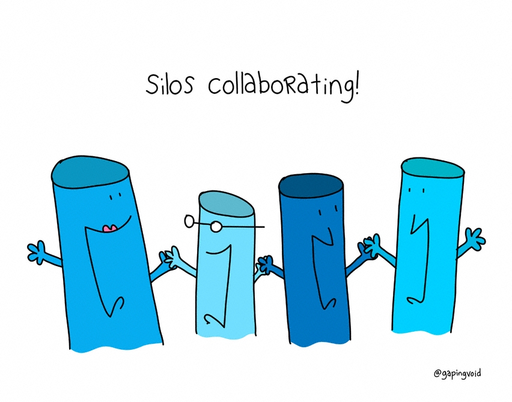
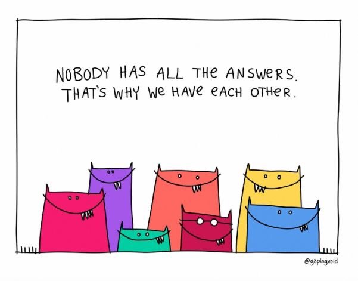

# Teams

### Learning Objectives

* Explain the impact of a team vs. individual

Fundamentally, modern software development begins with the team and the culture. Our journey continues as we look at building the team’s cross functional foundation.

## It's a Team
Modern technologies have underscored how strongly success relies on working in teams -- we collaborate with colleagues via Zoom, ship partially completed mechanical parts from one side of the world to the other, and leverage the expertise of team members in various timezones and states. A key part of modern life is the idea that we’re stronger in numbers than we are as individuals.   

In contrast, the DoD tends to attribute success to a single person in leadership, often glossing over the team that made that success possible. The key, and the thing that should always be leveraged, is strength in numbers.  

We can collaborate and elevate our team’s successes, and focus on building that connection. Some of the most innovative companies consistently demonstrate the strength of teams and teamwork.

## Debunking the myth of individual performance:

> “Individual performance is not just overrated. In organizations, it simply doesn’t exist.
Why? Because value, or results never arise from individual action, but from interaction between various individuals or within teams.” Pflaeging, Niels. Organize for Complexity: How to Get Life Back into Work to Build the High-Performance Organization. BetaCodex Publishing, 2014.  

**Here are two examples within the acquisitions role that demonstrate this fact**

### !callout-info
## Scenario 1: An approved acquisition strategy
A **Program Manager** is responsible for developing and defending an acquisition strategy. However, no acquisition strategy is complete without:  

* **Engineering** informing the technical approach and strategy
* **Contracting** providing a contracting strategy
* **Cost** creating a cost estimate
* **Finance** to validate the availability of funding     
* Other individuals are often consulted as well- multiple roles are required to support execution of any acquisition strategy  
### !end-callout

### !callout-info
## Scenario 2: Awarding a contract
A **Contracting Officer** is responsible for ensuring a contract is executed and adheres to the Federal Acquisition Regulation (FAR). But a contract is not developed in a vacuum, especially a contract for digital services. Even when a singular role is responsible for implementation, they are supported by a whole team:
* **Program Managers** support the overall development of the Statement of Objectives (SOO). Performance Work Statement (PWS), Statement of Work (SOW)
* **Engineers (Technical Advisors)** review proposals and determine if contractors can meet technical requirements
* **Financial Managers** provide funding information and transfer funding to contract
* **Lawyers** review to ensure compliance with the law     

### !end-callout

<!-- >>>>>>>>>>>>>>>>>>>>>> BEGIN CHALLENGE >>>>>>>>>>>>>>>>>>>>>> -->
<!-- Replace everything in square brackets [] and remove brackets  -->

### !challenge

* type: checkbox
* id: c5d9bdb4-0f22-40d4-866b-6e2de7e06c72
* title: Roles
<!-- * points: [1] (optional, the number of points for scoring as a checkpoint) -->
<!-- * topics: [python, pandas] (optional the topics for analyzing points) -->

##### !question

In scenarios like those described above, which role(s) have you played? Think more broadly than just “what title did you have”. Think instead about which responsibilities you undertook during this particular project.

##### !end-question

##### !options

* Engineer
* Program Manager
* Contracting Officer
* Financial Manager
* Lawyer
* Contracting
* Cost
* Other

##### !end-options

##### !answer

* *

##### !end-answer

<!-- other optional sections -->
<!-- !hint - !end-hint (markdown, hidden, students click to view) -->
<!-- !rubric - !end-rubric (markdown, instructors can see while scoring a checkpoint) -->
<!-- !explanation - !end-explanation (markdown, students can see after answering correctly) -->

### !end-challenge

<!-- ======================= END CHALLENGE ======================= -->
<!-- >>>>>>>>>>>>>>>>>>>>>> BEGIN CHALLENGE >>>>>>>>>>>>>>>>>>>>>> -->
<!-- Replace everything in square brackets [] and remove brackets  -->

### !challenge

* type: paragraph
* id: 0124fe05-d3be-43e6-b638-f899bac5fdd2
* title: Your experience
<!-- * points: [1] (optional, the number of points for scoring as a checkpoint) -->
<!-- * topics: [python, pandas] (optional the topics for analyzing points) -->

##### !question

In your experience, what has been inefficient or frustrating about working in this way?

##### !end-question

##### !placeholder

(Note: We’ll be compiling and discussing your responses during the in-person session. Eventually, we’ll use your responses to tune this course more finely to your experience.)

##### !end-placeholder

<!-- other optional sections -->
<!-- !hint - !end-hint (markdown, hidden, students click to view) -->
<!-- !rubric - !end-rubric (markdown, instructors can see while scoring a checkpoint) -->
<!-- !explanation - !end-explanation (markdown, students can see after answering correctly) -->

### !end-challenge

<!-- ======================= END CHALLENGE ======================= -->

## Individual vs Collective Competence and the Multi-Disciplinary Approach
The knowledge of one individual will almost never outstrip the collective knowledge of a team- this is individual versus collective competence, and another reason why a team-centered mindset is so important. This is much like the old saying “two heads are better than one”, but taken a step further. Everyone brings equity to the table. As an aside, this course provides multiple opportunities to connect with other students in your cohort (class), and build a collective community for acquisition innovators such as yourself.    

Never undervalue the personal connections you have built throughout your career- they still prove to be one of our most valuable tools in our toolkit.

This course is structured to be multi-disciplinary. As a result, students will also benefit by increasing diversity within their networks. The power of different perspectives brought to light in cross-functional teams creates space for unique ways to solve our most challenging problems.

### !callout-danger
## Watch out for
* When working in a team, look out for Groupthink -- it can always sneak in when working with teams. Soliciting input from individuals with similar backgrounds can lead to groupthink or lack of innovation.   

* The DoD tries to address this with rotations, both civilian and military. This approach does help to mitigate, but no problem is perfectly solved -- and you can personally find new problem solving techniques too.
### !end-callout

> “We learned that individual expertise did not distinguish people as high performers. What distinguished high performers were larger and more diversified personal networks.”
	Cross, Robe et. Al., The Hidden Power of Social Networks. Boston: Harvard Business
School Press, 2004.   

## The Power of the team
There is a study that really exemplifies the power of a team. Conducted by Harvard professors Linda Hill, Greg Brandeau, Emily Truelove, and Kent Lineback, the study looks at companies that not only innovate, but continually innovate to remain competitive in an ever-changing environment. Companies examined in the study include Pixar, Google, Volkswagen, eBay and more, representing businesses as diverse as film-making, e-commerce, auto-manufacturing, professional services, high-tech, and luxury goods.

The message is this:
> “Look beneath the surface of almost anything produced by an organization that is new, useful, and even moderately complex and you’ll almost certainly discover it came from multiple hands, not the genius of some solitary inventor. Innovation is a ‘team sport.’”
Hill, Linda A., Greg Brandeau, Emily Truelove, and Kent Lineback. Collective Genius: The Art and Practice of Leading Innovation. Boston: Harvard Business Review Press, 2014.

It's not a mistake that we spend time discussing the power of a team- recognizing individuals but also reinforcing the team that elevated your achievement is essential.   

One of the best examples of this in any industry is Pixar, and their generous bestowal of credits at the end of every film-- “each of Pixar’s first dozen or so movies named everyone in the organization who played a role, including the cooks in the company cafeteria and babies born to employees during production.” While including family members may be extreme, this is a powerful concept- highlighting your team reinforces everyone’s contribution and provides personal validation.

## A final note
Even if you’re not sold on the idea that recognizing teams is a good thing, the very real fact is that you cannot do your job as an acquisitions professional without working with other people. Read that again. It is literally impossible. Therefore, the most important thing you can do is learn to make this teamwork process as efficient and optimized as possible.

In the next lesson, we’ll talk about a strategy to accomplish that.

<!-- >>>>>>>>>>>>>>>>>>>>>> BEGIN CHALLENGE >>>>>>>>>>>>>>>>>>>>>> -->
<!-- Replace everything in square brackets [] and remove brackets  -->

### !challenge

* type: multiple-choice
* id: a2f132a3-1ca8-45bf-b9bf-44f8e4cb7742
* title: Market-leading companies
<!-- * points: [1] (optional, the number of points for scoring as a checkpoint) -->
<!-- * topics: [python, pandas] (optional the topics for analyzing points) -->

##### !question

The software companies that dominate the market (Apple, Google, Facebook, Microsoft, Amazon, etc.) have scaled successfully because of several factors, some more complicated than others. But this lesson argues that the main reason they've gotten ahead and stayed ahead is:

##### !end-question

##### !options

* Their ability to conduct user interviews
* Their ability to continually innovate
* Their ability to single out an outstanding individual to run a project
* Their acquisitions team structure

##### !end-options

##### !answer

* Their ability to continually innovate

##### !end-answer

<!-- other optional sections -->
<!-- !hint - !end-hint (markdown, hidden, students click to view) -->
<!-- !rubric - !end-rubric (markdown, instructors can see while scoring a checkpoint) -->
<!-- !explanation - !end-explanation (markdown, students can see after answering correctly) -->

### !end-challenge

<!-- ======================= END CHALLENGE ======================= -->

<!-- >>>>>>>>>>>>>>>>>>>>>> BEGIN CHALLENGE >>>>>>>>>>>>>>>>>>>>>> -->
<!-- Replace everything in square brackets [] and remove brackets  -->

### !challenge

* type: multiple-choice
* id: be8b83a8-18e3-41d8-aee8-21a344d691ad
* title: Time commitment
<!-- * points: [1] (optional, the number of points for scoring as a checkpoint) -->
<!-- * topics: [python, pandas] (optional the topics for analyzing points) -->

##### !question

How much time did you spend on this lesson?

##### !end-question

##### !options

* Less than 10 minutes
* 11-20 minutes
* 21-40 minutes
* 41-60 minutes
* 60 - 80 minutes
* More than 80 minutes

##### !end-options

##### !answer

* *

##### !end-answer

<!-- other optional sections -->
<!-- !hint - !end-hint (markdown, hidden, students click to view) -->
<!-- !rubric - !end-rubric (markdown, instructors can see while scoring a checkpoint) -->
<!-- !explanation - !end-explanation (markdown, students can see after answering correctly) -->

### !end-challenge

<!-- ======================= END CHALLENGE ======================= -->
