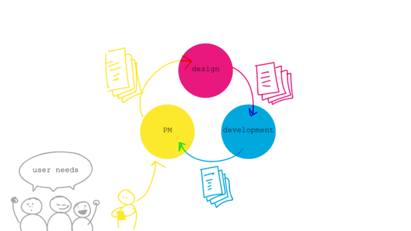
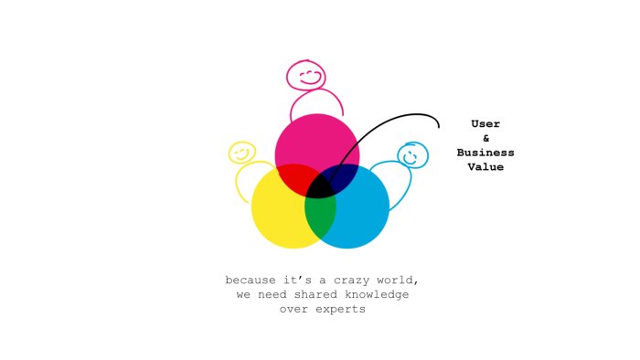
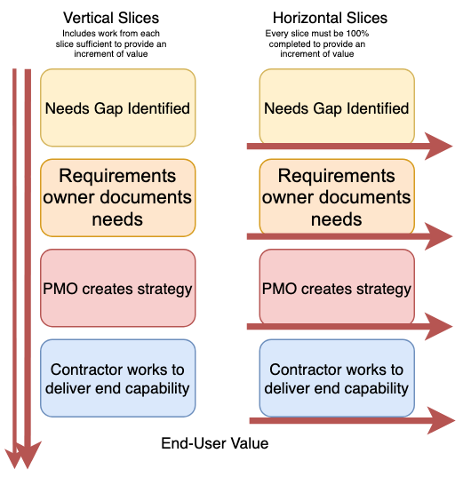

# Balanced Teams

### Learning Objectives:
* Define a balanced team
* Explain how a balanced team approach can improve potential results of acquisitions organizations

## Traditional vs. Balanced Teams and Acquisitions

For the purpose of this lesson, let’s continue with the theme of software, and look at each concept through the lens of building a software product.

### Traditional Team Approach in Software
Here's what a traditional team approach to software development looks like (this may look familiar...)  

1. A product manager representing the team solicits the user and carefully documents the user’s immediate requirements. When everything is documented, the product manager turns over the list to the team’s designer.
2. The designer takes the list and meticulously works their creative process, then turns the design over to the software developer(s).
3. After many iterations and tests, the software developer(s) creates the digital product.
4. The product is released, with much fanfare from the team- only to find out this isn’t what the user wanted. The customer immediately begins submitting change requests, and states that the current product is unusable. Or, worse still- something better has been fielded during the cycle-time of multiple tradeoffs.

### Traditional Team Approach in DoD Acquisitions

Similarly, this traditional approach is often seen in the DoD acquisitions process:  

1. A capability gap is identified through user (warfighter) needs, alignment with long-term strategy, or a vision of the DoD as articulated in the National Defense Strategy.  
2. The requirements owner carefully documents everything required to meet the capability gap, from technical specs to design constraints.  
3. Once documented, vetted, and approved, the Capability Development Document (CDD) is handed over to the Program Management Office (PMO).
4. The PMO interprets the requirements and creates the strategy and supporting contracts required to deliver capability.
5. The contract(s) is completed and awarded so that the Contractor can begin building the solution as envisioned.
6. The contractor(s) use technical specifications within the contract to deliver the end capability.  

### !callout-danger
## Takeaways
* This process takes multiple years. When it is finally delivered, the user immediately requests changes, or the scenario has changed and the capability is no longer valuable.    

* The traditional team approach requires intense time and effort, emphasizing the process and high expectations. On the contrary, working in a more balanced team setting can greatly diminish these hazards.
### !end-callout

## Balanced Team Approach
The increasing speed and demand of technology requires fostering communication and collaboration within a team, and balanced teams provide context and shared responsibility for delivering valuable capability. Instead of one individual at a time completing portions of the process, the team constantly communicates and collaborates to create shared understanding and ownership.  

Let’s revisit our two scenarios, this time with Balanced Teams.

### Balanced Team Approach in Software

1. _Product managers_ foster ongoing dialogue with users, continually soliciting their needs and liaising with designers and software developers. The team prioritizes, documents, and begins work on initial requirements at a high-level, while more user needs are continually solicited.
2. Concurrently, _designers_ begin their initial offerings in collaboration with product managers and software developers. Early designs are implemented while working through any new requests.
3. Finally, _software developers_ create small increments of the digital product, validating each release with the product manager, designer, and users.

### Balanced Team Approach in DoD settings
Here's what that looks like in the DoD acquisitions setting:  

1. _Requirements owners_ establish communication with product users (warfighters), while engaging PMO support to understand the problem and providing user access to contractor developing products.
2. _PMOs_ develop a contract with a flexible Statement of Work, allowing more refined requirements to be added as needed. The contract(s) is then completed and awarded.
3. _Contractors_ work in constant communication with the PMO to refine requirements and deliver end capabilities in small increments. This contract may still last multiple years, but each piece is delivered and vetted in months, if not weeks or days.   

### !callout-success
## Takaways
* Using this approach reduces downtime and ensures development is exactly what the user wants.

* Fewer change requests occur post-release, and the product is able to move more quickly with changing user needs.
### !end-callout

<!-- >>>>>>>>>>>>>>>>>>>>>> BEGIN CHALLENGE >>>>>>>>>>>>>>>>>>>>>> -->
<!-- Replace everything in square brackets [] and remove brackets  -->

### !challenge

* type: paragraph
* id: 3eda7e99-ca7e-4e10-9089-c998ebe7f469
* title: Speed in acquisitions
<!-- * points: [1] (optional, the number of points for scoring as a checkpoint) -->
<!-- * topics: [python, pandas] (optional the topics for analyzing points) -->

##### !question

Balanced Teams allow teams to adapt more quickly than the traditional way. Why is quick adaptation essential in DoD digital acquisition settings?

##### !end-question

##### !placeholder

Write your answer here.

##### !end-placeholder

##### !explanation
There are lots of ways to answer this question, but the overall key points are that Technology evolves at a rapid pace. In order to stay relevant, the DoD needs to be able to match the pace of commercial software. Having a nimble team de-risks the acquisition strategy because they can adapt quickly to constantly changing requirements.   
##### !end-explanation

<!-- other optional sections -->
<!-- !hint - !end-hint (markdown, hidden, students click to view) -->
<!-- !rubric - !end-rubric (markdown, instructors can see while scoring a checkpoint) -->
<!-- !explanation - !end-explanation (markdown, students can see after answering correctly) -->

### !end-challenge

<!-- ======================= END CHALLENGE ======================= -->

## “Thin-Slicing” Workflows

Sometimes, people use the term “thin-slice” to describe the way an efficient balanced team works together. Here’s the metaphor:  

The traditional team model is based on functional units. Even if you have perfect results, user value is not delivered until all the steps have been addressed- 100% of each functional unit must be completed before moving to the next step. In graph form, the functional units appear as thick, horizontal “slices”.  

The fastest way to deliver some value to the end user is to do just enough at every level of the process- the customer gets immediate value, and other team members can contribute. This “thin vertical slice” mentality allows you to deliver some increment of value sooner, and allows more pivot flexibility as more information is discovered.   

The DoD’s successes are due to collaboration across programs, services, and our allies. History has proven that the DoD is most successful when it works together. When we approach work as a balanced team, we can match the speed that technology demands.

<!-- >>>>>>>>>>>>>>>>>>>>>> BEGIN CHALLENGE >>>>>>>>>>>>>>>>>>>>>> -->
<!-- Replace everything in square brackets [] and remove brackets  -->

### !challenge

* type: checkbox
* id: df05c9b1-c51a-4d2e-bab4-0d4f27b6d682
* title: Benefits of balanced teams
<!-- * points: [1] (optional, the number of points for scoring as a checkpoint) -->
<!-- * topics: [python, pandas] (optional the topics for analyzing points) -->

##### !question

What are the benefits of a using balanced team vs. a functional team in the Acquisitions setting?

##### !end-question

##### !options

* Provides shared context and understanding across the team
* Creates shared responsibility
* Consistency -- a balanced team is always is composed of a product manager, designer and software engineer
* Collaboration and communication allows ability to better meet pace of technology change or changing environment 	

##### !end-options

##### !answer

* Provides shared context and understanding across the team
* Creates shared responsibility
* Collaboration and communication allows ability to better meet pace of technology change or changing environment

##### !end-answer

<!-- other optional sections -->
<!-- !hint - !end-hint (markdown, hidden, students click to view) -->
<!-- !rubric - !end-rubric (markdown, instructors can see while scoring a checkpoint) -->
<!-- !explanation - !end-explanation (markdown, students can see after answering correctly) -->

### !end-challenge

<!-- ======================= END CHALLENGE ======================= -->

<!-- >>>>>>>>>>>>>>>>>>>>>> BEGIN CHALLENGE >>>>>>>>>>>>>>>>>>>>>> -->
<!-- Replace everything in square brackets [] and remove brackets  -->

### !challenge

* type: paragraph
* id: 44eac199-abdf-4156-bbd3-3591abc7f84f
* title: Blockers
<!-- * points: [1] (optional, the number of points for scoring as a checkpoint) -->
<!-- * topics: [python, pandas] (optional the topics for analyzing points) -->

##### !question

There are some very real blockers to working in a balanced team delivering thin-slice value. Some of these have to do with the way a traditional workplace is organized, some are related to traditional ideas of “deliverables” etc.

List a few blockers that you’ve experienced or can imagine working in this new way.

##### !end-question

##### !placeholder
(Note: We’ll be compiling and discussing your responses during the in-person session. Eventually, we’ll use your responses to tune this course more finely to your experience.)

##### !end-placeholder

<!-- other optional sections -->
<!-- !hint - !end-hint (markdown, hidden, students click to view) -->
<!-- !rubric - !end-rubric (markdown, instructors can see while scoring a checkpoint) -->
<!-- !explanation - !end-explanation (markdown, students can see after answering correctly) -->

### !end-challenge

<!-- ======================= END CHALLENGE ======================= -->

<!-- >>>>>>>>>>>>>>>>>>>>>> BEGIN CHALLENGE >>>>>>>>>>>>>>>>>>>>>> -->
<!-- Replace everything in square brackets [] and remove brackets  -->

### !challenge

* type: multiple-choice
* id: bc2f8b656-c04a-45fd-9ffe-f65edc80d9df
* title: Time commitment
<!-- * points: [1] (optional, the number of points for scoring as a checkpoint) -->
<!-- * topics: [python, pandas] (optional the topics for analyzing points) -->

##### !question

How much time did you spend on this lesson?

##### !end-question

##### !options

* Less than 10 minutes
* 11-20 minutes
* 21-40 minutes
* 41-60 minutes
* 60 - 80 minutes
* More than 80 minutes

##### !end-options

##### !answer

* *

##### !end-answer

<!-- other optional sections -->
<!-- !hint - !end-hint (markdown, hidden, students click to view) -->
<!-- !rubric - !end-rubric (markdown, instructors can see while scoring a checkpoint) -->
<!-- !explanation - !end-explanation (markdown, students can see after answering correctly) -->

### !end-challenge

<!-- ======================= END CHALLENGE ======================= -->

Image Source: [Why Balanced Teams Work Better Together: Pam Dineva](https://medium.com/product-labs/why-balanced-teams-work-better-together-b29085536733#:~:text=What%20is%20Balanced%20Team%3F,as%20a%20source%20for%20innovation)
