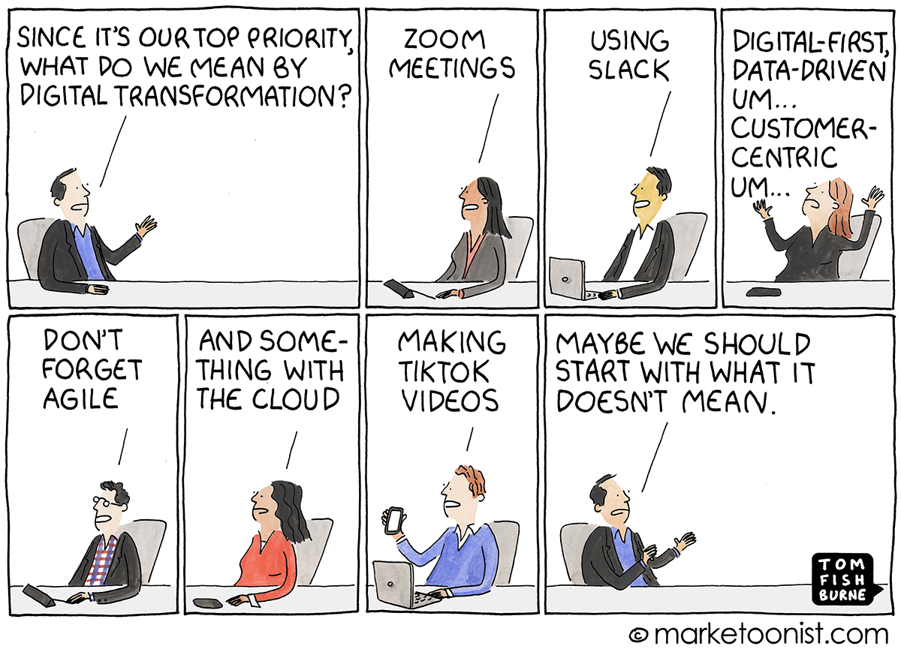
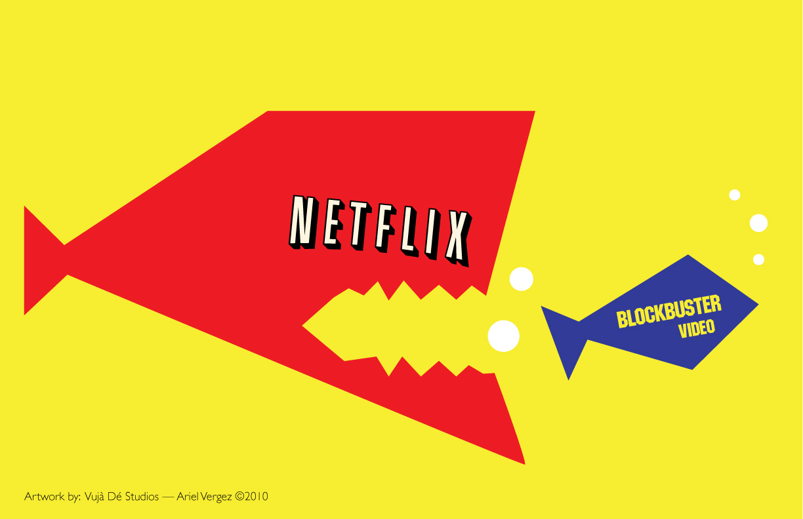
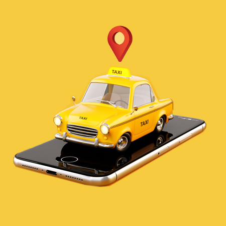
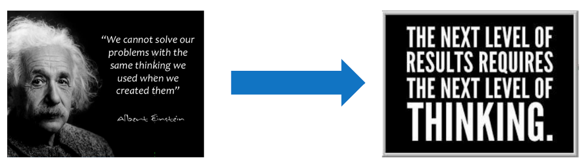

# Digital Disruption and Transformation

### Learning Objectives:
* Define ‘digital transformation’ and ‘disruption’
* List ways the DoD can open the door to transformation
* Analyze your own experience with disruption

## Introduction
How many times have you experienced this type of meeting?  

To move beyond buzzword bingo, we need to first create a common lexicon:

|         |           |  |
| ------------- |---------------| ------|
| **Digital Transformation**   | Anything from IT modernization, cloud computing, to digital optimization, to the invention of new digital business models (Gartner, 2020).           |
| **Digital Disruption**   | An effect that changes the fundamental expectation and behavior of a culture, market, industry or process, caused by or expressed through digital capabilities channels or assets (Gartner, 2020).|
| **Agile Mindset**   | “Having an Agile mindset is about adding value from the outset and working collaboratively with others by sharing the same common goal and using a continuous improvement process (inspection, adaptation, and transparency)”[Medium, 2019](https://medium.com/agile-it/agile-mindset-starts-with-you-568b544e17ae).|  

Globally, digital technology is changing the rules of successful business. As companies develop their business strategies for succeeding in the digital world, applying information and technology to meet the needs of digitally connected customers, digital skills become even more important. Existing companies must adapt, or risk no longer being competitive- this is a risk the DoD is unable to take.   

## The Agile Mindset

Disruption and transformation are not dirty words. As fundamental shifts in business, technology, and society, disruption and transformation require us to have an Agile mindset to take root.  

An Agile mindset is not being fast of mind- rather, an Agile mindset is an attitude that supports the Agile working environment through core values. Agile values include:  

|         |           |  |
| ------------- |---------------| ------|
| **Respect**   | Working with your team as a collective; united in your vision, purpose, and goal.          |
| **Collaboration**   | As mentioned above, you need to have the ability to work with your team and carry empathy for Your customers’ needs. This is what drives the value in the work you do.          |
| **Learning Cycles**   | Responding to change means learning from failure and making improvements to do better next time.          |
| **Improvement**   | The output from learning cycles is your ability to learn from what works and what has not. And adapt from what you learned to improve, first slowly and then at a rapid pace. The beauty is that it is organic — because it is intrinsic to the process, you improve in small incremental changes..          |
| **Accountability**   | By working as a team and taking pride in ownership of the work you, you become accountable to yourself and the team.          |
| **Being Adaptive**   | This is about focusing on delivering value, and the ability to adapt to change.”          |  

An Agile mindset is a crucial quality for adapting to organizational and market change. Further into release one, we will share more information on Agile mindsets and approaches. For now, remember that an Agile mindset allows your team to:   

* Efficiently and effectively respond to feedback from customers and stakeholders
* Be open to experimenting with different technologies using new digital channels
* Continuously learn through their problems and failures.   
### !callout-info
## Note
Later in this course, Agile methodologies and terminology will be the focus- for now, these definitions will help you through the rest of this section.
### !end-callout

### Technology, Transformation, & Disrupting Business Models

The course of advancing technology has accelerated greatly in the past forty years or so. While there have always been advancements in technology that changed the scope of human experience, looking at the graph it is easy to see that from around 1980 onward the tech space has experienced unprecedented growth. Innovation and technology used to be marked by centuries, decades, but is now happening constantly.  

<!-- >>>>>>>>>>>>>>>>>>>>>> BEGIN CHALLENGE >>>>>>>>>>>>>>>>>>>>>> -->
<!-- Replace everything in square brackets [] and remove brackets  -->

### !challenge

* type: paragraph
* id: d810f784-0b0c-4eed-9bfc-477f1f082cd4
* title: Your experience with disruption
<!-- * points: [1] (optional, the number of points for scoring as a checkpoint) -->
<!-- * topics: [python, pandas] (optional the topics for analyzing points) -->

##### !question

A. Describe your transformation or disruption experience within the DoD.  

B. Did it succeed or fail? Either way, what did you learn?  

##### !end-question

##### !placeholder
(Note: We’ll be compiling and discussing your responses during the in-person session. Eventually, we’ll use your responses to tune this course more finely to your experience.)

A.

B.

##### !end-placeholder

<!-- other optional sections -->
<!-- !hint - !end-hint (markdown, hidden, students click to view) -->
<!-- !rubric - !end-rubric (markdown, instructors can see while scoring a checkpoint) -->
<!-- !explanation - !end-explanation (markdown, students can see after answering correctly) -->

### !end-challenge

<!-- ======================= END CHALLENGE ======================= -->

### Digital Disruption in the wild
Digital transformations often mistakenly focus on technology alone- but **focusing solely on technology will not ensure success.** It's important that we also adopt an Agile mindset, and foster a culture where people work effectively and creatively by leveraging digital technology. An Agile mindset allows teams to efficiently and effectively respond to feedback, and be open to experimenting with different processes, approaches and technologies. This will then position us to thrive in the digital age, responding and adapting quickly to the challenges we face.   

**In-the-wild example 1: Blockbuster and Netflix**

In the ‘80s and ‘90s, the video store was a staple. Weekend nights could be spent wandering the aisles of VHS tapes and later DVDs, looking for the best Saturday night movie. One of the biggest video store chains in the business was Blockbuster. But all that changed when Netflix started as a subscription-based Internet mail order retailer, renting DVDs.  

Consumer trends quickly changed toward renting from home and enjoying the convenience of movies direct to your doorstep, and Netflix saw the further potential of streaming video via the Internet. They developed a subscription-based online streaming service and went on to become _very_ successful. ‘Netflix and chill’ started trending, and even though Blockbuster eventually introduced its own streaming and mail order services, it was too little, too late.

Netflix was innovative and Agile - at the heart of its success was a digital disruption. By changing consumer habits, competition from the new Netflix business model dealt Blockbuster a major blow. The rest is history- Blockbuster filed for bankruptcy in 2010.    

These days, you can still visit a Blockbuster- but only if you want to visit [Bend, Oregon](https://www.tripadvisor.com/Attraction_Review-g51766-d17653327-Reviews-The_Last_Blockbuster-Bend_Central_Oregon_Oregon.html).

<!-- >>>>>>>>>>>>>>>>>>>>>> BEGIN CHALLENGE >>>>>>>>>>>>>>>>>>>>>> -->
<!-- Replace everything in square brackets [] and remove brackets  -->

### !challenge

* type: checkbox
* id: 1127e5a3-8a71-408c-ac70-c48dc39ec765
* title: The Netflix disruption
<!-- * points: [1] (optional, the number of points for scoring as a checkpoint) -->
<!-- * topics: [python, pandas] (optional the topics for analyzing points) -->

##### !question

Disruption happens when a company recognizes an unsolved problem in the market -- a way that existing companies are failing to properly address user issues. Which problem(s) in the market did Netflix identify that Blockbuster wasn’t currently filling?

##### !end-question

##### !options

* People wanted to see things that weren’t popular enough to warrant stocking in a brick and mortar location
* People wanted movies when they wanted them, with no waiting
* People didn’t want to pay late fees
* People wanted to be able to search and select movies from the comfort of their home or where they have Internet access
* People wanted to have movies sent to them automatically without needing to search in a store each time

##### !end-options

##### !answer

* People wanted to see things that weren’t popular enough to warrant stocking in a brick and mortar location
* People wanted movies when they wanted them, with no waiting
* People didn’t want to pay late fees
* People wanted to be able to search and select movies from the comfort of their home or where they have Internet access
* People wanted to have movies sent to them automatically without needing to search in a store each time

##### !end-answer

##### !explanation-correct:
Who would have thought there were so many unmet needs in the video-rental space? Netflix did. And Blockbuster didn't. And you see how _that_ turned out...   
##### !end-explanation

##### !explanation-not: People wanted to see things that weren’t popular enough to warrant stocking in a brick and mortar location
Remember: Most Blockbusters wouldn't stock movies that aren't likely to be rented by a large number of people.   
##### !end-explanation

##### !explanation-not: People wanted movies when they wanted them, with no waiting
Don't forget: The expectation of immediate gratification is pretty huge in modern commerce.   
##### !end-explanation

##### !explanation-not: People wanted to have movies sent to them automatically without needing to search in a store each time
The idea of the "queue" has been hugely influential. People like the idea of sparingly going through the search process, but being able to set up a series of things that can be sent to them.   
##### !end-explanation

##### !explanation-not: People didn’t want to pay late fees
For the same reason that libraries are currently doing away with late fees, Netflix also decided to eliminate them.
##### !end-explanation

##### !explanation-not: People wanted to be able to search and select movies from the comfort of their home or where they have Internet access
Turns out peoples' preferred method of selecting movies is late at night in their pajamas on the couch.
##### !end-explanation
<!-- other optional sections -->
<!-- !hint - !end-hint (markdown, hidden, students click to view) -->
<!-- !rubric - !end-rubric (markdown, instructors can see while scoring a checkpoint) -->
<!-- !explanation - !end-explanation (markdown, students can see after answering correctly) -->

### !end-challenge

<!-- ======================= END CHALLENGE ======================= -->

Remember: **focusing solely on technology will not ensure success.** We need to break down the artificial silos and remember the missions we serve do not care about our internal processes. Real digital transformation requires a collective effort to collaborate and adapt to new ways of working.

### In-the-wild example 2: Taxi and Uber

In 2009, taxi services worked almost exactly the same as taxis in 1960 (and sometimes in similar numbers). With slightly different operating models in every city, taxis often had reputations for being slow to arrive, hard to flag down, cryptic in their pricing, and touting a cash only policy. The transportation industry wasn’t necessarily in need of disruption, but it was ripe for it.  

Uber originally launched as an online ride hailing service in San Francisco featuring private luxury cars. Digital disruption occurred as they expanded their service and footprint beyond a single city and customer base. Uber drivers were marketed as just a few taps away on a smartphone, with upfront prices payable by credit or digital wallet. Similar to Netflix, Uber’s disruption modified consumer behaviors. By simply offering an innovative approach, Uber has forever left its mark on history as an innovative disruptor.  

<!-- >>>>>>>>>>>>>>>>>>>>>> BEGIN CHALLENGE >>>>>>>>>>>>>>>>>>>>>> -->
<!-- Replace everything in square brackets [] and remove brackets  -->

### !challenge

* type: multiple-choice
* id: 46759f10-9a2d-41b6-a13a-f991dd67aeeb
* title: Disruption?
<!-- * points: [1] (optional, the number of points for scoring as a checkpoint) -->
<!-- * topics: [python, pandas] (optional the topics for analyzing points) -->

##### !question

A company is looking at new ways to become more efficient at what they currently do. Is
this digital transformation?

##### !end-question

##### !options

* Yes
* No

##### !end-options

##### !answer

* No

##### !end-answer

<!-- other optional sections -->
<!-- !hint - !end-hint (markdown, hidden, students click to view) -->
<!-- !rubric - !end-rubric (markdown, instructors can see while scoring a checkpoint) -->
<!-- !explanation - !end-explanation (markdown, students can see after answering correctly) -->

### !end-challenge
<!-- ======================= END CHALLENGE ======================= -->

<!-- >>>>>>>>>>>>>>>>>>>>>> BEGIN CHALLENGE >>>>>>>>>>>>>>>>>>>>>> -->
<!-- Replace everything in square brackets [] and remove brackets  -->

### !challenge

* type: paragraph
* id: 14cadbd3-dc49-4863-984d-6b04b3939e0d
* title: Recognizing a threat
<!-- * points: [1] (optional, the number of points for scoring as a checkpoint) -->
<!-- * topics: [python, pandas] (optional the topics for analyzing points) -->

##### !question

List a few reasons that incumbent companies (like Taxi or Blockbuster) might not recognize the threat of disrupting competition.

##### !end-question

##### !placeholder

List reasons here

##### !end-placeholder

<!-- other optional sections -->
<!-- !hint - !end-hint (markdown, hidden, students click to view) -->
<!-- !rubric - !end-rubric (markdown, instructors can see while scoring a checkpoint) -->
<!-- !explanation - !end-explanation (markdown, students can see after answering correctly) -->

##### !explanation
There are many reasons a company might not realize a threat until it's too late. Maybe they don't believe in the new company's business model (in Uber's case, many believed that people would not be willing to get into personal cars and would feel more comfortable with taxis).

Or, maybe their current market share or dominance provides false comfort. But this is a lagging indicator, and doesn't always reflect current opinion or situations.
##### !end-explanation

### !end-challenge

<!-- ======================= END CHALLENGE ======================= -->
### In-the-wild example 2: The ‘Knowledge of London’ Test

Technology not only disrupts business models, it also disrupts professional knowledge. To become a London taxi driver, drivers must pass the test known as the Knowledge of London.   

This test has been called “the hardest test, of any kind, in the world. It’s rigors have been likened to those required to earn a degree in law or medicine.” London taxi drivers not only have to have every street in London memorized, they also need to adjust routes based on time-of-day, and deep knowledge of the city’s top chefs and their restaurant locations, among other things.

Using a taxi service and relying on the driver’s knowledge used to be the norm- but now, Google Maps/Waze/Apple Maps can provide the same information and more. What makes more sense, studying for three years or more to understand the most effective ways of navigating London...or plugging it into your phone?  

These three examples are just a few of the many faces of business that have been changed by technology. So now you see- we must always be open and willing to learn, because technology will continue to disrupt skill sets and open up opportunities.  

### Digital Transformation and you
To successfully transform the organization, we need the DoD’s buy-in. Let’s look at some tangible ways _you_, regardless of rank or grade, can become part of the digital transformation movement.  

> The global threat landscape is constantly evolving and remaining competitive and modernizing our digital environment for great power competition is imperative for the Department of Defense. We must act now to secure our future.
-- DoD Digital Modernization Strategy FY19-23  

### !callout-success
## For transformation to happen, we need everyone to:  
* Feel connected to the mission, have a sense of purpose, and feel empowered to act on that purpose
* See the value in reducing the “not invented here” mentality, and collaborate with shared platforms and code to “build once, use many times”
* Choose and manage technology effectively in service of its larger mission
* Put our users, mission, business, and security at the forefront and commit to practicing continuous improvement
* Begin a journey of mastering relevant skills; moving beyond shallow adoption of modern principals
### !end-callout

Successfully achieving these goals will depend on a culture of openness and inclusivity, fostering a customer-first environment, and a keen focus on individual accountability. Perhaps more importantly, these goals require an Agile mindset.   

To ensure our adversaries do not disrupt us, we should think about disruption as an opportunity -- but this will require us to see how we typically do business in a new way.

<!-- >>>>>>>>>>>>>>>>>>>>>> BEGIN CHALLENGE >>>>>>>>>>>>>>>>>>>>>> -->
<!-- Replace everything in square brackets [] and remove brackets  -->

**Still think that business as usual is good enough?** Take 3 minutes to watch this:
<iframe width="560" height="315" src="https://www.youtube.com/embed/ystdF6jN7hc" frameborder="0" allow="accelerometer; autoplay; clipboard-write; encrypted-media; gyroscope; picture-in-picture" allowfullscreen></iframe>
### !challenge

* type: paragraph
* id: 070ab097-c1f2-4b4c-bb4e-1ab078136b54
* title: Transformation
<!-- * points: [1] (optional, the number of points for scoring as a checkpoint) -->
<!-- * topics: [python, pandas] (optional the topics for analyzing points) -->

##### !question

A. Per the video, how will you discover new opportunities during one of the most transformational times in recorded history?  

B. What are ways we can transcend technology (referenced in the video above)?

##### !end-question

##### !placeholder
(Note: We’ll be compiling and discussing your responses during the in-person session. Eventually, we’ll use your responses to tune this course more finely to your experience.)

A.

B.

##### !end-placeholder

<!-- other optional sections -->
<!-- !hint - !end-hint (markdown, hidden, students click to view) -->
<!-- !rubric - !end-rubric (markdown, instructors can see while scoring a checkpoint) -->
<!-- !explanation - !end-explanation (markdown, students can see after answering correctly) -->

### !end-challenge

<!-- ======================= END CHALLENGE ======================= -->

<!-- >>>>>>>>>>>>>>>>>>>>>> BEGIN CHALLENGE >>>>>>>>>>>>>>>>>>>>>> -->
<!-- Replace everything in square brackets [] and remove brackets  -->

### !challenge

* type: multiple-choice
* id: 69cc35dc-0718-4f98-8cdc-cb2afd363ac0
* title: Time commitment
<!-- * points: [1] (optional, the number of points for scoring as a checkpoint) -->
<!-- * topics: [python, pandas] (optional the topics for analyzing points) -->

##### !question

How much time did you spend on this lesson?

##### !end-question

##### !options

* Less than 10 minutes
* 11-20 minutes
* 21-40 minutes
* 41-60 minutes
* 60 - 80 minutes
* More than 80 minutes

##### !end-options

##### !answer

* *

##### !end-answer

<!-- other optional sections -->
<!-- !hint - !end-hint (markdown, hidden, students click to view) -->
<!-- !rubric - !end-rubric (markdown, instructors can see while scoring a checkpoint) -->
<!-- !explanation - !end-explanation (markdown, students can see after answering correctly) -->

### !end-challenge

<!-- ======================= END CHALLENGE ======================= -->
