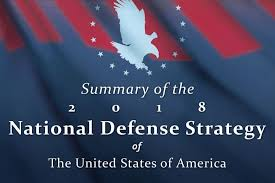
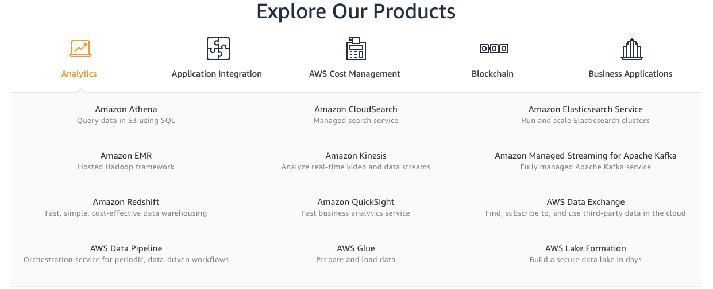

# Tech Like I’m Ten Part 1: The Cloud

### Learning Objectives
* Define the Cloud
* Explain how Cloud services directly relate to acquisitions, and your role as acquisitions professional

This lesson will teach you just enough to be effective with a few essential IT terms and concepts. You should be comfortable discussing them, but a deep understanding of how they work is not required.   

## Why You Need to Know These Technologies

### The Critical Role of Acquisitions

It has become clear the speed at which technology is changing commercial industry. Netflix, AirBnB, and Uber are all companies that began as start-ups, and greatly affected industries that had not been challenged in the past. As stated in that National Defense Strategy (NDS):   

> “New commercial technology will change society and, ultimately, the character of war. The fact that many technology developments will come from the commercial sector means that state competitors and non-state actors will have access to them, a fact that risks eroding the conventional overmatch to which our Nation has grown accustomed.”  

We cannot integrate technology into our business and weapon systems without you, the acquisition professional. Your role is critical- you ensure that our program, contracting, and financial strategies can meet the pace of technology change.   

Developing a shared language and basic understanding of these concepts is essential to begin leveraging new ways for your program to deliver.     

<iframe src="https://player.vimeo.com/video/477804847" width="640" height="360" frameborder="0" allow="autoplay; fullscreen" allowfullscreen></iframe>

### The Cloud as an Enabling Technology
The Cloud has greatly decreased the price of entry, for anyone. In the past, what has hampered so many ideas or start-ups is the up-front investment cost.   

Take Netflix, for example. In the beginning Netflix offered a limited selection of movies and TV shows, and their primary source of revenue was their rent-by-mail alternative. Though the vision of their CEO was always an on-demand video streaming service, the company still had to remain profitable and prove feasibility. They waited over 10 years to offer on-demand streaming, because videos take up a huge amount of data storage, and the required computing bandwidth (Internet reliability) to match DVD-quality is enormous. So you see, it is not only the idea that matters, but also the timing--both in terms of consumers and supporting technology.    

In order to take their business to the Cloud, Netflix fielded their on-demand service with the Cloud provider **Amazon Web Services** (AWS) to provide the necessary Cloud services. This allowed Netflix to:  

* **Avoid** making large, up-front investments in terms of time and money.
 * AWS provided the data storage (servers) and redundancies (multiple storage locations) required to host high-quality video streaming, a major expense and delay had Netflix chosen to build it themselves.
* **Focus** on their unique on-demand video streaming service and cultivating a large library of options.  

### !callout-warning
## Remember
In the video, we note that one of the dangers of the Cloud is its similarity to an electricity bill -  you pay for it if you “leave it on”. You may also know that the Cloud can be costly even if usage is properly managed.    

Despite that, there are massive benefits to using the Cloud.

* Cost savings for you, the acquisitions professional
* Fast and secure acquisition of technology
### !end-callout

<!-- >>>>>>>>>>>>>>>>>>>>>> BEGIN CHALLENGE >>>>>>>>>>>>>>>>>>>>>> -->
<!-- Replace everything in square brackets [] and remove brackets  -->

### !challenge

* type: checkbox
* id: b14cfe1f-d661-4463-8dfd-177aab90d764
* title: Cloud benefits
<!-- * points: [1] (optional, the number of points for scoring as a checkpoint) -->
<!-- * topics: [python, pandas] (optional the topics for analyzing points) -->

##### !question

There are many reasons using an externally-managed Cloud service that can be accessed from anywhere is beneficial for a company. Which of the following are reasons a business might begin utilizing the Cloud?

##### !end-question

##### !options

* Securely access software apps and data from anywhere, using any computer or mobile device.
* Increased Reliability - Most providers deliver system uptimes of 99.99% or more because their infrastructure is architected with greater resiliency and redundancy than many small and medium-sized businesses could otherwise afford to ensure.
* Increased Flexibility - Quickly and easily add, remove and change new software applications and users.
* Reduced network infrastructure capital purchases, such as servers.
* Cloud infrastructure is inherently more secure

##### !end-options

##### !answer

* Securely access software apps and data from anywhere, using any computer or mobile device.
* Increased Reliability - Most providers deliver system uptimes of 99.99% or more because their infrastructure is architected with greater resiliency and redundancy than many small and medium-sized businesses could otherwise afford to ensure.
* Increased Flexibility - Quickly and easily add, remove and change new software applications and users.
* Reduced network infrastructure capital purchases, such as servers.

##### !end-answer

<!-- other optional sections -->
<!-- !hint - !end-hint (markdown, hidden, students click to view) -->
<!-- !rubric - !end-rubric (markdown, instructors can see while scoring a checkpoint) -->
<!-- !explanation - !end-explanation (markdown, students can see after answering correctly) -->

### !end-challenge

<!-- ======================= END CHALLENGE ======================= -->

<!-- >>>>>>>>>>>>>>>>>>>>>> BEGIN CHALLENGE >>>>>>>>>>>>>>>>>>>>>> -->
<!-- Replace everything in square brackets [] and remove brackets  -->

### Public, Private and Hybrid Cloud
For Netflix, the Cloud (in their case AWS) provided them with the opportunity to focus on their service/product, while providing reliable infrastructure and availability to support the demand of their customers.  

Hearing that example, the question becomes “Is it advantageous to purely use a Cloud service provider?”  

The answer: **it depends**. Though this may be frustrating, you will see it often as we move through the course. Individual situations differ, and adapting to what is best for each situation is much more effective than attempting a one-size fits all approach.

Companies often transition their whole product and subsequent data to a Cloud provider during their digital transformation. After this transition, the question becomes “What is most cost effective- solely using a Cloud service provider (_public Cloud_), building our own data centers (_private Cloud_), or leveraging both a public and a private Cloud (_hybrid model_)?”     

### !callout-success
## Industry examples of pubic, private, hybrid cloud
* **Netflix (Public Cloud)**: Netflix views their use of AWS as an operating cost. The advantage here is their ability to focus on other aspects of their streaming service, namely investing in their own original content. This is increasingly important with mounting competition from Disney+, Peacock, Hulu, and more.  

 “For Netflix, there is no competitive advantage for building their own data centers. In 2016, Netflix went live in 130 countries simultaneously. This would have been impossible if Netflix had to build their own data centers around the world. Netflix can pay AWS for its services because Netflix is getting paid too.” _Hoff, Todd. Explain the Cloud like I'm 10: Learn the Inner-Secrets behind Kindle, Netflix, AWS, Apple, Facebook, and Google. Possibility Outpost Inc., 2017._  

* **Dropbox (Private Cloud):** Dropbox started in AWS. Dropbox was able to build their platform and acquire customers without spending precious time and resources on building out infrastructure. AWS managed the infrastructure for them. Now Dropbox is established. They have a user base. They know what product they want to build. Which is why Dropbox is moving out of AWS. Dropbox is building out their own custom infrastructure that is tailored to their exact needs. This will reduce costs, increase profitability and allow them to better serve their customers (Hoff, 2017).  

* **BestBuy (Hybrid):** Like many companies, BestBuy expanded their online presence out of necessity, and for 11 months out of the year can predict their infrastructure requirements (data storage, availability, etc). But November is a different story- the surge in buying due to Black Friday creates an astronomical infrastructure need in comparison to the 11-month average. The Cloud offers elasticity on-demand, i.e. it expands and contracts to meet the need based on consumption. Because BestBuy cannot afford to lose the sales associated with Black Friday and the holiday season, they have chosen a hybrid option, paying only for services that support their surge in business, instead of for servers that will sit idle for months.  
### !end-callout

These examples show that often when a decision is made to optimize costs, the first step is migration to the Cloud. The DoD encounters scenarios where all of these models are appropriate. Disconnected operations, when either access to the Internet or other data/communication networks are not accessible and only on-premise data and applications can support operations, is a scenario where on-site infrastructure will likely be required. That means developing DoD mission critical applications to leverage Cloud services.  

<!-- >>>>>>>>>>>>>>>>>>>>>> BEGIN CHALLENGE >>>>>>>>>>>>>>>>>>>>>> -->
<!-- Replace everything in square brackets [] and remove brackets  -->
### !challenge

* type: checkbox
* id: b124f094-0395-4b22-9441-cf64de909e13
* title: Cloud drawbacks
<!-- * points: [1] (optional, the number of points for scoring as a checkpoint) -->
<!-- * topics: [python, pandas] (optional the topics for analyzing points) -->

##### !question

Which of the following are reasons to use an On-Prem solution instead of a Cloud solution?

##### !end-question

##### !options

* The business already owns its own infrastructure, and maintenance costs are low
* The business uses specific hardware configurations for specific systems
* The Cloud is a fad
* The users may not have a reliable access to the Internet

##### !end-options

##### !answer

* The business already owns its own infrastructure, and maintenance costs are low
* The business uses specific hardware configurations for specific systems
* The users may not have a reliable access to the Internet

##### !end-answer

##### !explanation: The Cloud is a fad
The Cloud is a well-documentated, reliable solution that's been tested over the course of many years.  
##### !end-explanation

##### !explanation-not: The business uses specific hardware configurations for specific systems
Remember, if your systems are super custom, you might not be able to find an existing Cloud provider that can work with your configurations.  
##### !end-explanation
<!-- other optional sections -->
<!-- !hint - !end-hint (markdown, hidden, students click to view) -->
<!-- !rubric - !end-rubric (markdown, instructors can see while scoring a checkpoint) -->
<!-- !explanation - !end-explanation (markdown, students can see after answering correctly) -->

### !end-challenge

<!-- ======================= END CHALLENGE ======================= -->

### !challenge

* type: multiple-choice
* id: 8758f163-754b-4cf9-88af-092a088db4d0
* title: Disconnected operations
<!-- * points: [1] (optional, the number of points for scoring as a checkpoint) -->
<!-- * topics: [python, pandas] (optional the topics for analyzing points) -->

##### !question

Disconnected operations is a requirement for all DoD missions.

##### !end-question

##### !options

* True
* False
##### !end-options

##### !answer

* False

##### !end-answer

##### !explanation
Disconnected operations is a requirement for certain missions, but is not a blanket requirement for all DoD capabilities. The video highlighted ways that back-up and redundancy can be designed into applications. Examples: Google Maps and Kindle.  

* Google Maps – When you use Google Maps to get to your destination, the route loads to your phone in smaller pieces from the Cloud, who has access to a map, billions of data points, and also your location using GPS coordinates. The small pieces of data and their flow to your device allow you to continue to navigate even if you experience any intermittent connectivity issue.
* Amazon Kindle – Kindle is an application where you can see a device vs. see Cloud storage options. A Kindle allows you to download content based on available storage and/or when you have an Internet connection. The application tracks purchases, and shows the purchased digital product (e.g. book) on your Cloud library with an option of downloading to individual devices.

##### !end-explanation

<!-- other optional sections -->
<!-- !hint - !end-hint (markdown, hidden, students click to view) -->
<!-- !rubric - !end-rubric (markdown, instructors can see while scoring a checkpoint) -->
<!-- !explanation - !end-explanation (markdown, students can see after answering correctly) -->

### !end-challenge

<!-- ======================= END CHALLENGE ======================= -->

<!-- >>>>>>>>>>>>>>>>>>>>>> BEGIN CHALLENGE >>>>>>>>>>>>>>>>>>>>>> -->
<!-- Replace everything in square brackets [] and remove brackets  -->

### !challenge

* type: checkbox
* id: 01e84740-9c3c-47b2-94eb-0258d101dec3
* title: Cloud and utilities
<!-- * points: [1] (optional, the number of points for scoring as a checkpoint) -->
<!-- * topics: [python, pandas] (optional the topics for analyzing points) -->

##### !question

Earlier in the lesson, we used the analogy of a Utility Provider to describe certain aspects of the Cloud. Which of the following describes how this analogy relates to the Cloud?

##### !end-question

##### !options

* In both utilities and Cloud services, the purchaser is responsible for keeping their services maintained and functioning
* In both utilities and in Cloud services, you pay for what you use (i.e. consumption model)
* Both Cloud services and utilities require the purchaser to make large investments in hardware
* Both allow you to turn on or off your services at any time

##### !end-options

##### !answer

* In both utilities and in Cloud services, you pay for what you use (i.e. consumption model)
* Both allow you to turn on or off your services at any time

##### !end-answer

<!-- other optional sections -->
<!-- !hint - !end-hint (markdown, hidden, students click to view) -->
<!-- !rubric - !end-rubric (markdown, instructors can see while scoring a checkpoint) -->
<!-- !explanation - !end-explanation (markdown, students can see after answering correctly) -->

### !end-challenge

<!-- ======================= END CHALLENGE ======================= -->

<!-- >>>>>>>>>>>>>>>>>>>>>> BEGIN CHALLENGE >>>>>>>>>>>>>>>>>>>>>> -->
<!-- Replace everything in square brackets [] and remove brackets  -->

### !challenge

* type: short-answer
* id: 3d037394-3842-4170-91c8-2799ba7035c0
* title: AWS
<!-- * points: [1] (optional, the number of points for scoring as a checkpoint) -->
<!-- * topics: [python, pandas] (optional the topics for analyzing points) -->

##### !question

This is an image of the AWS products page. Each of these products is an example of a Cloud `_______` (fill in the blank)

##### !end-question

##### !placeholder

##### !end-placeholder

##### !answer

/[Ss]ervice/

##### !end-answer

##### !hint

##### !end-hint

<!-- other optional sections -->
<!-- !hint - !end-hint (markdown, hidden, students click to view) -->
<!-- !rubric - !end-rubric (markdown, instructors can see while scoring a checkpoint) -->
<!-- !explanation - !end-explanation (markdown, students can see after answering correctly) -->

### !end-challenge

<!-- ======================= END CHALLENGE ======================= -->

<!-- >>>>>>>>>>>>>>>>>>>>>> BEGIN CHALLENGE >>>>>>>>>>>>>>>>>>>>>> -->
<!-- Replace everything in square brackets [] and remove brackets  -->

### !challenge

* type: multiple-choice
* id: 64972750-200d-4323-bd03-abc3c727f994
* title: Purchasing products
<!-- * points: [1] (optional, the number of points for scoring as a checkpoint) -->
<!-- * topics: [python, pandas] (optional the topics for analyzing points) -->

##### !question

In the above AWS example, a company needs to purchase a full suite of products in order to use an AWS product.

##### !end-question

##### !options

* True
* False

##### !end-options

##### !answer

* False

##### !end-answer

##### !explanation
You could purchase one or many services from this provider, and pair that with one or many services from another provider, etc.

##### !end-explanation

<!-- other optional sections -->
<!-- !hint - !end-hint (markdown, hidden, students click to view) -->
<!-- !rubric - !end-rubric (markdown, instructors can see while scoring a checkpoint) -->
<!-- !explanation - !end-explanation (markdown, students can see after answering correctly) -->

### !end-challenge

<!-- ======================= END CHALLENGE ======================= -->

<!-- >>>>>>>>>>>>>>>>>>>>>> BEGIN CHALLENGE >>>>>>>>>>>>>>>>>>>>>> -->
<!-- Replace everything in square brackets [] and remove brackets  -->

### !challenge

* type: multiple-choice
* id: 0d430017-f531-4103-a32e-ae81f2110175
* title: Time commitment
<!-- * points: [1] (optional, the number of points for scoring as a checkpoint) -->
<!-- * topics: [python, pandas] (optional the topics for analyzing points) -->

##### !question

How much time did you spend on this lesson?

##### !end-question

##### !options

* Less than 10 minutes
* 11-20 minutes
* 21-40 minutes
* 41-60 minutes
* 60 - 80 minutes
* More than 80 minutes

##### !end-options

##### !answer

* *

##### !end-answer

<!-- other optional sections -->
<!-- !hint - !end-hint (markdown, hidden, students click to view) -->
<!-- !rubric - !end-rubric (markdown, instructors can see while scoring a checkpoint) -->
<!-- !explanation - !end-explanation (markdown, students can see after answering correctly) -->

### !end-challenge

<!-- ======================= END CHALLENGE ======================= -->
