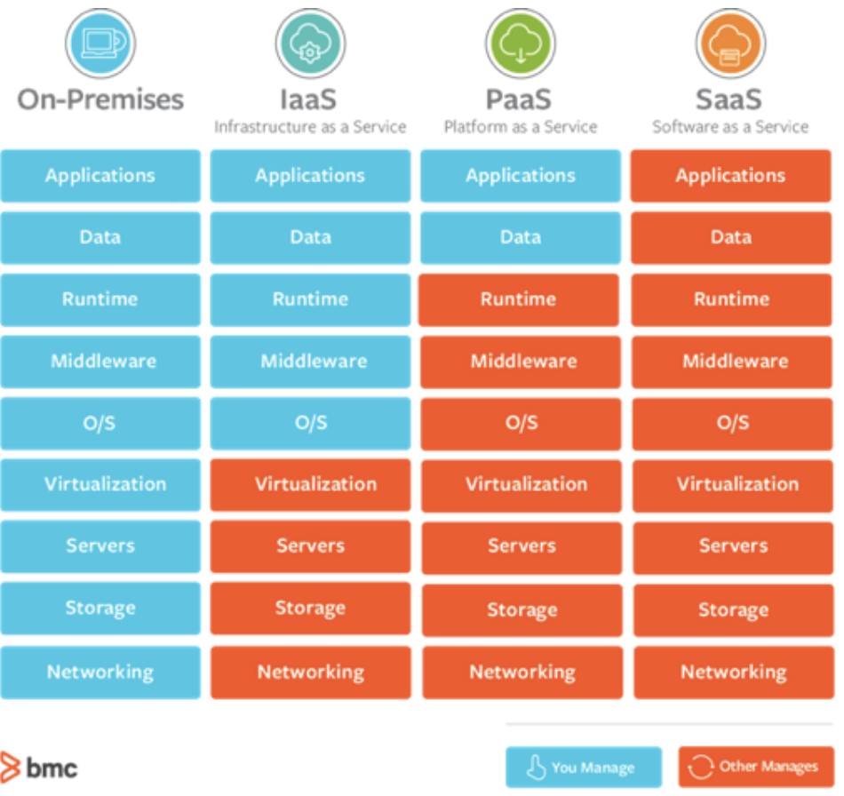
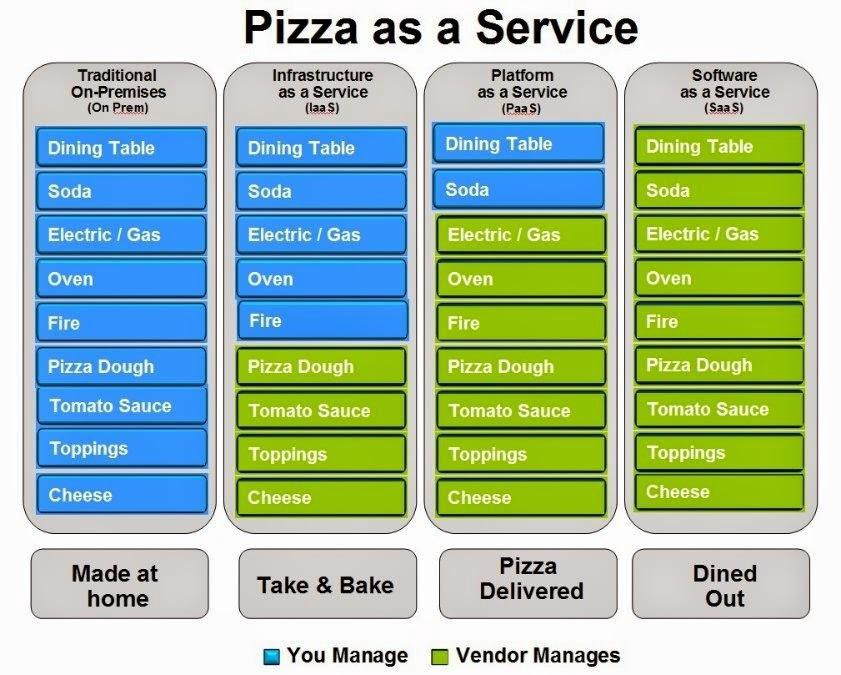
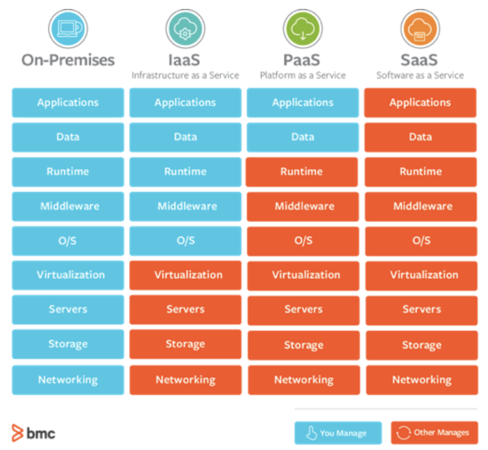

# Tech Like I’m Ten Part 2: Software Delivery and Services

### Learning Objectives
* Explain the difference between IaaS, PaaS, and SaaS
* Explain how technologies work together to provide a user-facing application

This lesson will provide foundational concepts for the underlying infrastructure associated with cloud computing.

<iframe src="https://player.vimeo.com/video/478309349" width="640" height="360" frameborder="0" allow="autoplay; fullscreen" allowfullscreen></iframe>

In the video and in the previous lesson, the Cloud is an example of an enabling technology. But as we progress toward Lesson 1.B, processes and practices that surround technology such as Agile and DevSecOps are also contributing factors.

## Speed, Risk, and Security
Our end goal is acquiring digital products that support mission needs. In the digital world, there are common concerns about how programs deliver software:  

* **Slow and Secure**: This might seem like the best way, but there are a few issues:
 * We are not delivering at the speed of relevance, and
 * When implemented correctly, the best form of security is speed
* **Fast and Risky**: This might also seem like the best way given previous statements, but there are issues here too:
 * Speed on its own does not ensure security
 * Code that isn’t tested and therefore secure creates more vulnerabilities
  * **Example:** Code that is buggy or doesnt work, or code that does not meet the mission need

There’s actually a third way: the way all successful modern tech companies are working is Fast and Secure. The DoD’s goal is to begin working in this way also.

The DoD’s path to fast and safe is paved by leveraging a few technologies, including:
* the Cloud
* Kubernetes
* DevSecOps principles

## As-A-Service
Recall this graphic from the video. This graphic shows what you manage [in blue] vs. what a service provider (contractor) manages [in orange].

Again, what's best for your mission is based on your unique scenario. As the BestBuy example showed, using multiple columns or “stacks” is not apparent to the end-user (customer). Whether the developer leveraged an on-premise stack or an AWS stack, the BestBuy website is all the customer sees.

Still a little confused? Here’s that same diagram, using the relatable example of Pizza As A Service:

Just like traditional ‘as-a-service’ products, the columns to the far left are entirely or mostly managed by you. As you move right, the balance shifts toward vendor management.

To the left, Made at Home is the least expensive as far as ingredient costs, but the most expensive in terms of time and financial commitment because you’re doing all the work to make the pizza. As you move right, the ingredient costs become more expensive because someone else does the work to make the pizza, but there’s less time commitment because someone else is serving you. There are always trade-offs, and just as many of us choose to dine out or order delivery when our time is spent in other areas, the same can be true for the underlying infrastructure of a mission capability. The other important note is you can have the flexibility to change depending, it does not have to be a permanent decision to pick a column “stack”. While a simple example, it helps make the costs relatable.

### !callout-warning
## Reasons for each service type
In a nutshell, here’s what each of these service types is best at:  
 s
* **IaaS** provides you with maximum flexibility when it comes to hosting custom-built apps, as well as providing a general data center for data storage.
* **PaaS** is most often built on top of an IaaS platform, reducing the need for system administration and allowing you to focus on app development instead of infrastructure management. As the graphic above demonstrates, management requirements between IaaS and SaaS layers are still heavy- when a PaaS is managed for you, that requirement is reduced because it’s a predefined layer from the provider.
* **SaaS** offers ready-to-use, out-of-the-box solutions that meet a particular business need (such as website or email). Most modern SaaS platforms are built on IaaS or PaaS platforms.
### !end-callout

### !callout-info
## Distinguishing between IaaS, PaaS, SaaS
Note: an easy way to distinguish SaaS from IaaS and PaaS: SaaS are customer-facing, thus can be used without additional development. Examples: Microsoft 365, Gmail, Quickbooks online, Slack, Mattermost, etc.
Hint: In the DoD, you can look to SaaS solutions to solve problems that are solved in the commercial space. For example “how do I keep track of inventory” is a problem that commercial companies have solved, so there are probably existing SaaS solutions. On the other hand, you would not look to a SaaS solution for something that’s DoD-specific (such as planning missions).
### !end-callout

When considering ‘as-a-service’ products during the procurement process, there are certain questions that should be asked- this lesson outlines some of the decisions that need to be made, and how to start forming the questions. There isn’t one single person who should be asking these questions; rather, the whole team is responsible. Technology is changing, and new offerings are constantly emerging in ‘-as-a-service’ models- having flexibility is key, and there are many ways you can implement via contracting and overall strategies.

<!-- >>>>>>>>>>>>>>>>>>>>>> BEGIN CHALLENGE >>>>>>>>>>>>>>>>>>>>>> -->
<!-- Replace everything in square brackets [] and remove brackets  -->

### !challenge

* type: multiple-choice
* id: 9488d6cd-6046-4962-987f-787bc2dd289a
* title: * -as-a-service 1
<!-- * points: [1] (optional, the number of points for scoring as a checkpoint) -->
<!-- * topics: [python, pandas] (optional the topics for analyzing points) -->

##### !question

AWS EC2 provides virtual servers for companies who want to host cloud-based applications. Users only pay for the usage of the servers, saving them the cost (and associated ongoing maintenance) of investing in physical hardware. Your company builds your own applications on top of AWS ECs.

##### !end-question

##### !options

* IaaS
* PaaS
* SaaS

##### !end-options

##### !answer

* IaaS

##### !end-answer

<!-- other optional sections -->
<!-- !hint - !end-hint (markdown, hidden, students click to view) -->
<!-- !rubric - !end-rubric (markdown, instructors can see while scoring a checkpoint) -->
<!-- !explanation - !end-explanation (markdown, students can see after answering correctly) -->

### !end-challenge

<!-- ======================= END CHALLENGE ======================= -->

<!-- >>>>>>>>>>>>>>>>>>>>>> BEGIN CHALLENGE >>>>>>>>>>>>>>>>>>>>>> -->
<!-- Replace everything in square brackets [] and remove brackets  -->

### !challenge

* type: multiple-choice
* id: 65a92314-4517-4de0-9a1e-fead6f76984b
* title: * -as-a-service 2
<!-- * points: [1] (optional, the number of points for scoring as a checkpoint) -->
<!-- * topics: [python, pandas] (optional the topics for analyzing points) -->

##### !question

Salesforce is a program that your employees log in to via device. The Salesforce company manages everything related to the application, including security, availability, storage, and performance.  

##### !end-question

##### !options

* IaaS
* PaaS
* SaaS

##### !end-options

##### !answer

* SaaS

##### !end-answer

<!-- other optional sections -->
<!-- !hint - !end-hint (markdown, hidden, students click to view) -->
<!-- !rubric - !end-rubric (markdown, instructors can see while scoring a checkpoint) -->
<!-- !explanation - !end-explanation (markdown, students can see after answering correctly) -->

### !end-challenge

<!-- ======================= END CHALLENGE ======================= -->

<!-- >>>>>>>>>>>>>>>>>>>>>> BEGIN CHALLENGE >>>>>>>>>>>>>>>>>>>>>> -->
<!-- Replace everything in square brackets [] and remove brackets  -->

### !challenge

* type: multiple-choice
* id: d52e2020-4894-4112-9505-47b5fec25b63
* title: Procurement 1
<!-- * points: [1] (optional, the number of points for scoring as a checkpoint) -->
<!-- * topics: [python, pandas] (optional the topics for analyzing points) -->

##### !question

Your government Program Management Office (PMO) is interested in shifting application development and deployment from strictly contractor led, to a government led operation. The PMO is interested in developing their own software applications internally, and deploying the software applications to numerous geographically dispersed locations around the globe. You have expertise on your team for application development but not in servers or data security.   

Based on the information above, what recommendation would you make for underlying infrastructure

##### !end-question

##### !options

* Either PaaS or IaaS
* Fully on-Prem
* SaaS

##### !end-options

##### !answer

* Either PaaS or IaaS

##### !end-answer

<!-- other optional sections -->
<!-- !hint - !end-hint (markdown, hidden, students click to view) -->
<!-- !rubric - !end-rubric (markdown, instructors can see while scoring a checkpoint) -->
<!-- !explanation - !end-explanation (markdown, students can see after answering correctly) -->

#### !hint
In this scenario, the applications will _not_ be created/maintained by the Cloud Service Provider -- or rather, the PMO wants the applications to be managed internally. This means that SaaS is not the correct choice.
#### !end-hint

#### !hint
In order to move something fully on-prem, you'd need to have expertise on your team for the entire infrastructure. In this case, your team has expertise in some, but not all, of what's need to run on-prem.
#### !end-hint

### !end-challenge

<!-- ======================= END CHALLENGE ======================= -->

<!-- >>>>>>>>>>>>>>>>>>>>>> BEGIN CHALLENGE >>>>>>>>>>>>>>>>>>>>>> -->
<!-- Replace everything in square brackets [] and remove brackets  -->

### !challenge

* type: paragraph
* id: aeac046f-36a3-4630-8765-1570d67c2328
* title: Procurement 2
<!-- * points: [1] (optional, the number of points for scoring as a checkpoint) -->
<!-- * topics: [python, pandas] (optional the topics for analyzing points) -->

##### !question

You need to discuss with your PMO to find out whether it's possible for a cloud provider to provide certain services or if the PMO must manage the services instead. What areas of this scenario should you explore further with your PMO? Use the image below as a resource.

##### !end-question

##### !placeholder
Your answer here
##### !end-placeholder

#### !explanation
As a starting point, you'll want to understand what sort of resources/expertise you have available.
#### !end-explanation

### !end-challenge

<!-- >>>>>>>>>>>>>>>>>>>>>> BEGIN CHALLENGE >>>>>>>>>>>>>>>>>>>>>> -->
<!-- Replace everything in square brackets [] and remove brackets  -->

### !challenge

* type: paragraph
* id: e760cf53-7eb3-4fe3-9c56-be084233af25
* title: PaaS
<!-- * points: [1] (optional, the number of points for scoring as a checkpoint) -->
<!-- * topics: [python, pandas] (optional the topics for analyzing points) -->

##### !question

Recall from the video that PaaS can be defined two ways:

* Definition 1: PaaS in its pre-packaged and managed form. Provided as a service by a company – you do not have the ability to influence individual services. Using the term ‘PaaS Companies’ in your favorite search engine will provide a current list of providers.

* Definition 2: PaaS in its “building blocks” form. You define and build out the applications capability –  numerous service options are provided to meet requirements under PaaS. The individual building blocks can be offered by companies for a cost, or free through the open source community.  

Provide an example of when each scenario could be advantageous within the DoD. How does your program address PaaS (if it does)?
##### !end-question

##### !placeholder
Note: We’ll be compiling and discussing your responses during the in-person session. Eventually, we’ll use your responses to tune this course more finely to your experience.

##### !end-placeholder

<!-- other optional sections -->
<!-- !hint - !end-hint (markdown, hidden, students click to view) -->
<!-- !rubric - !end-rubric (markdown, instructors can see while scoring a checkpoint) -->
<!-- !explanation - !end-explanation (markdown, students can see after answering correctly) -->

### !end-challenge

<!-- ======================= END CHALLENGE ======================= -->

<!-- ======================= END CHALLENGE ======================= -->

<!-- >>>>>>>>>>>>>>>>>>>>>> BEGIN CHALLENGE >>>>>>>>>>>>>>>>>>>>>> -->
<!-- Replace everything in square brackets [] and remove brackets  -->

### !challenge

* type: multiple-choice
* id: 56498d28-9ee2-4102-b5a3-d84ffea6c95d
* title: Time commitment
<!-- * points: [1] (optional, the number of points for scoring as a checkpoint) -->
<!-- * topics: [python, pandas] (optional the topics for analyzing points) -->

##### !question

How much time did you spend on this lesson?

##### !end-question

##### !options

* Less than 10 minutes
* 11-20 minutes
* 21-40 minutes
* 41-60 minutes
* 60 - 80 minutes
* More than 80 minutes

##### !end-options

##### !answer

* *

##### !end-answer

<!-- other optional sections -->
<!-- !hint - !end-hint (markdown, hidden, students click to view) -->
<!-- !rubric - !end-rubric (markdown, instructors can see while scoring a checkpoint) -->
<!-- !explanation - !end-explanation (markdown, students can see after answering correctly) -->

### !end-challenge

<!-- ======================= END CHALLENGE ======================= -->
