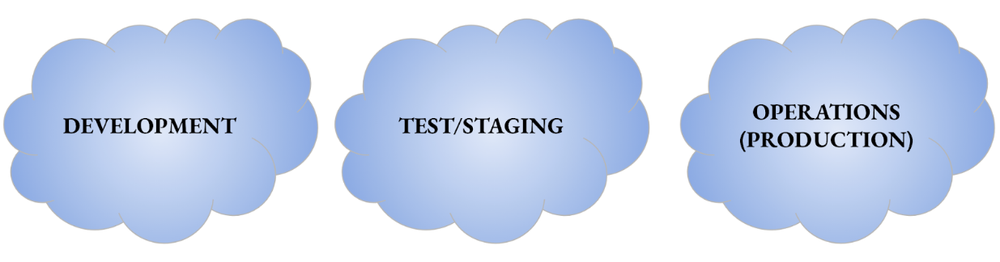

# Tech Like I'm Ten Part 3: Environments

### Learning Objectives
* Differentiate between Development, Test/Stage, and Operations (Production) environments

<iframe src="https://player.vimeo.com/video/478221654" width="640" height="360" frameborder="0" allow="autoplay; fullscreen" allowfullscreen></iframe>  
In acquisitions, we adhere to a program life cycle encompassing development, testing, production and sustainment. Software follows a similar process, but moves through each stage at a much faster pace. We will explain why code should be pushed through environments in small batches, but for now it is important to understand that software can move through the environments at a pace of minutes/days/weeks/months, driven by user need.  

## Environments
Similar to the program life cycle, the software life cycle moves through environments, and each successive environment provides necessary infrastructure. In most cases, when working a software-intensive program, you will be supporting the ability for an application or a suite of applications to be developed and deployed for your mission needs. **In each environment, each layer is present**--IaaS, PaaS, SaaS.

### Development
Development Environments are where developers first build new features and test and deploy their code. Bugs found are mitigated before re-deploying their code for further testing. The process is iterated (repeated) until the code is ready for the next stage of testing.   

This environment is often called a “sandbox”, i.e. somewhere for developers to literally play around with the code in a safe, structured environment, without compromising existing applications or code. Multiple teams can test new and/or different software that can be augmented to mission specific products, and can include software that is not currently available in operations.

### Test/Staging:
A Test/Staging Environment is an environment for testing that seeks to mirror an actual production environment as closely as possible, and may connect to other production services and data, such as databases. Because the Test/Staging environment matches the Production [Operations] environment, teams can test how new changes might affect the Operations environment without risk (teams never, ever test in Operation environments).   

Quick ways people tend to describe the Staging environment:
* “Staging is where you deploy code before you deploy to Operations”
* “Staging is like Operations but without customers.”   

Staging reduces the risk of pushing “bad code”, which is code with bugs or that is susceptible to breaking. Staging does not catch everything, but it greatly reduces risk.   

### Operations (Production)
This code is being utilized by the end user, the software has passed numerous tests in both development and staging and now supports the mission. This is where the end user is seeing and experiencing the existing application and any new changes made by developers.

### !callout-warning
## Note
In Industry, “Operations” is referred to as “Production”. In the DoD and acquisitions, we’ll refer to this as Operations to avoid confusion.
### !end-callout

A final thing to know about Environments is that each environment has testing incorporated. We will discuss why in the next lesson.

<!-- >>>>>>>>>>>>>>>>>>>>>> BEGIN CHALLENGE >>>>>>>>>>>>>>>>>>>>>> -->
<!-- Replace everything in square brackets [] and remove brackets  -->

### !challenge

* type: checkbox
* id: 3e48cd45-7a48-4e23-b9c9-e03c074f7175
* title: End-users
<!-- * points: [1] (optional, the number of points for scoring as a checkpoint) -->
<!-- * topics: [python, pandas] (optional the topics for analyzing points) -->

##### !question

Which of these environments are seen by end users?

##### !end-question

##### !options

* Development
* Stage/Testing
* Operations

##### !end-options

##### !answer

* Operations

##### !end-answer

<!-- other optional sections -->
<!-- !hint - !end-hint (markdown, hidden, students click to view) -->
<!-- !rubric - !end-rubric (markdown, instructors can see while scoring a checkpoint) -->
<!-- !explanation - !end-explanation (markdown, students can see after answering correctly) -->

### !end-challenge

<!-- ======================= END CHALLENGE ======================= -->

### Environments for procurement

Each environment -- Development, Staging, and Operations-- can have a different composition. How is this possible? PaaS.   

A consistent PaaS provides opportunities to leverage cloud providers such as AWS or Azure as the IaaS in Development, and on-premise hardware as the IaaS in Operations.  

### !callout-info
## Procurement
Reasons a Program Office may want to have different environment compositions include:
* Disconnected operations drives the use of on-premise hardware in operations
* Security level or impact level of operational environment (i.e. classified vs. unclassified). Several examples exist of programs that first develop in unclassified and use the environments to move up security levels. Why is this useful?
 * **Talent** - It can be a difficult and lengthy processes to acquire cleared personnel (both organic and contractor) that have necessary clearances and skills
 * **Additional Products** - utilizing an unclassified Development environment can provide the opportunity to test different software products (SaaS and open-source) prior to the lengthy certification process
### !end-callout

It’s important to understand up front that technical decisions often impact the overall contracting strategy, and we should be flexible (Agile) when meeting operational user needs.

**Bottom Line:** Environments provide a way to reduce the risk of pushing code that does not work to the end user. We will describe how in further detail in the next lesson.

Understanding the composition of the environments helps to prepare the overall acquisition and contracting strategy.

<!-- >>>>>>>>>>>>>>>>>>>>>> BEGIN CHALLENGE >>>>>>>>>>>>>>>>>>>>>> -->
<!-- Replace everything in square brackets [] and remove brackets  -->

### !challenge

* type: checkbox
* id: fcf03803-e238-4eaf-b367-598246977de8
* title: Environments and Procurement
<!-- * points: [1] (optional, the number of points for scoring as a checkpoint) -->
<!-- * topics: [python, pandas] (optional the topics for analyzing points) -->

##### !question

Which of these environments could acquisitions teams procure solutions for?

##### !end-question

##### !options

* Development
* Stage/Testing
* Operations

##### !end-options

##### !answer

* Development
* Stage/Testing
* Operations

##### !end-answer

<!-- other optional sections -->
<!-- !hint - !end-hint (markdown, hidden, students click to view) -->
<!-- !rubric - !end-rubric (markdown, instructors can see while scoring a checkpoint) -->
<!-- !explanation - !end-explanation (markdown, students can see after answering correctly) -->

### !end-challenge

<!-- ======================= END CHALLENGE ======================= -->

<!-- >>>>>>>>>>>>>>>>>>>>>> BEGIN CHALLENGE >>>>>>>>>>>>>>>>>>>>>> -->
<!-- Replace everything in square brackets [] and remove brackets  -->

### !challenge

* type: checkbox
* id: c761b785-7cc4-41dc-860a-b7875f09f81f
* title: Benefits of multiple environments
<!-- * points: [1] (optional, the number of points for scoring as a checkpoint) -->
<!-- * topics: [python, pandas] (optional the topics for analyzing points) -->

##### !question

Why have multiple environments, rather than just a single one?

##### !end-question

##### !options

* It's backward-compatible to the way software used to be deployed
* It reduces the chance of pushing bugs or broken code to end users
* It's the fastest way to launch applications
* It allows a larger team of test engineers to work on the codebase
* It's easier to communicate progress to end-users

##### !end-options

##### !answer

* It reduces the chance of pushing bugs or broken code to end users

##### !end-answer

##### !hint
There's only one correct answer to this question
##### !end-hint
<!-- other optional sections -->
<!-- !hint - !end-hint (markdown, hidden, students click to view) -->
<!-- !rubric - !end-rubric (markdown, instructors can see while scoring a checkpoint) -->
<!-- !explanation - !end-explanation (markdown, students can see after answering correctly) -->

### !end-challenge

<!-- ======================= END CHALLENGE ======================= -->

<!-- >>>>>>>>>>>>>>>>>>>>>> BEGIN CHALLENGE >>>>>>>>>>>>>>>>>>>>>> -->
<!-- Replace everything in square brackets [] and remove brackets  -->

### !challenge

* type: multiple-choice
* id: 4cd8d3f3-5d9c-4df4-b1e5-782c4d68f353
* title: Time commitment
<!-- * points: [1] (optional, the number of points for scoring as a checkpoint) -->
<!-- * topics: [python, pandas] (optional the topics for analyzing points) -->

##### !question

How much time did you spend on this lesson?

##### !end-question

##### !options

* Less than 10 minutes
* 11-20 minutes
* 21-40 minutes
* 41-60 minutes
* 60 - 80 minutes
* More than 80 minutes

##### !end-options

##### !answer

* *

##### !end-answer

<!-- other optional sections -->
<!-- !hint - !end-hint (markdown, hidden, students click to view) -->
<!-- !rubric - !end-rubric (markdown, instructors can see while scoring a checkpoint) -->
<!-- !explanation - !end-explanation (markdown, students can see after answering correctly) -->

### !end-challenge

<!-- ======================= END CHALLENGE ======================= -->
