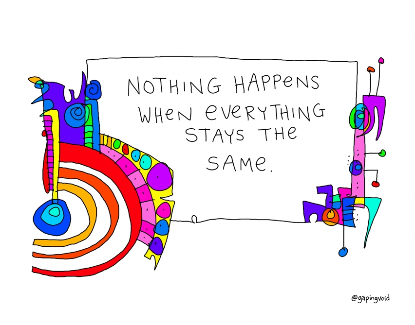
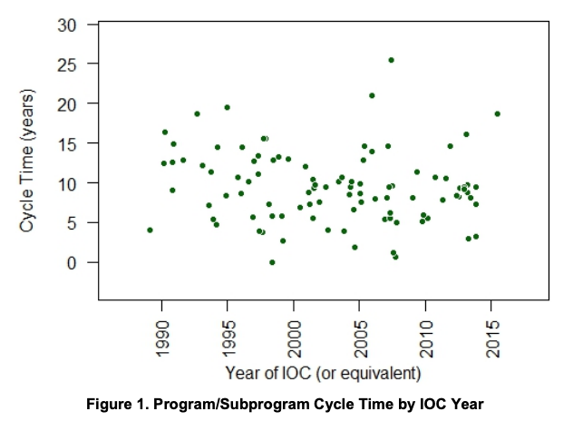
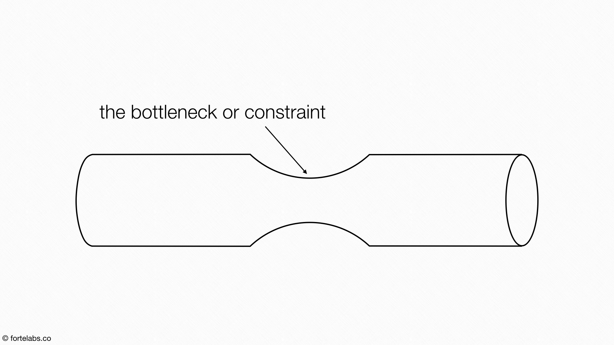
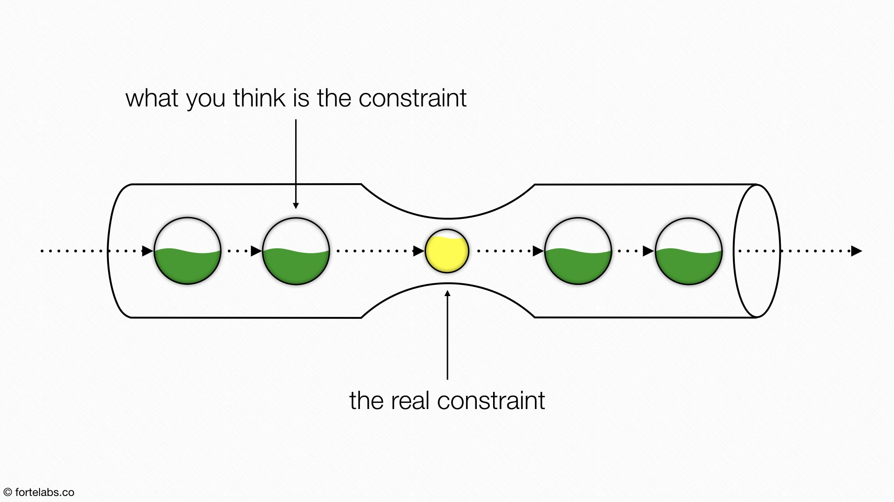

# The Need to Modernize Digital Acquisitions

###
* Explain why technical change (disruption and innovation) impacts DoD acquisitions
* Use the Theory of Constraints to improve DoD acquisition workflow

The US government spends ~$76B a year on IT projects with only ~6.4% of the projects being considered successful - ~41% are complete failures that have to be scrapped and started again.   

Not every software project or program will be successful, but there is a sizable opportunity here to do better.
If we only think of dollars invested that means:

> Only ~$4.9B of investment is successful. ~$31B is scrapped capability and re-started

Not every software project or program will be successful, but there is a sizable opportunity here to do better.

<!-- >>>>>>>>>>>>>>>>>>>>>> BEGIN CHALLENGE >>>>>>>>>>>>>>>>>>>>>> -->
<!-- Replace everything in square brackets [] and remove brackets  -->

### !challenge

* type: multiple-choice
* id: f127346b-1a6b-4ab1-bbf4-db245db8e4c7
* title: Costs
<!-- * points: [1] (optional, the number of points for scoring as a checkpoint) -->
<!-- * topics: [python, pandas] (optional the topics for analyzing points) -->

##### !question

Agree or disagree with the following statement: The DoD spends too much time and money establishing contracts.

##### !end-question

##### !options

* Agree
* Disagree
##### !end-options

##### !answer

* Agree

##### !end-answer

<!-- other optional sections -->
<!-- !hint - !end-hint (markdown, hidden, students click to view) -->
<!-- !rubric - !end-rubric (markdown, instructors can see while scoring a checkpoint) -->
<!-- !explanation - !end-explanation (markdown, students can see after answering correctly) -->

### !end-challenge

<!-- ======================= END CHALLENGE ======================= -->

<!-- >>>>>>>>>>>>>>>>>>>>>> BEGIN CHALLENGE >>>>>>>>>>>>>>>>>>>>>> -->
<!-- Replace everything in square brackets [] and remove brackets  -->

### !challenge

* type: paragraph
* id: 14268b07-11ee-4a26-bfc2-604413ff8d31
* title: Explain your answer
<!-- * points: [1] (optional, the number of points for scoring as a checkpoint) -->
<!-- * topics: [python, pandas] (optional the topics for analyzing points) -->

##### !question

Why do you agree or disagree?

##### !end-question

##### !placeholder

Note: We’ll be compiling and discussing your responses during the in-person session. Eventually, we’ll use your responses to tune this course more finely to your experience.

##### !end-placeholder

<!-- other optional sections -->
<!-- !hint - !end-hint (markdown, hidden, students click to view) -->
<!-- !rubric - !end-rubric (markdown, instructors can see while scoring a checkpoint) -->
<!-- !explanation - !end-explanation (markdown, students can see after answering correctly) -->

### !end-challenge

<!-- ======================= END CHALLENGE ======================= -->

## The Traditional Acquisitions Process
In order to grasp our future, we must first look at our history and ask it to provide insight and opportunities for improvement.

The graph below plots the average cycle time of programs, initiation to Initial Operational Capability (IOC) for all Major Defense Acquisition Programs (MDAPs), from 1990 to 2015:

This study is from 2016, but it still provides some important insights, even if we assume that we have made improvements. Note that there is no correlation between program type and cycle time- the distribution of the graph above shows that the type of program (aircraft, ship, submarine, software system) has no bearing on cycle time.

**Median Cycle Time for DoD Programs: 8 Years**

We may be taking near decades to field technology or programs, but the industry is quickly iterating and improving:  

Interested in learning more? Check out [this article](https://www.forbes.com/sites/amirhusain/2020/01/09/technologies-that-will-shape-the-next-decade/?sh=5c54c17568ac) at Forbes.

We can show specifically the swift uptick in commercial technology. If we round up to ten years ago (a slight exaggeration of the DoD 8 year cycle time) we see:

|  Ten Years Ago (2010) | Today (2020)    |  |
| ------------- |---------------| ------|
|iPad Generation 1 was introduced| Current iPad Generation 8   |
|  Tesla did not have self-driving cars| Self-driving is a feature of Tesla vehicles |
| 3G| 5G  |
| Windows 7 latest released Microsoft OS|Windows PE 10   |
| Uber/Lyft were not a business| Uber/Lyft is dominant transportation  |

These examples drive home how technology has changed the landscape, and how fielding old technology puts the DoD at a significant disadvantage.

We can no longer field on a cadence of decades. Documenting the mission need/requirement for years behind closed doors before it ever makes it into the hands of an acquisition team cannot go on. There is no longer room for that acquisition team to generate a strategy behind closed doors using limited market research from the current defense industry database. We must no longer accept vendor proposals developed behind closed doors with only a few carefully scripted conversations with the PMO (if any) before final submission.

<!-- >>>>>>>>>>>>>>>>>>>>>> BEGIN CHALLENGE >>>>>>>>>>>>>>>>>>>>>> -->
<!-- Replace everything in square brackets [] and remove brackets  -->

### !challenge

* type: paragraph
* id: d730e1f3-fe27-460b-bafe-dd6055d1756a
* title: Blockers
<!-- * points: [1] (optional, the number of points for scoring as a checkpoint) -->
<!-- * topics: [python, pandas] (optional the topics for analyzing points) -->

##### !question

What are ways you can co-develop an acquisition and contracting strategy with industry?  

Is there anything that prohibits you from co-creating an acquisition and contracting strategy with industry?

##### !end-question

##### !placeholder

Note: We’ll be compiling and discussing your responses during the in-person session. Eventually, we’ll use your responses to tune this course more finely to your experience.

A.

B.

##### !end-placeholder

<!-- other optional sections -->
<!-- !hint - !end-hint (markdown, hidden, students click to view) -->
<!-- !rubric - !end-rubric (markdown, instructors can see while scoring a checkpoint) -->
<!-- !explanation - !end-explanation (markdown, students can see after answering correctly) -->

### !end-challenge

<!-- ======================= END CHALLENGE ======================= -->

Collaboration and communication are essential for improving the DoD success rate for IT projects, and must include multiple different groups- PMOs, stakeholders, users, and contractors are at the top of the list.

We have always been tasked with delivering valuable capability from the Federal Acquisition Regulation (FAR):
> The vision for the Federal Acquisition System is to deliver on a timely basis the best value product or service to the customer.

### !callout-warning
## Acquisitions bottleneck
We are only as fast as our slowest part. At almost a decade, the overall acquisitions process is the slowest part.
### !end-callout

## Bottlenecks and the Theory of Constraints
In every industry there are limits. For the DoD, limits in terms of funding, personnel to support an effort, expertise, and time are just a few examples.

> “The amount of requests (the demand) and the amount of time people have to hand the request (their capacity) is almost always unbalanced.”
Degrandis, Dominica/ Demaria Tonianne (FRW). MAKING WORK VISIBLE: Exposing Time Theft to Optimize Work & Flow. Nat’l Book Network, 2017.

This imbalance creates bottlenecks in the acquisition process.

>Eliyahu M. Goldratt, who created the Theory of Constraints, showed us how any improvements made anywhere beside the bottleneck are an illusion. Astonishing, but true! Any improvement made after the bottleneck is useless, because it will always remain starved, waiting for work from the bottleneck. And any improvements made before the bottleneck will merely result in more inventory piling up at the bottleneck.” Kim, Gene, et al. The Phoenix Project: a Novel about IT, DevOps, and Helping Your Business Win. IT Revolution, 2018.

In other words, the bottleneck sets the pace:
* Any build up of work before the constraint grows and accumulates (waste)
* Any build of resources after the constraint is underutilized and left waiting (waste)

All processes and workflows are limited by at least one constraint (bottleneck), affecting any system or workflow that requires its product. Bottlenecks are natural and can be caused by a multitude of reasons. We cannot always fix the fact that a bottleneck exists- but we can reorganize resources or work to try to optimize.

This concept will come up again in other lessons, and we will talk about ways that as a balanced acquisitions team you can mitigate constraints.

**Step 1:** Visualizing the workflow creates opportunities for improvement through understanding and communication.

## Wrapping Up: Why This Matters
There is no way around it- digital transformation is difficult for companies that were not born in the digital age, and the DoD was not born in the digital age.   

But we cannot fail to transform ourselves and become a digital entity.   

### !callout-info
## Note from a Learning Coach
When I started at Kessel Run, we visited multiple companies a few years ahead of us on their digital transformation journey. One CTO turned to us and said:
"One of the most difficult things was the competition for talent and the enticing factor he used was their mission." He worked for an insurance firm, and Groupon HQ and others were tough competition. He turned to us and said, “Would you rather write code for coupons for McDonald’s, or tracking your dog’s walk when using a dog walker - or work here and build capability that supports the insurance of millions of Americans and ensures they get the service they deserve?”  
### !end-callout

The DoD does not have a mission problem. In fact, we have the imperative to ensure we remain a powerful player on the world stage.  The challenge for us all is to ensure we remain competitive, and protect against our adversaries like Russia and China. Acquisition and technology changes can no longer happen in a slow and methodical way, however, that does not remove our need to be deliberate.   Every day, we get to ensure the liberties and protection of the American people are preserved, and that the men and women that wear the uniform are given the best technology and capability.

We need you, software acquisition professionals across the DoD, to meet this imperative.
> “Success no longer goes to the country that develops a new technology first, but rather to the one that better integrates it and adapts its way of fighting.” - Summary of the National Defense Strategy, 2018
<!-- >>>>>>>>>>>>>>>>>>>>>> BEGIN CHALLENGE >>>>>>>>>>>>>>>>>>>>>> -->
<!-- Replace everything in square brackets [] and remove brackets  -->

### !challenge

* type: paragraph
* id: f61cda3b-f047-4cff-b49a-dffd17b59912
* title: How this applies to you
<!-- * points: [1] (optional, the number of points for scoring as a checkpoint) -->
<!-- * topics: [python, pandas] (optional the topics for analyzing points) -->

##### !question

What is a “hard” problem you are trying to solve right now? Thinking about the problem you seek to solve, what are the hurdles you are trying to overcome?
##### !end-question

##### !placeholder
Note: We’ll be compiling and discussing your responses during the in-person session. Eventually, we’ll use your responses to tune this course more finely to your experience.

A.

B.

##### !end-placeholder

<!-- other optional sections -->
<!-- !hint - !end-hint (markdown, hidden, students click to view) -->
<!-- !rubric - !end-rubric (markdown, instructors can see while scoring a checkpoint) -->
<!-- !explanation - !end-explanation (markdown, students can see after answering correctly) -->

### !end-challenge

<!-- ======================= END CHALLENGE ======================= -->

<!-- >>>>>>>>>>>>>>>>>>>>>> BEGIN CHALLENGE >>>>>>>>>>>>>>>>>>>>>> -->
<!-- Replace everything in square brackets [] and remove brackets  -->

### !challenge

* type: multiple-choice
* id: 38ab59a5-8e85-48f0-acaa-7f400468d310
* title: Time commitment
<!-- * points: [1] (optional, the number of points for scoring as a checkpoint) -->
<!-- * topics: [python, pandas] (optional the topics for analyzing points) -->

##### !question

How much time did you spend on this lesson?

##### !end-question

##### !options

* Less than 10 minutes
* 11-20 minutes
* 21-40 minutes
* 41-60 minutes
* 60 - 80 minutes
* More than 80 minutes

##### !end-options

##### !answer

* *

##### !end-answer

<!-- other optional sections -->
<!-- !hint - !end-hint (markdown, hidden, students click to view) -->
<!-- !rubric - !end-rubric (markdown, instructors can see while scoring a checkpoint) -->
<!-- !explanation - !end-explanation (markdown, students can see after answering correctly) -->

### !end-challenge

<!-- ======================= END CHALLENGE ======================= -->
