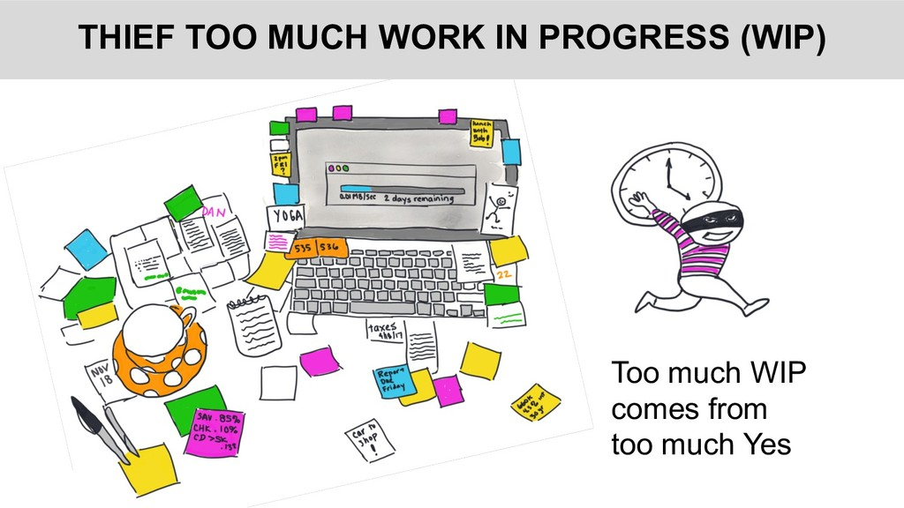
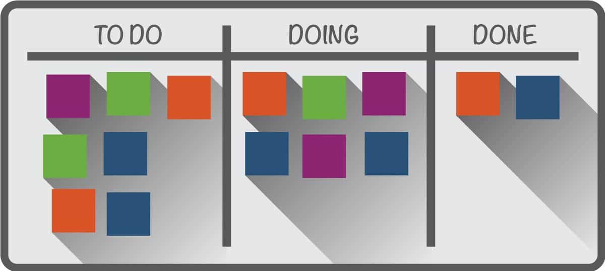
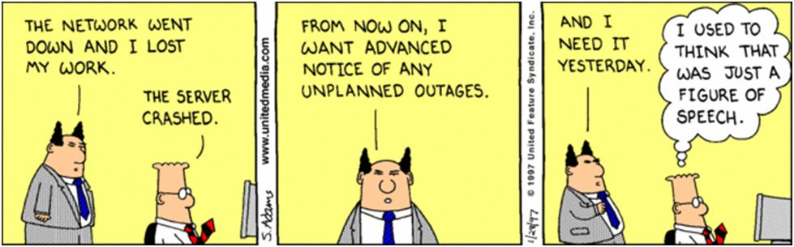

# The Five Thieves of Time

## Learning Objectives

By the end of this lesson you will be able to:

* Define the Five Thieves of Time
* Understand how the Five Thieves of Time impact your productivity
* Apply the Five Thieves of Time to your current role, and define what the most common thief is for you

#### !callout-info

## Note

This lesson and the next lesson (The Five Thieves of Time and Benefit: Making Work Visible) are heavily influenced by Dominica DeGrandis’ book [_Making Work Visible: Exposing Time Theft to Optimize Work and Flow._](https://itrevolution.com/making-work-visible-by-dominica-degrandis/) These lessons hit the highlights, but we highly recommend you read the full book to gain a better understanding of the material.

Before jumping into the **how** of _Making Work Visible_, this section helps explain the **why**. This section leads you through why _Making Work Visible_ will directly benefit you as an individual and as a team member.

#### !end-callout

## The Five Thieves of Time

Most people notice when their wallet or car is stolen - but do they notice how often their time is stolen from them? Think about it. Time is a precious resource that should be spent/allocated carefully. Have you ever asked yourself where your day went? Are there times you feel like you just can’t complete the days To Do list? Okay, okay - we know not everyone makes a To Do list - but the concept is relatable! Let’s have a closer look.

## 1. First Thief: Too Much Work-in-Progress (WIP)

This always seems to be the case -- work continues to build up, why? To name a few common reasons:
* We are team players
* The new project is more enticing than current work
* We do not realize how time-consuming the request will be, and
* We like to please people 

Why does this matter? Too much WIP can result in _delayed delivery of value_, _increased costs_, and _irritation within teams_.

> It can take up to twenty minutes to get back to the same thinking spot after an interruption.
>
> -David Rock
> 
> &nbsp;

Furthermore, WIP is a **leading indicator** of cycle time. As a preview to our metrics discussion: leading indicators are predictive measures, while lead time and cycle time are **trailing indicators**.

### !callout-info
## Takeaway:
We must learn to **say no** to additional work when our schedules are full. As a preview to our next lesson, a great strategy for yourself and your team is to use Kanban.
### !end-callout

**Kanban** is Japanese for signal card--a card that, very simply, signals your availability to do some work. 

In the Kanban example above, the number of WIP is 6. In the next section, we provide more examples of structuring a Kanban.
<!-- >>>>>>>>>>>>>>>>>>>>>> BEGIN CHALLENGE >>>>>>>>>>>>>>>>>>>>>> -->
<!-- Replace everything in square brackets [] and remove brackets  -->

### !challenge

* type: checkbox
* id: 6e67b046-78a3-4f55-898f-12236200a3f7
* title: Work In Progress
<!-- * points: [1] (optional, the number of points for scoring as a checkpoint) -->
<!-- * topics: [python, pandas] (optional the topics for analyzing points) -->

##### !question

Too much WIP can result in:

##### !end-question

##### !options

* Delayed delivery of value
* Frequency reduces difficulty
* Increased costs
* Irritation within teams

##### !end-options

##### !answer

* Delayed delivery of value
* Increased costs
* Irritation within teams

##### !end-answer

#### !hint
One of these is true but is not a result of too much WIP
#### !end-hint

<!-- other optional sections -->
<!-- !hint - !end-hint (markdown, hidden, students click to view) -->
<!-- !rubric - !end-rubric (markdown, instructors can see while scoring a checkpoint) -->
<!-- !explanation - !end-explanation (markdown, students can see after answering correctly) -->

### !end-challenge

<!-- ======================= END CHALLENGE ======================= -->

## 2. Second Thief: Unknown Dependencies

 

Let’s start by defining dependencies. Typically, there are three types of dependencies that emerge:
1. **Architecture (both software and hardware)**- A change in one area causes a break or stop of functionality in another.
1. **Expertise**- Specific knowledge of a person is needed.
1. **Activity**- Progress is halted until activity is completed (can be a bottleneck).

**Fun Fact**: At AgileAlliance 2015, Troy Magennis used Boolean logic to demonstrate a key fact: **Every time you remove one dependency, half the total possible delay combinations are removed, reducing your risk when delivering capability!**

Imagine you have dinner reservations with four people, each traveling independently to the reservation. The caveat: you cannot be seated until all four people arrive. There are sixteen possible outcomes, but **dependencies are asymmetrical in their impact**. With four dependencies, there **is not** a 25% probability you won’t be seated, there’s a 93% probability, or 15/16th of a chance, that **you won’t be seated**.

Indicators of Unknown Dependencies include:
- Program Manager is constantly coordinating across teams/functions
- People unavailable when needed (higher potential when leveraging matrix support)
- Unexpected breaks in code when changes introduced

**Cross-team communication is hard.** Adopting small teams can increase integration costs. Remember our bottleneck discussion. A team is only as fast as the slowest part of their process. We aren’t saying this to scare you, but again, as a build up to the next section - the importance of making work visible and accessible across organizations is paramount. 

<!-- >>>>>>>>>>>>>>>>>>>>>> BEGIN CHALLENGE >>>>>>>>>>>>>>>>>>>>>> -->
<!-- Replace everything in square brackets [] and remove brackets  -->

### !challenge

* type: checkbox
* id: ccbcccaf-7d9b-4257-ac07-2d770e7e0fbf
* title: Unknown Dependencies
<!-- * points: [1] (optional, the number of points for scoring as a checkpoint) -->
<!-- * topics: [python, pandas] (optional the topics for analyzing points) -->

##### !question

Under the second thief “Unknown Dependencies”, the three dependencies that begin to emerge are:

##### !end-question

##### !options

* Expertise
* Activity
* Architecture
* Conflicting Priorities

##### !end-options

##### !answer

* Expertise
* Activity
* Architecture

##### !end-answer

<!-- other optional sections -->
<!-- !hint - !end-hint (markdown, hidden, students click to view) -->
<!-- !rubric - !end-rubric (markdown, instructors can see while scoring a checkpoint) -->
<!-- !explanation - !end-explanation (markdown, students can see after answering correctly) -->

### !end-challenge

<!-- ======================= END CHALLENGE ======================= -->

 

## 3. Third Thief: Unplanned Work

> Code will be used in ways we cannot anticipate, in ways it was never designed for, and for longer than it was ever intended.
>
> -Joshua Corman
>
> &nbsp;

Unplanned and expedited work steals time away from work that’s creating value- it impacts every organization, and the goal is to minimize it as much as possible.

 Source: [Dilbert by Scott Adams](https://dilbert.com/strip/1997-01-28)

Unplanned work is _hard to see_ and/or predict, but it can be made visible.

Here are some strategies to mitigate an instance of unplanned work:

- Kanbans help to combat and better anticipate by making unplanned work visible.
- Leave slack in your schedule by reserving team and individual capacities - never fully commit your staff or technology stack.

<!-- >>>>>>>>>>>>>>>>>>>>>> BEGIN CHALLENGE >>>>>>>>>>>>>>>>>>>>>> -->
<!-- Replace everything in square brackets [] and remove brackets  -->

### !challenge

* type: multiple-choice
* id: 095b2b34-5aab-4608-ae02-e267779a761f
* title: Unplanned Work
<!-- * points: [1] (optional, the number of points for scoring as a checkpoint) -->
<!-- * topics: [python, pandas] (optional the topics for analyzing points) -->

##### !question

Unplanned work is hard to see (or predict), but it can be made visible.

##### !end-question

##### !options

* True
* False

##### !end-options

##### !answer

* True

##### !end-answer

<!-- other optional sections -->
<!-- !hint - !end-hint (markdown, hidden, students click to view) -->
<!-- !rubric - !end-rubric (markdown, instructors can see while scoring a checkpoint) -->
<!-- !explanation - !end-explanation (markdown, students can see after answering correctly) -->

### !end-challenge

<!-- ======================= END CHALLENGE ======================= -->

 

## 4. Fourth Thief: Conflicting Priorities

 

> Productivity isn’t about being a workhorse, keeping busy, or burning the midnight oil...It’s about priorities and fiercely protecting your time.
>
> -Margarita Tartakovsky
>
> &nbsp;

When people prioritize ineffectively, everything takes longer, leading to too much WIP. We know this is a relatable thief - many of you noted in Module 1 the difficulties you have when navigating priorities because you are supporting multiple projects.

Again, this highlights the need to show your work in a data driven manner, i.e. using Kanban - not only for yourself, but to communicate with others. 

 

## 5. Fifth Thief: Neglected Work

Legacy system maintenance is one of the most neglected types of work. Typically, the longer a system is used, the more complex it becomes due to updates, bug fixes, and multiple individuals working the code, increasing the complexity of the system. Thus, when something goes wrong it is difficult to easily identify the source of the problem, often removing multiple people (or teams) from other important work.

Recall that we spent a lot of time talking about tech debt. Gene Kim’s The Unicorn Project refers to tech debt as “complexity debt”, defining it as changes in the software or environment that increase the complexity of operations and/or new changes.

There is a saying -- _‘if it hurts, do it more often’_- or, **frequency reduces difficulty**. Have you ever lapsed in your workout regimen? Taken a few weeks (or months) off and your first day back could barely walk by the time you are finished? But after you stick with it for a while, you notice that the impact of working out is less and less drastic.

The same concept applies to software. This is a great example of why refactoring (constantly updating code and simplifying if possible) is so important- it helps reduce the technical debt created with fielded systems.

Now let’s apply this concept to contracting. Multiple contracts support a capability delivery, and contracting is one of the biggest tools in the Program Offices tool belt. It allows you to be responsive to emerging technology, new companies, or to pivot strategy. **Frequency reduces difficulty and allows optimization of the process.**

Sound familiar? This concept is behind the small, frequent batches of work that are key to Agile and DevSecOps implementation -- code deployment (a contract award) is a non-event, and instead is simply part of the daily (monthly) practice.

Back to neglected work. Key ideas that will help you to recognize or prevent neglected work include:
- If not dealt with, neglected work (i.e. technical debt) will become an emergency
- Consistently re-evaluate the investment of time and resources needed to finish the project. Aim to prevent ‘zombie projects’ from overtaking your current responsibilities.

The next section will show you:
- Strategies that expose time thieves,
- How your team can optimize your workflow, and
- How to express resulting data to your leadership and stakeholders

<!-- >>>>>>>>>>>>>>>>>>>>>> BEGIN CHALLENGE >>>>>>>>>>>>>>>>>>>>>> -->
<!-- Replace everything in square brackets [] and remove brackets  -->

### !challenge

* type: checkbox
* id: 4d328685-8cb5-4139-913b-eb0fef184486
* title: !Five Thieves of Time
<!-- * points: [1] (optional, the number of points for scoring as a checkpoint) -->
<!-- * topics: [python, pandas] (optional the topics for analyzing points) -->

##### !question

Select which Time Thief from the Five Thieves of Time that you are **most commonly witnessing** in your role.

_Note: There is no correct answer, this is an opportunity for us to learn from you!_

##### !end-question

##### !options

* Too Much Work in Progress
* Unknown Dependencies
* Unplanned Work
* Conflicting Priorities
* Neglected Work

##### !end-options

##### !answer

* * 

##### !end-answer

<!-- other optional sections -->
<!-- !hint - !end-hint (markdown, hidden, students click to view) -->
<!-- !rubric - !end-rubric (markdown, instructors can see while scoring a checkpoint) -->
<!-- !explanation - !end-explanation (markdown, students can see after answering correctly) -->

### !end-challenge

<!-- ======================= END CHALLENGE ======================= -->

  

### !callout-success
## Key Takeaways: 
* The Five Thieves of Time are: 
      * Too Much Work-in-Progress,
      * Unknown Dependencies,
      * Unplanned Work,
      * Conflicting Priorities, and
      * Neglected Work. 
* Time matters. Your time is a valuable resource that cannot be replenished. Awareness of the Five Thieves of Time is the first step to mitigating for yourself and your team, to prevent: 
      * Delay of valuable (and sometimes critical) capability
      * Increased costs
      * Decreased team and/or individual productivity 
      * Impact team dynamics, i.e. increased irritation  
* Remember, one of the strongest tools in your toolkit is frequency--by frequently performing tasks they become common and eventually, habitual. Think of ways to make painful processes a nonevent, the idea behind frequent code delivery. For acquisition professionals this can be mirrored with awarding (multiple) smaller contracts.
### !end-callout

## Resources

* **Books:** 
    * [_Making Work Visible: Exposing Time Theft to Optimize Work and Flow_](https://itrevolution.com/making-work-visible-by-dominica-degrandis/) by Dominica DeGrandis
    * [_The Unicorn Project: A Novel about Developers, Digital Disruption, and Thriving in the Age of Data_](https://itrevolution.com/the-unicorn-project/) by Gene Kim
* **Video:** [How to Unmask Capacity Killing WIP](https://www.youtube.com/watch?v=KR7Y8IUgyyA), _(approximately 30 minutes)_  
