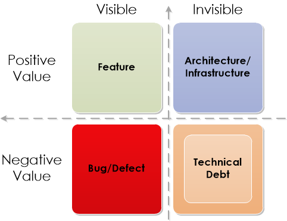
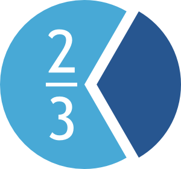
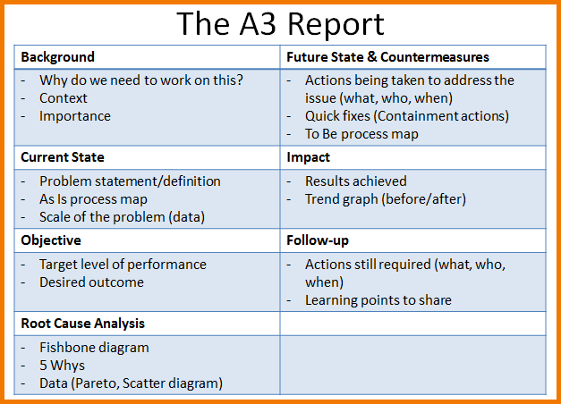
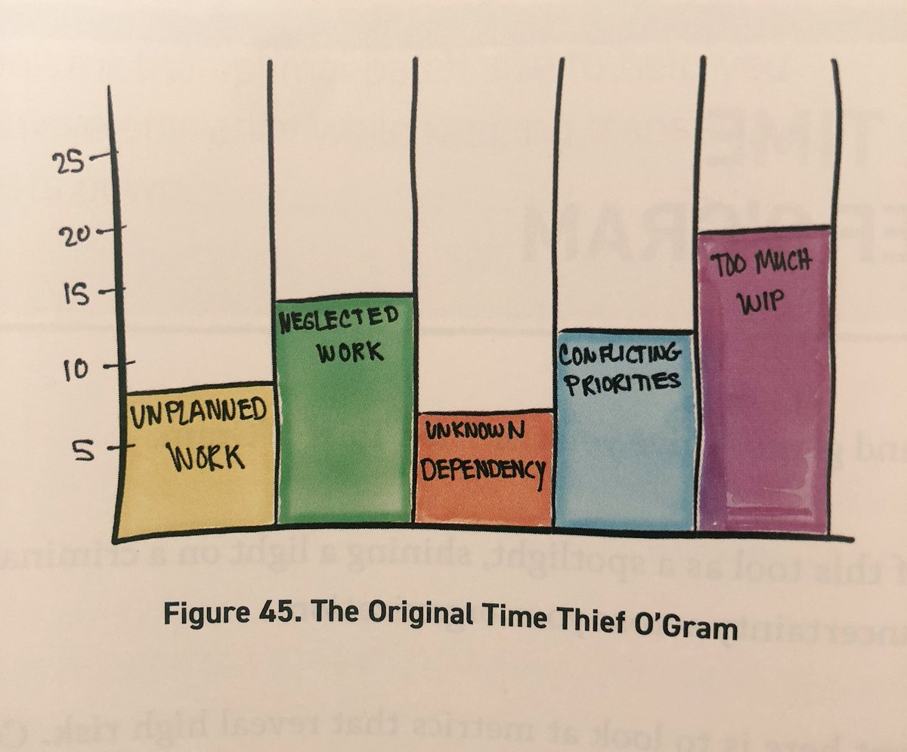

# Benefits To Making Work Visible

## Learning Objectives

By the end of this lesson you will be able to:

* Understand the value of Making Work Visible
* Describe ways that you can implement visualization within your own organization
* Understand utilizing data to make informed team decisions, and provide justification to leadership and stakeholders
* Describe the tools that help optimize workflows and decision-making

#### !callout-info

##Note

This is the second module using the book _Making Work Visible: Exposing Time Theft to Optimize Work and Flow_ by Dominica DeGrandis as a framework and primary source of content. Again, these sections are only able to address some key ideas and themes. We highly recommend reading the full book!

#### !end-callout

## Relating to Lean

_This Is Lean: Resolving the Efficiency Paradox_ defines Lean as: "a strategy of flow efficiency with key principles of just-in-time and visual management."

Much like our vendors, the Department (Government):
* Must remain competitive in delivery value to production (operations);
* Has many organizations running deployment strategies that are **slow** and **cumbersome**

Finally, by adding some human psychology in the mix we understand a key point; we are wired to do our best when we can clearly see what we are doing right, as well as what we are doing wrong.

What is the solution? We need to design **and use** a workflow system that does the following things:
1. Make Work Visible
1. Limit work-in-progress (WIP)
1. Measure and manage workflow
1. Prioritize effectively (this is challenging, but don’t worry- we provide strategies)
1. Make adjustments based on learnings, feedback, and metrics

Remember:
> A bad system will beat a good person every time.
>
> -W. Edwards Demming
>
> &nbsp;

## 1. Making work visible

Let’s start with an example. Take a look at this diagram of a visibility grid by Philippe Kruchten: 

The diagram highlights the four elements that are needed to make a visual work:
1. Structure
1. Usefulness
1. Relevance
1. Honesty

Using these four elements together they achieve a visual that is: accurate, meaningful, easy on the eyes, and efficient at a glance. Again, we are all busy - how to simply communicate is an art we should all try to master!

**Did you know?**

  **of the population are visual learners!** 

Visualizing work through the lens of flow improves team communication and understanding. By making work visible, we improve our work by engaging the human brain as it is designed, by allowing it to find meaningful patterns and structures perceived through sight.

So, do we need to track everything? How do we implement?The answer to the first question - no.

To answer the second question, let’s use a scenario.

A ten-minute task probably doesn’t need to be tracked unless one of the following is true:
1. **Only one person knows how to do it (Thief: Unknown Dependencies)**
   * Making this visible can prompt needed cross-training
1. **The work impacts other teams (Thief: Unknown Dependencies)**
   * Creating a card on a Kanban board is a one or two minute task, posing a low level of overhead, that greatly improves cross-team communication
1. **Someone’s primary job function involves completing tasks lasting fifteen minutes or less (Thief: Too Much WIP)**
   * When tasks are fifteen minutes or less, they are difficult to track using Kanban, meaning that person’s work is invisible. This makes it too easy to over-task an individual.

#### !callout-secondary

##Note

Any Kanban implemented by your team or organization **_should involve those who perform the work_**. A Kanban helps to manage workflow, those who are directly within that workflow need to have input.

#### !end-callout

A way to improve your Kanban board is to color-code your tasks to better understand the types of work items:

 **UNPLANNED WORK**

 **MAINTENANCE**

 **CAPABILITY REQUESTS (PRODUCT & INFRASTRUCTURE)**

 **TEAM IMPROVEMENTS**

Using the legend above, we can visualize work using a structure with an expanded 'in progress' column:

<table>
    <thead>
        <tr><th rowspan="2">BACKLOG</th><th colspan="3">IN PROGRESS</th><th rowspan="2">DONE</th> </tr>
        <tr><th>PREP</th><th>IMPLEMENT</th><th>REVIEW</th> </tr>
    </thead>
    <tbody>
        <tr>
            <td> 
                 
                
            </td>
            <td> 
                
            </td>
            <td>
                 
                
            </td>
            <td>
                
            </td>
            <td> 
                 
                 
                
            </td>
    </tbody>
</table>

Notice that this allows us to visualize what type of work is dominating the workflow. In this scenario: capability requests, then unplanned work and maintenance.
#### !callout-warning
##KEY

KEEP IT SIMPLE.

#### !end-callout

A Kanban should be adapted to **YOUR** workflow - and it may need to be further divided to show transitions. Here is an example of how the Digital DNA team is using a Kanban to support their workflow (this is only a portion of our Kanban): 

Our full column list includes: Icebox, Backlog, Educational Outline in Progress, First Draft in Progress, Ready for SME 2, SME 2 In-Progress, Ready for Copy Edit, Copy Edit in Progress, Ready for Learn, Learn In-Progress, Done.

This was not how our board started, but because we are not co-located, all reside in different time zones, etc. we expanded our board to make transition points easier. Team members get the satisfaction of moving a card, hence the “ready for” columns, and color code cards based on lessons, sections, and administration, making the type of work more easily identifiable, just like the concept introduced above. 

## 2. Limit Work-In-Progress (WIP)

The Time Thief of Too Much WIP infiltrates **all** other time thieves, upping their damage and making them more difficult to control.

A Kanban is a great tool to help drive the conversation within the team, and eventually to stakeholders and leaders regarding the need to limit WIP. To refresh your memory, too much WIP indicators are when:
* Context switching is common
* New tasks are started before old tasks are completed
* Work gets neglected for ages (some tools that implement Kanban boards actually measure time in each part of process that helps to provide even more data)

_Remember: a tool is only useful if first it is used and second it is helpful._

If you are already using a Kanban (or intend to now that we have convinced you of their value), you must ensure it's accessible to all members of the team and easily viewable. Many of you have heard of stand-ups, or short targeted meetings to review current workload before a day begins. Kanbans are a great tool to support stand-ups. **CAUTION**: Do not fall victim to stand-ups becoming staff meetings and dragging on. Keep them brief, and schedule follow-up conversations as needed.

To increase communication, you can further subdivide your Kanban board using horizontal columns, based on different types of work, or you can introduce another column type (typically under unplanned work) known as “hot tasks” from leadership or stakeholders. You can also set WIP limits when using your Kanban board. WIP limits can be per column, per work-item, per function, etc. These are just some of the options, and because each team and project is different, no Kanban board will always look or operate the same as another.

Again, the goal of a Kanban is to communicate across team workflows, help manage individual and team workload, and use the resulting data to inform leaders and stakeholders. A properly implemented Kanban board will help support awkward conversations about delays, inform process improvements, and expose the Five Thieves of Time, among other things. 

## 3. Measure and manage the flow of work

As you increase your capability to deliver, you will soon realize that the more teams that are working, the higher the probability that more features are worked on at the same time. This fact eventually leads to more dependencies.

#### !callout-success
##TIP

Design your workflow to highlight dependencies. You can highlight them at the bottom of a card, create a new card, or show links between cards. There are many ways to do this, but ensuring visibility between both teams that share the dependencies and their respective Kanban boards is key.

#### !end-callout

Again, use your board as the rich data source it is. You can do this by tracking time:
* In each state
* For each type of work, and
* Tracking the number of times a dependency emerges,
* Etc.

All are great ways to use the data to improve the workflow.

#### !callout-success
##TIP

Protect your time and your team’s time by designating specific “Do Not Disturb” hours, or office hours.

#### !end-callout

Working humans use various tools to keep in touch and communicate- emails, Slack, Microsoft Teams, Mattermost, Text Messages, phone calls, etc. All are distracting, and while we may not have cubicle “drop by visits” in this primarily telework environment, there are plenty of work disruptions or distractions. We highly recommend (the learning guides implement this as well) blocking off calendars for uninterrupted work time. This prevents disruptions and distractions, and increases productivity. 

## 4. Prioritize effectively
Remember how we said that Too Much WIP infiltrates all other thieves? People take on more WIP when they are unclear on priorities.

So what are some ways to prioritize work:
* **Highest paid person’s opinion (HiPPO)**: Each job is assigned a priority by the most senior person in charge
* **Cost of delay**: A measure of the impact of time on the outcomes we want, a preview to our next section on Outcomes over Outputs
* **First-in, First-out (FIFO)**: Simple as it sounds - first in, first worked. Note there is also a reverse, last in first out.
* **Weighted shortest job first (WSJF)**: Preference to the shortest job with the highest Cod. WSJF is calculated by dividing the CoD by job duration. NOTE: The Scaled Agile Framework (SAFe) model uses a variant of WSJF

Whichever way you prioritize your work, it is essential to document your strategy. Documenting your prioritization strategy helps to inform improvements, track decisions, and creates more effective communication.

One tool for breaking down objectives to inform priorities is the A3 Method: 

The A3 Method helps to ensure continuous improvement - the report above shows an outline and activities within each section. If you wish to learn more about this method, simply Googling the term “A3 method” will provide additional resources. Again, it serves as documentation - what is believed at a point in time, and the actions taken to improve.

As we discussed in Release 1, committing yourself and your team to prioritizing work and implementing tools like the A3 method could all be worthwhile discussions in support of a team retrospective (retro). 

## 5. Make Adjustments Based on Learning, Feedback and Metrics

#### !callout-info
##Note

This section previews a discussion on metrics, but is focused primarily on workflow optimization.
#### !end-callout

When a project kicks off, it usually begins with an arbitrary due date. Someone sits down and thinks about how long it’s going to take themselves and/or the team to accomplish the goal, and they go with it. But the problem is that humans are notoriously bad at estimating, and pretty great at being overly optimistic. [There is a lot of research](https://thedecisionlab.com/biases/planning-fallacy/) to support this fact- don’t feel bad if you see some of yourself in this scenario! If you don’t, take a moment to think about how you spend your time - how often do you underestimate how long something will take to complete?

Back to our arbitrary due date. In reality, setting a date before you’ve even begun sets the wrong expectations from the outset- despite all our best efforts, we end up surpassing that due date, then losing faith and confidence in leadership, stakeholders, and our users. It’s a vicious cycle.

But what if we told you that if expectations are set correctly, not everything needs a due date, because being predictable is what counts, and predictability saves time?

Again, remember: 100% capacity utilization doesn’t work. One of the drivers for why companies implement ‘creative time’ is that the 20% rule isn’t actually for innovation, although that is a definite bonus. Rather, it’s to maintain capacity utilization at or below 80%.

#### !callout-success
##TIP

Small batches of work enable fast and predictable lead times.

#### !end-callout

Measure and track your team’s flow of work -- track the work, not the people! _There is a cost for delayed feedback._ While tracking your workflow, you should have ways to show work over a period of time (a week, month, quarter). Here are some ways to use your Kanban board to inform improvements.

Create visuals that show:
* Throughput (organized by type of work)
* Flow time - once initiated how long it takes to complete
* Common themes or issues that occured

> Invest energy in collecting metrics that help you make decisions.
>
> -Eric Reis
>
> &nbsp;

How do these proposed metrics help?

Think of showing your leadership a throughput graph for a period of time: 

Based on your Kanban board and weekly retros, you are able to identify the most common thieves of time and how they are impacting your workflow. Clearly, this graph shows that “Too Much WIP” is the worst offender. You can use this information to improve your process, then potentially use the A3 Method to better identify priorities, and ensure work is completed, not neglected. This strategy is informed by the next two largest columns.

Also, this is a great visual to help show leadership - it garners buy-in, and supports transparency.

This is just the beginning of this conversation. Implementing and visualizing your workflow is an ongoing process- hopefully we have clearly demonstrated its value, not only from a team perspective but also from a data-driven, decision-making role within a team. Implementation and visualization are the building blocks of establishing feedback loops within your organization that will allow for you to continually improve. 

<!-- >>>>>>>>>>>>>>>>>>>>>> BEGIN CHALLENGE >>>>>>>>>>>>>>>>>>>>>> -->
<!-- Replace everything in square brackets [] and remove brackets  -->

### !challenge

* type: checkbox
* id: 2cbbb437-26cc-417d-a6ce-b138fc4d6711
* title: Kanban
<!-- * points: [1] (optional, the number of points for scoring as a checkpoint) -->
<!-- * topics: [python, pandas] (optional the topics for analyzing points) -->

##### !question

**Select all that apply.** What are the reasons that a ten-minute task should be tracked in your Kanban?

##### !end-question

##### !options

* Only one person can complete the task
* To show that your team is busy
* The work impacts other teams
* Most of the work performed by a person is less than 10 minutes and is invisible to the organization

##### !end-options

##### !answer

* Only one person can complete the task
* The work impacts other teams
* Most of the work performed by a person is less than 10 minutes and is invisible to the organization

##### !end-answer

#### !hint
Is our goal to show that we are at 100% workload capacity
#### !end-hint
<!-- other optional sections -->
<!-- !hint - !end-hint (markdown, hidden, students click to view) -->
<!-- !rubric - !end-rubric (markdown, instructors can see while scoring a checkpoint) -->
<!-- !explanation - !end-explanation (markdown, students can see after answering correctly) -->

### !end-challenge

<!-- ======================= END CHALLENGE ======================= -->
<!-- >>>>>>>>>>>>>>>>>>>>>> BEGIN CHALLENGE >>>>>>>>>>>>>>>>>>>>>> -->
<!-- Replace everything in square brackets [] and remove brackets  -->

### !challenge

* type: multiple-choice
* id: f5996f14-c5a0-4292-880c-9a3fdf64fcad
* title: WIP
<!-- * points: [1] (optional, the number of points for scoring as a checkpoint) -->
<!-- * topics: [python, pandas] (optional the topics for analyzing points) -->

##### !question

Too much Work in Progress infiltrates all the other time thieves.

##### !end-question

##### !options

* True
* False

##### !end-options

##### !answer

* True

##### !end-answer

<!-- other optional sections -->
<!-- !hint - !end-hint (markdown, hidden, students click to view) -->
<!-- !rubric - !end-rubric (markdown, instructors can see while scoring a checkpoint) -->
<!-- !explanation - !end-explanation (markdown, students can see after answering correctly) -->

### !end-challenge

<!-- ======================= END CHALLENGE ======================= -->
<!-- >>>>>>>>>>>>>>>>>>>>>> BEGIN CHALLENGE >>>>>>>>>>>>>>>>>>>>>> -->
<!-- Replace everything in square brackets [] and remove brackets  -->

### !challenge

* type: paragraph
* id: 0139cccd-eac1-4759-b849-1a8e97b77362
* title: Making work visible
<!-- * points: [1] (optional, the number of points for scoring as a checkpoint) -->
<!-- * topics: [python, pandas] (optional the topics for analyzing points) -->

##### !question

How can you implement making work visible within your team? And how will you use the metrics to inform decisions?

NOTE: If you already use a Kanban in your organization - please describe who uses it, how it supports decisions, and the workflow it tracks.

##### !end-question

##### !placeholder

##### !end-placeholder

<!-- other optional sections -->
<!-- !hint - !end-hint (markdown, hidden, students click to view) -->
<!-- !rubric - !end-rubric (markdown, instructors can see while scoring a checkpoint) -->
<!-- !explanation - !end-explanation (markdown, students can see after answering correctly) -->

### !end-challenge

<!-- ======================= END CHALLENGE ======================= -->

##Resources
* BOOK: _Making Work Visible: Exposing Time Theft to Optimize Work and Flow_ by Dominica DeGrandis
