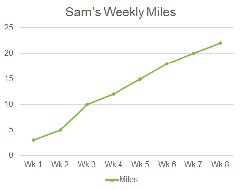
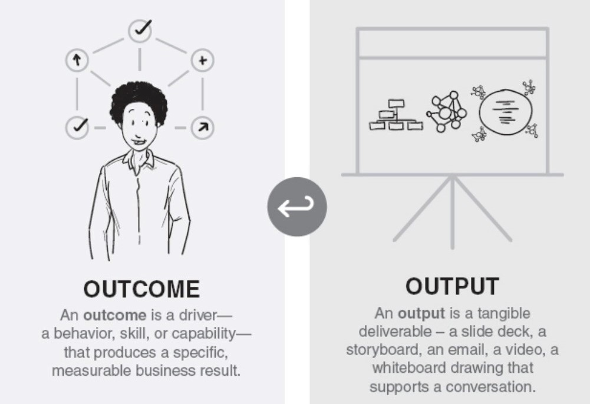
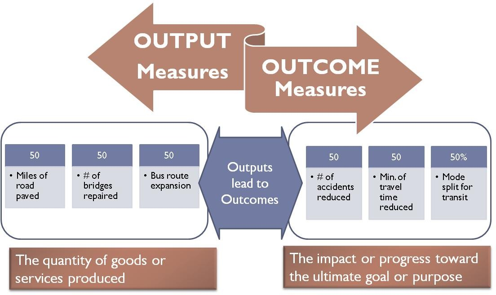
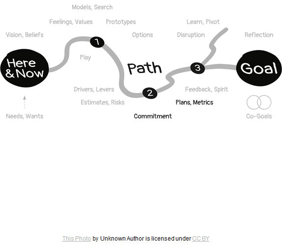
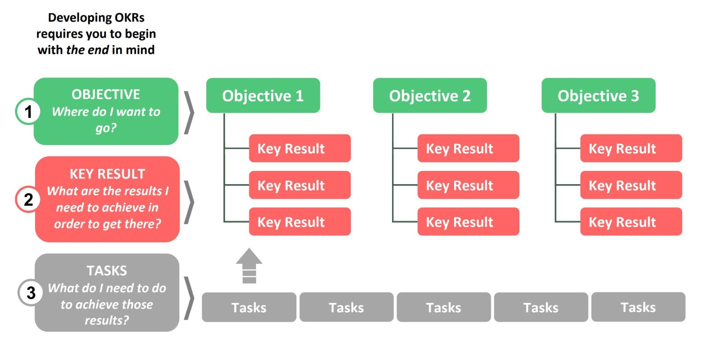

# Outcomes over Outputs

## Learning Objectives

By the end of this lesson you will be able to:

* Differentiate between outputs and outcomes
* Define steps that tie outputs to outcomes
* Understand how to measure what matters to the business

## Defining Outcomes and Outputs

Let’s begin with a short, non-software related story. With no context, assess Sam’s workout regimen and answer the following questions.

What if we asked you the following:

**Question:** Is she progressing on her runs?   
**Answer:** From this pictorial her increased miles over the weeks look really good!  So _yes her fitness looks great_.

**Question:** Is she prepared for her marathon next week?   
**Answer:** From this pictorial, it depends there are a lot of variables unanswered (incline, weather, pace, and so on), so in this case _meh...we are not as certain but maybe she is ready_.

**Question:** Is she prepared to climb Mt. Kilimanjaro?   
**Answer:** _Unknown_ simply not enough data.

> Not everything that can be counted….counts.
>
> -William Bruce Cameron
>
> &nbsp;

Let’s define **outcomes** and **outputs**:

  
Source: [To Create Radical Outcomes – Make Sure Every Output Has A Purpose](https://www.strategydriven.com/2019/02/07/to-create-radical-outcomes-make-sure-every-output-has-a-purpose/) 

Many times we prioritize measuring outputs simply because they are the easiest thing to measure. We placate ourselves with the fact that we are measuring something.

When we focus on measuring **outputs**, we often miss the outcomes we are intending to achieve. Focusing on outputs can:
* Demotivate good behavior that moves us toward meeting the overall outcome.
* Limit a team’s agility and problem solving flexibility. Features don’t always deliver value.

We urge you to resist the tendency to give up and revert to writing outputs. When we instead focus instead on managing **outcomes**:

* Your team creates a specific behavior, allowing them the latitude to find the right solution, and keeps the focus on what’s important: delivering mission value.

To provide another example: 

Source: [ Cities That Work Blog - Outcomes and Outputs](http://www.citiesthatwork.com/blog-renaissance/2013/10/outcomes-and-outputs)

To best understand outcomes vs. outputs, let’s run through some examples:

<!-- >>>>>>>>>>>>>>>>>>>>>> BEGIN CHALLENGE >>>>>>>>>>>>>>>>>>>>>> -->
<!-- Replace everything in square brackets [] and remove brackets  -->

### !challenge

* type: multiple-choice
* id: 2462282c-5296-48e4-b3a6-906839b7e4ca
* title: Outcome or Output
<!-- * points: [1] (optional, the number of points for scoring as a checkpoint) -->
<!-- * topics: [python, pandas] (optional the topics for analyzing points) -->

##### !question

A new environment for the product is an:

##### !end-question

##### !options

* Outcome
* Output

##### !end-options

##### !answer

* Outcome

##### !end-answer

<!-- other optional sections -->
<!-- !hint - !end-hint (markdown, hidden, students click to view) -->
<!-- !rubric - !end-rubric (markdown, instructors can see while scoring a checkpoint) -->
<!-- !explanation - !end-explanation (markdown, students can see after answering correctly) -->

### !end-challenge

<!-- ======================= END CHALLENGE ======================= -->
<!-- >>>>>>>>>>>>>>>>>>>>>> BEGIN CHALLENGE >>>>>>>>>>>>>>>>>>>>>> -->
<!-- Replace everything in square brackets [] and remove brackets  -->

### !challenge

* type: multiple-choice
* id: 43776623-9879-4909-b732-2ec5033fbe88
* title: Outcome or Output
<!-- * points: [1] (optional, the number of points for scoring as a checkpoint) -->
<!-- * topics: [python, pandas] (optional the topics for analyzing points) -->

##### !question

The number of customer service reps attending training is an:

##### !end-question

##### !options

* Outcome
* Output

##### !end-options

##### !answer

* Output

##### !end-answer

<!-- other optional sections -->
<!-- !hint - !end-hint (markdown, hidden, students click to view) -->
<!-- !rubric - !end-rubric (markdown, instructors can see while scoring a checkpoint) -->
<!-- !explanation - !end-explanation (markdown, students can see after answering correctly) -->

### !end-challenge

<!-- ======================= END CHALLENGE ======================= -->
<!-- >>>>>>>>>>>>>>>>>>>>>> BEGIN CHALLENGE >>>>>>>>>>>>>>>>>>>>>> -->
<!-- Replace everything in square brackets [] and remove brackets  -->

### !challenge

* type: multiple-choice
* id: ee3a86c6-566c-4580-82ad-23bf16959a71
* title: Outcome or Output
<!-- * points: [1] (optional, the number of points for scoring as a checkpoint) -->
<!-- * topics: [python, pandas] (optional the topics for analyzing points) -->

##### !question

Maintaining compliance with new DoD regulations, incorporating licensing requirements, or removing dependencies under pressure of budget constraints is an:

##### !end-question

##### !options

* Outcome
* Output

##### !end-options

##### !answer

* Outcome

##### !end-answer

<!-- other optional sections -->
<!-- !hint - !end-hint (markdown, hidden, students click to view) -->
<!-- !rubric - !end-rubric (markdown, instructors can see while scoring a checkpoint) -->
<!-- !explanation - !end-explanation (markdown, students can see after answering correctly) -->

### !end-challenge

<!-- ======================= END CHALLENGE ======================= -->
<!-- >>>>>>>>>>>>>>>>>>>>>> BEGIN CHALLENGE >>>>>>>>>>>>>>>>>>>>>> -->
<!-- Replace everything in square brackets [] and remove brackets  -->

### !challenge

* type: multiple-choice
* id: fdeed7f5-1801-4d5c-a898-fc6c47d39090
* title: Outcome or Output
<!-- * points: [1] (optional, the number of points for scoring as a checkpoint) -->
<!-- * topics: [python, pandas] (optional the topics for analyzing points) -->

##### !question

Cleaning up impediments to support future improvements is an:

##### !end-question

##### !options

* Outcome
* Output

##### !end-options

##### !answer

* Outcome

##### !end-answer

<!-- other optional sections -->
<!-- !hint - !end-hint (markdown, hidden, students click to view) -->
<!-- !rubric - !end-rubric (markdown, instructors can see while scoring a checkpoint) -->
<!-- !explanation - !end-explanation (markdown, students can see after answering correctly) -->

### !end-challenge

<!-- ======================= END CHALLENGE ======================= -->
<!-- >>>>>>>>>>>>>>>>>>>>>> BEGIN CHALLENGE >>>>>>>>>>>>>>>>>>>>>> -->
<!-- Replace everything in square brackets [] and remove brackets  -->

### !challenge

* type: multiple-choice
* id: 2bc3c14d-4bca-4a54-a290-4e75ebbf4a3f
* title: Outcome or Output
<!-- * points: [1] (optional, the number of points for scoring as a checkpoint) -->
<!-- * topics: [python, pandas] (optional the topics for analyzing points) -->

##### !question

The number of customer service calls closed out is an:

##### !end-question

##### !options

* Outcome
* Output

##### !end-options

##### !answer

* Output

##### !end-answer

<!-- other optional sections -->
<!-- !hint - !end-hint (markdown, hidden, students click to view) -->
<!-- !rubric - !end-rubric (markdown, instructors can see while scoring a checkpoint) -->
<!-- !explanation - !end-explanation (markdown, students can see after answering correctly) -->

### !end-challenge

<!-- ======================= END CHALLENGE ======================= -->
<!-- >>>>>>>>>>>>>>>>>>>>>> BEGIN CHALLENGE >>>>>>>>>>>>>>>>>>>>>> -->
<!-- Replace everything in square brackets [] and remove brackets  -->

### !challenge

* type: multiple-choice
* id: baeb6ec3-3e4f-49f3-a59f-5800ded21c17
* title: Outcome or Output
<!-- * points: [1] (optional, the number of points for scoring as a checkpoint) -->
<!-- * topics: [python, pandas] (optional the topics for analyzing points) -->

##### !question

Onboarding new personnel or reaching larger audiences through stakeholder demos is an:

##### !end-question

##### !options

* Outcome
* Output

##### !end-options

##### !answer

* Outcome

##### !end-answer

<!-- other optional sections -->
<!-- !hint - !end-hint (markdown, hidden, students click to view) -->
<!-- !rubric - !end-rubric (markdown, instructors can see while scoring a checkpoint) -->
<!-- !explanation - !end-explanation (markdown, students can see after answering correctly) -->

### !end-challenge

<!-- ======================= END CHALLENGE ======================= -->

## Outcome Goals
Leaders and employees alike are wondering:  

"What should I be measuring"

Meetings, emails, phone calls etc. alone do not create an outcome. An outcome should maintain alignment and focus on a program/PEO/service component’s desired goal, and enable you to measure whether or not you have achieved that goal.

Let’s put it in another light:

The daily tasks you complete are outputs, not outcomes.       
If you can’t connect your work to a measurable outcome, should you be doing it at all?

If you are reading this and see yourself or your leadership style focused on outputs and not lacking the tie into the strategic imperative, this next section is for you.

Let’s go on a journey!

## Objectives and Key Results (OKRs)

OKRs like Kanbans are a tool that can be used by you and your organization. Even if you are familiar please use this section as a refresher. If this is a new concept for you, we hope this provides a good foundation and explanation of why they are used. 
 
What is the goal?  What questions need to be answered? One way we can look at understanding this is by creating Objective Key Results (OKRs). 

Below depicts a timeline of how and when OKRs came to fruition.

* 1954: Peter Drucker invents MBO, or Management by Objectives.
* 1968: Andrew Grove co-founds Intel and while CEO at Intel, further develops MBO into the “OKR” framework we know today.
* 1974: John Doerr joins Intel and learns OKR during his time there.
  * Doerr goes on to join Kleiner Perkins Caufield & Byers, one of the first major investors in Google, and becomes an advisor to Google in its earliest days.
  * Doerr introduces OKR to Google’s founders, Larry Page and Sergey Brin, who then implement OKR at Google (who still uses it today)    

  * **FUN FACT**: In Google’s early days, Larry Page set aside two days per quarter to personally scrutinize the OKRs for each and every software engineer (_Measure What Matters_ by John Doerr)

But where do we start understanding how OKRs can be used in our efforts?  Well, most of us have a mission and a vision statement: these are your organization’s North Star.

## How Objectives and Key Results (OKRs) Can Help

Before we go into any more detail regarding OKRs, let’s make one thing abundantly clear. OKRs are a _tool_, not a _weapon_. As recommended and implemented by Andy Grove, OKRs are not a legal document upon which to base a performance review. They are intended to encourage risk-taking, and prevent sandbagging. **OKRs, performance reviews, and therefore bonuses are best kept separate.**

Directly from Doerr’s _Measure what Matters_, the following definitions apply:

**OBJECTIVE** - _What_ is to be achieved? By definition, objectives are significant, concrete, action-oriented, and (ideally) inspirational

**KEY RESULTS** - _How_ we get to the objective. KRs are specific and time-bound, aggressive yet realistic, and measurable and verifiable. 

### 1.    Focus  
To focus on what matters most, a high-performing team and organization will utilize OKRs.  Defining what matters the most means you must choose what NOT to do- OKRs focus on eliminating ambiguity, confusion, and is a tool to clearly communicate up, down, and across the organization.
### 2.    Alignment  
When we all move in the same direction and toward the same goal, we create alignment.  
The key to alignment is to communicate priorities across all organizations, so everyone understands what they are contributing to, with an additional bonus of increased job satisfaction. In some way, we all have the desire to belong, and thrive on a sense of ownership.
### 3.   Accountability  
OKRs enable a data driven culture by creating a recurring check-in model for how we are meeting individual, team, and organizational goals. OKRs also drive accountability when achieving outcomes, and promote a deliberate dialogue of potential accomplishments. This organizational feedback cycle is psychologically safe, and void of judgment.
### 4.   Amazing  
You might be thinking, “How weird...AMAZING. Whatever do you mean?” Step back for a moment and think back through the past three points- FOCUS, ALIGNMENT, ACCOUNTABILITY...when all of these come together, we are motivated to excel, and test our limits. We have freedom to fail, feel psychological safety to recover from that failure, and most importantly, we push ourselves beyond a checklist and as a person. We are striving to create the most creative and ambitious mindsets, to solve some of the largest problems our nation faces.  That is AMAZING!

### !challenge

* type: multiple-choice
* id: 0220f7d1-7adf-49b1-9d10-ca8a34560b0f
* title: OKR's
<!-- * points: [1] (optional, the number of points for scoring as a checkpoint) -->
<!-- * topics: [python, pandas] (optional the topics for analyzing points) -->

##### !question

When defining OKR’s _______________ helps you understand the What is to be achieved?

##### !end-question

##### !options

* Key Results
* Objectives
* Tasks

##### !end-options

##### !answer

* Objectives

##### !end-answer

<!-- other optional sections -->
<!-- !hint - !end-hint (markdown, hidden, students click to view) -->
<!-- !rubric - !end-rubric (markdown, instructors can see while scoring a checkpoint) -->
<!-- !explanation - !end-explanation (markdown, students can see after answering correctly) -->

### !end-challenge

OKRs can help you understand outcomes and outputs and how those align to your north star. Let’s break down how each area can support your adoption of OKRs or other similar models.  

Objectives should explain **where** you want to go:
* **High Impact** - What will be most impactful to your organization.
* **Aligned** - If you are an embedded organization, these should align with higher level goals.
* **Time Bound** - Objectives should be time bound in a way that requires you to frequently revisit and adjust your organization or program's goals.

Key Results should explain **what** results you need to achieve to get there:
* **High Impact** - If successful, this key result should be felt by over half of your organization.
* **Specific** - Should be focused and have a clearly defined scope.
* **Within Influence** - You may not be able to control this, BUT here you should be able to influence the outcome.

Tasks (or Initiatives) should help you define **how** you achieve those results:
* **Specific** - This should reflect a clearly defined task
* **Within Control** - These should be within the tasked organization or individual’s ability to complete

If you currently lead a team, plan to lead a team, and/or you want to implement OKRs (or any strategies you have learned)- make sure you implement them yourself and post for your team to see (transparency) as well as setting OKRs for the organization and team. Hey, if it worked for Google….

Finally, you are not going to get OKRs right the first time. You will learn, just be patient! 

### !callout-success
## Key Takeaways: 
* Outputs are easier to identify and quantify thus making them appealing to focus on, but do not provide insight or drive to strategic goals. Outcomes are more difficult to define, but when properly identified can support measurable valuable capability outcomes. 
* Objectives and Key Results (OKRs) are one tool that can be utilized to help to identify desired outcomes and how to achieve through specific, measurable, time-bound and verifiable metrics or key results. 
* Regardless of the specific tool your team uses to identify outcomes, apply continuous improvement to defining (and refining) outcomes. Remember to involve stakeholders, users, and the larger overall team!
### !end-callout
 
 <!-- >>>>>>>>>>>>>>>>>>>>>> BEGIN CHALLENGE >>>>>>>>>>>>>>>>>>>>>> -->
<!-- Replace everything in square brackets [] and remove brackets -->

### !challenge

* type: paragraph
* id: d4ca8670-fc4d-11eb-9a03-0242ac130003
* title: !Opt. Lesson Feedback: Outcomes over Outputs
<!-- * points: [1] (optional, the number of points for scoring as a checkpoint) -->
<!-- * topics: [python, pandas] (optional the topics for analyzing points) -->

##### !question

Do you have any specific feedback, positive or constructive, regarding the content of this lesson? 

##### !end-question

##### !placeholder

Remember, this is optional - this is a way for you to provide input while working through the lesson content. 

##### !end-placeholder

### !end-challenge

<!-- ======================= END CHALLENGE ======================= -->

## Resources
 
* **Books:** 
    * [_Making Work Visible: Exposing Time Theft to Optimize Work and Flow_](https://itrevolution.com/making-work-visible-by-dominica-degrandis/) by Dominica DeGrandis
    * [_Measure What Matters_](https://www.google.com/books/edition/Measure_What_Matters/u2NDDwAAQBAJ?hl=en&gbpv=0)by John Doerr
    * [_Sense and Respond_](https://www.senseandrespondpress.com/managing-outcomes) by Jeff Gothelf and Josh Seiden
