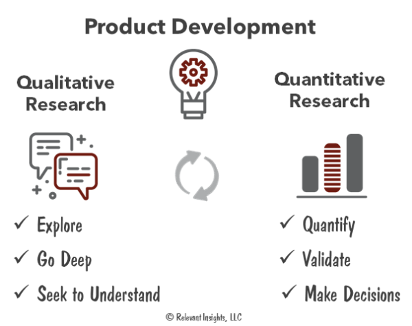
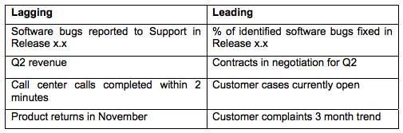
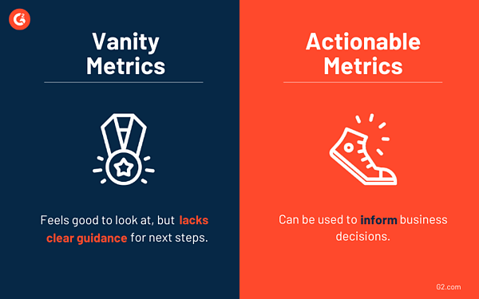

# Metrics - What Are They?

## Learning Objectives

By the end of this lesson you will be able to:

* Understand the goals of metrics
* Define the characteristics of ideal metrics
* Recognize the different types of metrics

> Your job isn’t to build more software faster: it’s to maximize the outcome and impact you get from what you choose to build.
>
> -Jeff Patton
>
> &nbsp;

#### !callout-warning

## Disclaimer

This is an introduction to this topic. We have two metric sections, and we are still just scratching the surface! Tory and Christina are both very passionate about this topic- though similar, their experiences were encountered individually, since they supported different program offices. It’s safe to say that both Tory and Christina have made countless blunders in their pursuit to prevent harmful metrics from being levied against teams. However, they have learned and continue to learn, as an ongoing process of improving their role. Throughout this lesson, we will emphasize areas to exercise caution - if we could go back in time, these are the places we would make different choices. We aim to to help you and your team this way, because at the end of the day:

"What gets measured gets improved."

-Robin S. Sharma

&nbsp;

#### !end-callout

## Metrics and Stakeholders: The Value 

> You can’t manage what you don’t measure.
>
> -Peter Drucker
>
> &nbsp;

An alternative to the above quote is, you manage what you measure. **Metrics matter** - they impact individual and team behavior alike. In Module 1, we asked you the current measure of progress in your organization. Overwhelmingly, many of you stated obligations and expenditures, or planning documents. Take a minute and ask yourself- what unintended consequences do these current metrics cause?

Some answers that come to mind: overemphasis on obligation and expenditures (spending money) vice valuable capability delivery or planning vice execution.

Now, let’s dig into metrics. Specifically, we are interested in what makes a good metric, and how to generate common understanding by facilitating discussions with stakeholders and leadership to enhance the goal of a metric.

**FIRST CAUTION**: We learned this one the hard way, though it may seem obvious: simply saying no to what you perceive as a bad metric will not typically be well-received by stakeholders and leadership. Benefit from our mistakes and avoid this tactic!

So if you can’t say no, what can you do? We provide strategies below, but think of every engagement with stakeholders and/or leadership as a learning opportunity, for both you and them. It is your job to defend your program, effort, or initiative - if a meeting doesn’t go well (i.e. you don’t get the desired support or outcome), you need to change your communication approach or strategy. Learn from each engagement and see them as the opportunity they are - nothing is as strong as **having others champion your message**. 

## Characteristics: Ideal Metrics

**Ideal metrics** are:
* Clearly defined
* Objective
* Measurable, and
* Support decision-making

Metrics should align to improvement goals communicated from the top-- the National Defense Strategy (NDS) articulates DoD goals and serves as the top strategy.

The books _[Lean Analytics](https://www.amazon.com/Lean-Analytics-Better-Startup-Faster/dp/1449335675)_ and _[The StartUp Way](https://www.amazon.com/Startup-Way-Companies-Entrepreneurial-Management/dp/1101903201)_ both define several characteristics of good metrics:

| Lean Analytics | The Startup Way |
| --- | --- |
| Comparative Understandable A ratio or a rate Changes the way you behave | Accessible Actionable Auditable | 

## Types of Metrics

Spending time securing a common understanding and language is worth the time, especially when communicating why a ‘new’ or alternative metric than traditionally reported is valuable. We know that many of the below definitions are not new for many of you, so we will be brief:

### Quantitative vs. Qualitative Metrics

From _Lean Analytics_:

A _**quantitative metric**_ is easy to understand, and involves hard numbers but typically provides less insight.
* Example: sport scores and movie ratings
* Answers ‘what’ and ‘how much’

A _**qualitative metric**_ is messy, subjective, imprecise, and is not measured easily.
* This is why engagement with users (user interviews) are vital to begin to define this metric, and refine over time
* Answers a ‘why’

### Leading vs. Lagging Metrics
From _Lean Analytics_:

A _**lagging metric**_ indicates that there’s a problem—but by the time you collect the data and identify the problem, it’s too late.
* Caveat: they are still useful, and can provide a solid baseline of performance/value.

A _**leading metric**_ tries to predict the future.

Some examples:  

 https://www.bpminstitute.org/resources/articles/leading-vs-lagging-metrics 

### Vanity vs. Actionable Metrics

Using the characteristics we first defined, metrics are actionable, and are able to answer the question: what will we do differently based on this information?

A _**vanity metric**_ makes you feel good, but does not change the way you act. It may be a number that can only increase over time.
Example: Number of views/visits

An _**actionable metric**_ changes your behavior by helping you pick a course of action.

Notice that we haven’t yet told you what metrics to track. As per usual, it depends. Metrics that you choose will change over time depending on what phase of the program you and your team are in. 

<!-- >>>>>>>>>>>>>>>>>>>>>> BEGIN CHALLENGE >>>>>>>>>>>>>>>>>>>>>> -->
<!-- Replace everything in square brackets [] and remove brackets  -->

### !challenge

* type: multiple-choice
* id: 1d770993-20b9-46a3-9764-1c25fa58e1b0
* title: Vanity vs. Actionable Metrics
<!-- * points: [1] (optional, the number of points for scoring as a checkpoint) -->
<!-- * topics: [python, pandas] (optional the topics for analyzing points) -->

##### !question

Vanity metrics have no value and should not be collected.

##### !end-question

##### !options

* True
* False

##### !end-options

##### !answer

* False

##### !end-answer

#### !hint
Although they may not be actionable, they still can help to demonstrate progress - be cautious to over rely on vanity metrics for multiple consecutive reporting periods.
#### !end-hint

<!-- other optional sections -->
<!-- !hint - !end-hint (markdown, hidden, students click to view) -->
<!-- !rubric - !end-rubric (markdown, instructors can see while scoring a checkpoint) -->
<!-- !explanation - !end-explanation (markdown, students can see after answering correctly) -->

### !end-challenge

<!-- ======================= END CHALLENGE ======================= -->
<!-- >>>>>>>>>>>>>>>>>>>>>> BEGIN CHALLENGE >>>>>>>>>>>>>>>>>>>>>> -->
<!-- Replace everything in square brackets [] and remove brackets  -->

### !challenge

* type: checkbox
* id: fac88f5a-188b-4ad0-a933-f05585127f5a
* title: Qualitative vs. Quantitative Metrics
<!-- * points: [1] (optional, the number of points for scoring as a checkpoint) -->
<!-- * topics: [python, pandas] (optional the topics for analyzing points) -->

##### !question

**Select all that apply**. Qualitative metrics are:

##### !end-question

##### !options

* Subjective and often imprecise
* Easy to understand and hard numbers
* Make decisions
* Typically identified through user engagement

##### !end-options

##### !answer

* Subjective and often imprecise
* Typically identified through user engagement

##### !end-answer

<!-- other optional sections -->
<!-- !hint - !end-hint (markdown, hidden, students click to view) -->
<!-- !rubric - !end-rubric (markdown, instructors can see while scoring a checkpoint) -->
<!-- !explanation - !end-explanation (markdown, students can see after answering correctly) -->

### !end-challenge

<!-- ======================= END CHALLENGE ======================= -->
<!-- >>>>>>>>>>>>>>>>>>>>>> BEGIN CHALLENGE >>>>>>>>>>>>>>>>>>>>>> -->
<!-- Replace everything in square brackets [] and remove brackets  -->

### !challenge

* type: checkbox
* id: 9ae99d5c-f58b-4609-ab1a-3115d9811598
* title: Metric Characteristics
<!-- * points: [1] (optional, the number of points for scoring as a checkpoint) -->
<!-- * topics: [python, pandas] (optional the topics for analyzing points) -->

##### !question

**Select all that apply.** What are ideal metric characteristics?

##### !end-question

##### !options

* A ratio or rate
* Comparative
* Actionable
* Understandable         
* Accessible

##### !end-options

##### !answer

* A ratio or rate
* Comparative
* Actionable
* Understandable
* Accessible

##### !end-answer

#### !hint
Do all of these look like ideal characteristics?
#### !end-hint

<!-- other optional sections -->
<!-- !hint - !end-hint (markdown, hidden, students click to view) -->
<!-- !rubric - !end-rubric (markdown, instructors can see while scoring a checkpoint) -->
<!-- !explanation - !end-explanation (markdown, students can see after answering correctly) -->

### !end-challenge

<!-- ======================= END CHALLENGE ======================= -->
