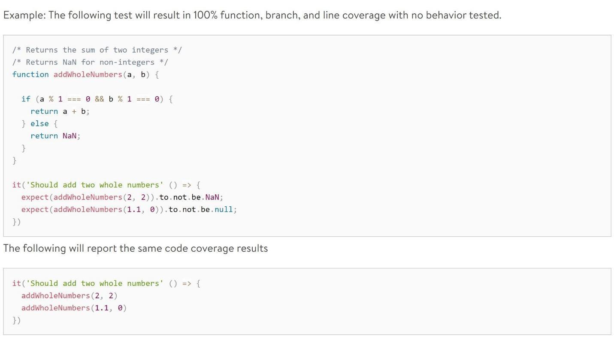

# How to Navigate the Sea of Metrics

## Learning Objectives

By the end of this lesson you will be able to:

* Understand strategies to define metrics
* Identify ways metrics can be improved
* Identify ways metrics can be manipulated

## Introduction

Velocity, Change Failure Rate, Source Lines of Code, Lead Time, Deployment Frequency,  Mean Time to Restore, Latency, Traffic, Saturation- is anyone else’s head swimming?

Are you thinking these are additions to what you are already expected to track programmatically, like obligations, expenditures, schedule, risk?

Don’t worry. Our goal is to provide you with strategies to help define your metrics, and to prioritize effectively. As you begin implementing more Agile and DevSecOps practices, the eventual benefit is that these should be easily collected, i.e. automatically collected- however, we understand that you may not be there yet. Furthermore, starting with strategies to define metrics can help you to show progress.

## Adaptation of User Stories

Think of metrics as a sense of purpose. What’s a good way of bringing in strategies that are used in software development? Start with user stories. User stories are a way to frame value, and can be a great tool to support your metrics. A typical user story follow this format where you replace the text in black:

As a [type of user], * 
I want [a result/goal-state], * 
So that [a business need is satisfied].

This allows us to answer: **who** we are measuring for, **what** we are measuring and what must be done to achieve the goal state, and **why** we are measuring it across various DoD.

This can be used at a feature, product, or portfolio (program) just to name some ways. Using a feature measure (metric) at a portfolio level wouldn’t make sense, nor would a product measure (metric) at portfolio level. 

 

#### !callout-secondary

## Note

User stories typically have acceptance criteria associated with them.  This allows you to answer the question, ”How do I know when I have met the user's needs?”

#### !end-callout

<!-- >>>>>>>>>>>>>>>>>>>>>> BEGIN CHALLENGE >>>>>>>>>>>>>>>>>>>>>> -->
<!-- Replace everything in square brackets [] and remove brackets  -->

### !challenge

* type: multiple-choice
* id: 7b3b377c-d38e-11eb-b8bc-0242ac130003
* title: Process Improvement
<!-- * points: [1] (optional, the number of points for scoring as a checkpoint) -->
<!-- * topics: [python, pandas] (optional the topics for analyzing points) -->

##### !question

Which of the following are properly written user stories?

##### !end-question

##### !options

* User Story 1: As a manager, I want to view a list of my employees so that I can manage my people
* User Story 2: As a Manager within the US Government, I want to view a list of my non-compliant employees so that, I can take action to bring them back into compliance
* User Story 3: As a Manager of the X-Files department within the FBI, I want to view a list of my Employees that are non-compliant with their annual Extraterrestrial Autopsy Training, so that I can help them schedule a training session and bring them back into compliance.

##### !end-options

##### !answer

* User Story 3: As a Manager of the X-Files department within the FBI, I want to view a list of my Employees that are non-compliant with their annual Extraterrestrial Autopsy Training, so that I can help them schedule a training session and bring them back into compliance.

##### !end-answer

### !explanation-correct
Even better. We know who we are solving the problem for, what the goal state is, and why. Notice that this User Story has not dictated any specific technical solution. This is important for the developers & the team! This allows the team to exercise their unique problem solving abilities and technical expertise.
### !end-explanation

### !explanation: User Story 1: As a manager, I want to view a list of my employees so that I can manage my people
Ok, possibly a good Epic. But could this be better defined?
### !end-explanation

### !explanation: User Story 2: As a Manager within the US Government, I want to view a list of my non-compliant employees so that, I can take action to bring them back into compliance
Better, but this could be more specific.  
### !end-explanation

<!-- other optional sections -->
<!-- !hint - !end-hint (markdown, hidden, students click to view) -->
<!-- !rubric - !end-rubric (markdown, instructors can see while scoring a checkpoint) -->
<!-- !explanation - !end-explanation (markdown, students can see after answering correctly) -->

### !end-challenge

<!-- ======================= END CHALLENGE ======================= -->

## Metric Playbooks

#### !callout-warning

## Tory's Caution

Playbooks are quickly emerging in the DoD, and I have personally helped to author some. But keep in mind - playbooks are not a silver bullet. For example, playbooks are used by all major football teams in the NFL. But each playbook is different, because each team has different players and skills - trying to force a team to use a playbook that isn’t within their capacity to use or understand will not be successful. Giving the playbook for the Chicago Bears to the New England Patriots will not be effective, because the team is unable to support itself using the tool provided.

#### !end-callout

So what are practices we can adopt that will improve the usefulness of our playbooks? The following recommendations are an adaptation of tips and frameworks established by Walmart. We believe this format helps to further define specific metrics, is understandable, and clearly defines the behavior the metric is trying to change: [Dojo Consortium - Metrics Definitions](https://dojoconsortium.org/docs/playbooks/metrics/index.html)

Here are some playbook tips from our industry teammates that we believe are worth adopting.

Playbooks should be focused yet easy to reference by the teams using them.  They should be built in a way that not only coaches teams but enables them to improve how they perform an activity. Consider how a playbook addresses a single pain point or practice.

A playbook can follow the following structure/guidelines:

**Structure**
* Definition of what the playbook is trying to accomplish
* Note who the target audience is
* Recommend actionable practices that have been effective

**Guidelines**
* Consider how you address feedback and continue to improve the playbook
* Keep the playbook short enough that it can be consumed quickly.
* Think 5 minute read, not a novel -- Revise to shorten if required.

Deployment Cycle Time is an example from the Dojo Consortium. This is just one example- the rest of the playbooks are included in the bonus section. You may need to tweak the definitions slightly, but our recommendation is to try to stay as consistent with industry. Our assumption is that this will help to minimize misunderstanding when working with our industry partners:

<table>
<tbody>
<tr>
<th>Development Cycle Time * CD Execution - Throughput</th>
<td>The average time from starting work until released to production.</td>
</tr>
<tr>
<th>What is the intended behavior?</th>
<td>Reduce the time it takes to deliver refined work to production to mitigate the effects of priorities changing and to improve value delivery.</td>
</tr>
<tr>
<th>How is it improved?</th>
<td><ul><li>Decompose work so it can be delivered in smaller increments and by more team members.</li><li> Identify and remove process waste, handoffs, and delays in the construction process.</li><li> Improve testing efficiency for more rapid feedback loops.</li><li> Automate and standardize the build and deploy pipeline.</li></ul></td>
</tr>
<tr>
<th>How is it gamed?</th>
<td><ul><li>Move things to “Done” status that are not in production.</li><li> Move items directly from “Backlog” to “Done” after deploying to production.</li><li> Split work into functional tasks that should be considered part of development (development task, testing task, etc.).</li></ul></td>
</tr>
<tr>
<th>Guardrail Metrics</th>
<td><ul><li>The following metrics could degrade if not tracked with this metric</li><li> Quality decreases as quality processes are skipped.</li><li> Change Fail Rate increases.</li></ul></td>
</tr>
</tbody>
</table>

## Phases of Metrics
We opened this section by listing several software metrics available to you. As previously stated, there is no one-size-fits-all solution, but we want to provide some possible options.

#### !callout-secondary
## NOTE
The following recommendations are made based on our personal experiences, and may not be right for your situation or scenario.
#### !end-callout

### Starting a Digital Transformation:
Recall,
> <strong>Software is made by  people and for  people, so digital talent matters.</strong>
>
> 2019 [Software is Never Done](https://innovation.defense.gov/software/) by Defense Innovation Board
>
> &nbsp;

**Enabling your Team**. You already have a head start on this one- this recommendation is what inspired this course! Now it’s your turn to ensure your team has the same opportunity. Training your team with either this course or others will be the best launch point.

**Establishing a repeatable path to production**. Books like _[Ahead in the Cloud](https://www.amazon.com/Ahead-Cloud-Practices-Navigating-Enterprise/dp/1981924310)_ provide details for establishing a repeatable path to production (operations) for a few products. This is the embodiment of starting small, then establish feedback loops that include your users.

**Preparing for scale**. While that is ongoing, if you are in a modernization program, upgrade or even if you have to interface with additional systems, start thinking about architecture and data. 

### Scaling a Digital Transformation:

**Documentation and Repeatable Processes**. This is not only vital for your current team, but also enables scaling.

**On-boarding**. Again, this is vital for both technology and additional personnel. Make sure you are able to use the processes or tools that helped scale your initial team, and work quickly to establish ways to enable others that are verified with feedback.

**Incorporating Software Performance Metrics**. The goal is to automate software performance metrics that are appropriate to support tradeoff decisions as required. This can be accomplished in various ways, whether you are implementing the [DevOps Research and Assessment (DORA) Four](https://cloud.google.com/blog/products/devops-sre/using-the-four-keys-to-measure-your-devops-performance), or [Google’s Golden Signals](https://sre.google/sre-book/monitoring-distributed-systems/#xref_monitoring_golden-signals).

### !challenge

* type: checkbox
* id: d03d2738-8312-450f-b888-8e40d1da72b0
* title: !Your Metrics 1
<!-- * points: [1] (optional, the number of points for scoring as a checkpoint) -->
<!-- * topics: [python, pandas] (optional the topics for analyzing points) -->

##### !question

The instructors have provided some of their thoughts on metrics. What are some software performance metrics that you are currently using to demonstrate progress in your organization? Have these metrics changed your decision processes?

##### !end-question

##### !options

* Commit Frequency
* Build Cycle Time
* Average Build Downtime
* Development Cycle Time
* Deploy Frequency
* Change Failure Rate
* Deploy Frequency
* Change Failure Rate
* Mean Time to Repair
* Code Coverage
* Quality
* Development Cycle Time
* Productivity
* Lead Time
* WIP

##### !end-options

##### !answer

* *

##### !end-answer

<!-- other optional sections -->
<!-- !hint - !end-hint (markdown, hidden, students click to view) -->
<!-- !rubric - !end-rubric (markdown, instructors can see while scoring a checkpoint) -->
<!-- !explanation - !end-explanation (markdown, students can see after answering correctly) -->

### !end-challenge

<!-- >>>>>>>>>>>>>>>>>>>>>> BEGIN CHALLENGE >>>>>>>>>>>>>>>>>>>>>> -->
<!-- Replace everything in square brackets [] and remove brackets  -->

### !challenge

* type: multiple-choice
* id: 99b7dffe-d422-11eb-b8bc-0242ac130003
* title: !Your Metrics 2
<!-- * points: [1] (optional, the number of points for scoring as a checkpoint) -->
<!-- * topics: [python, pandas] (optional the topics for analyzing points) -->

##### !question

How do you track these metrics:

_Note: There is no right answer, we are using this as an opportunity to learn from you_

##### !end-question

##### !options
* CDRL Documentation only
* CDRL Documentation and Automated Dashboard
* Automated Dashboard only
* We don’t track any of the metrics from the previous question
* I do not know how or if we are tracking these metrics 
##### !end-options

##### !answer

* *

##### !end-answer

<!-- other optional sections -->
<!-- !hint - !end-hint (markdown, hidden, students click to view) -->
<!-- !rubric - !end-rubric (markdown, instructors can see while scoring a checkpoint) -->
<!-- !explanation - !end-explanation (markdown, students can see after answering correctly) -->

### !end-challenge

<!-- ======================= END CHALLENGE ======================= -->

As a preview to Module 103 and 104, there are programmatic metrics that help show that you are de-risking your program. Here are some examples:

* **Team Composition**: Utilizing civilians, military, and vendors across teams, coupled with onboarding to help mitigate known movement of personnel
* **[FAR 39.103 Modular Contracting](https://www.acquisition.gov/far/39.103)**. Modular contracting is intended to reduce program risk and to incentivize contractor performance, while meeting the government's need for timely access to rapidly changing technology. **Agencies should, to the maximum extent practicable, use modular contracting to acquire major systems (see 2.1010) of information technology**, consistent with the agency's information technology architecture. Agencies may also use modular contracting to acquire non-major systems of information technology.
  * When using modular contracting, an acquisition of a system of information technology may be **divided into several smaller acquisition increments** that:
    * Are **easier to manage individually** than one comprehensive acquisition;
    * Address complex information technology objectives incrementally, in order to **enhance the likelihood of achieving workable systems or solutions** for attaining those objectives
    * Provide for delivery, implementation, and testing of workable systems or solutions in discrete increments, each of which **is not dependent on any subsequent increment in order to perform its principal functions**;
    * Provides an opportunity for subsequent increments to take advantage of any evolution in technology or needs that occur during implementation and/or use of earlier increments; and
    * **Reduces risk** of potential adverse consequences on the overall project by isolating and avoiding custom-designed system components.
    

<!-- >>>>>>>>>>>>>>>>>>>>>> BEGIN CHALLENGE >>>>>>>>>>>>>>>>>>>>>> -->
<!-- Replace everything in square brackets [] and remove brackets  -->

### !challenge

* type: paragraph
* id: 39706441-5677-411e-aa5e-ecf6a394f8ab
* title: !Acquisition Metrics
<!-- * points: [1] (optional, the number of points for scoring as a checkpoint) -->
<!-- * topics: [python, pandas] (optional the topics for analyzing points) -->

##### !question

What are some software **acquisition** metrics that you currently are using, or planning to use in your organization? Have these metrics changed your decision processes?

##### !end-question

##### !placeholder

If you don’t know how to answer this for your specific program or effort, utilize the user story approach and share what SW Acquisition metrics you believe are critical to be tracked based upon what you have learned to date.

##### !end-placeholder

<!-- other optional sections -->
<!-- !hint - !end-hint (markdown, hidden, students click to view) -->
<!-- !rubric - !end-rubric (markdown, instructors can see while scoring a checkpoint) -->
<!-- !explanation - !end-explanation (markdown, students can see after answering correctly) -->

### !end-challenge

<!-- ======================= END CHALLENGE ======================= -->

## Tying Together: Effectiveness, Efficiency, and Health
We are all in this together. The DoD is most effective when it can leverage the capabilities and skills of multiple individual services as one. We say this because although friendly competition can help improve performance - the real competition is our adversaries. Do not let friendly competition become tearing down other organizations starting (or continuing) this journey. We can support this mission by:
* Recognizing teams who are trying new things, and publishing their results with transparency (successful or not).  
* Establish an environment committed to reducing the amount of duplicate work (unless it’s essential for the DoD’s security posture).  We achieve this by learning from our peers, committing to collaboration, and reusing tools and resources wherever possible. This supports interoperability and improves engagements across programs, PEOs, Services and industry.

Finally, we need to become more efficient, more effective, and retain domain expertise to remain competitive. A few ways we can do this are:

### 1.    Efficiency
Finding ways to measure efficiency and tracking the cost of changes, including speed and quality of delivery.
* Focusing on efficiency is the driving force for shrinking critical feedback loops and removing waste.
* As we become more efficient, toil is reduced, and it becomes more economical to run product experiments.
* Speed of change is contextual to what is being delivered, but the goal should always be to find ways to obtain feedback more rapidly tomorrow than today.
* If we are satisfied with our feedback loops, we are too slow.
* Comparing efficiencies across programs leads to negative behavior, **disincentivizing collaboration** and _leading to antipatterns_.

### 2.    Effectiveness
Improving efficiency is important, but we need to effectively deliver value.
* Delivering slowly is bad enough. It’s worse if we spend years building something, only to discover our customers don't want it.
* We can identify value goals for each product, and adjust our systems to measure accordingly.
* We can measure user, mission, and overall business satisfaction to detect report trends.
* We need to improve, without degrading efficiency.

### 3.    Health
If we are efficient and effective but have heroes keeping our systems stable, we cannot sustain improvement.
* We need to set goals around stability, both in our systems and in our teams.
    * **Are teams happy?**
        * If you think this is a weird question to ask - here are some statistics that may sway you: _“In studies by the Queens School of Business and by the Gallup Organization, disengaged workers had 37% higher absenteeism, 49% more accidents, and 60% more errors and defects. In organizations with low employee engagement scores, they experienced 18% lower productivity, 16% lower profitability, 37% lower job growth, and 65% lower share price over time.”_
    * **Do we have high turnover on teams?**
* Ways to measure the health and happiness of teams include:
  * Product Delivery: Happy teams who have product ownership will deliver better products.
  * Needs Met: Mission and business needs being met will have a positive impact.
  * Overall Satisfaction: Are the team/organization/service/employee feeling satisfied overall?

### !challenge

* type: multiple-choice
* id: 58840bd8-9456-436c-afba-f5d57bf63753
* title: Meaning of Metrics
<!-- * points: [1] (optional, the number of points for scoring as a checkpoint) -->
<!-- * topics: [python, pandas] (optional the topics for analyzing points) -->

##### !question

Above all else, metrics should be used as: 

##### !end-question

##### !options

* As Program Planning and Execution tool
* As an indicator of efficient, effective and healthy effort
* To inform the PPB&E Process
* To oversee the Product Development teams
* To reduce WIP in your SW intensive program

##### !end-options

##### !answer

* As an indicator of efficient, effective and healthy effort

##### !end-answer

<!-- other optional sections -->
<!-- !hint - !end-hint (markdown, hidden, students click to view) -->
<!-- !rubric - !end-rubric (markdown, instructors can see while scoring a checkpoint) -->
<!-- !explanation - !end-explanation (markdown, students can see after answering correctly) -->

### !end-challenge

### !callout-success
## Key Takeaways: 
The volume of metrics available with software intensive systems can be overwhelming. Be careful of falling into the trap of collecting and tracking all the metrics. Look to automate metrics when feasible -- and only track a subset. 
Playbooks are not a silver bullet. They can be a tool but context matters. Using a football playbook as an analogy, a playbook is tailored for that team and often the opponent they play--it is only useful for their skills. If your running back is hurt you wouldn’t run a lot of running plays. Applying back to your team, keep in mind who you have to build your plays or tailor others.
All metrics can be manipulated. When defining metrics, think of how it can be ‘gamed’ or manipulated and make sure the team is aware of antipatterns. 
### !end-callout

## Resources:
* **Article:** Proof that Positive Work Cultures are More Productive https://hbr.org/2015/12/proof-that-positive-work-cultures-are-more-productive
* **Books:** 
   * [_Accelerate: The Science of Lean Software and DevOps: Building and Scaling High Performing Technology_](https://itrevolution.com/book/accelerate/) by Nicole Forsgren, Jez Humble and Gene Kim
   * [_Ahead in the Cloud: Best Practices for Navigating the Future of Enterprise IT_](https://www.amazon.com/Ahead-Cloud-Practices-Navigating-Enterprise/dp/1981924310) by Stephen Corban
   * [_Lean Analytics: Use Data to Build a Better Startup Faster_](https://www.amazon.com/Lean-Analytics-Better-Startup-Faster/dp/1449335675) by Alistair Croll & Benjamin Yoskovitz
   * [_The Startup Way_](https://www.amazon.com/Startup-Way-Companies-Entrepreneurial-Management/dp/1101903201) by Eric Ries
* **Websites:**
   * https://dojoconsortium.org/docs/playbooks/index.html
   * [Google’s Golden Signals](https://sre.google/sre-book/monitoring-distributed-systems/)

## Bonus Material: Additional Metric Playbooks

<table>
<tbody>
<tr>
<th>Commit Frequency CI Execution</th>
<td>The average number of times each developer on a team integrates tested, non-breaking code to trunk / master. Healthy CI practice is at least once per day per developer.</td>
</tr>
<tr>
<th>What is the intended behavior?</th>
<td><ul><li>Increase the frequency of code integration:</li><li> Reduce the size of each change.</li><li> Improve code review processes.</li></ul></td>
</tr>
<tr>
<th>How is it improved?</th>
<td><ul><li>Break down code changes into smaller units to incrementally deliver features.</li><li> Use BDD to aid functional breakdown.</li><li> Use TDD to design more modular code that can be integrated more frequently.</li><li> Make new code reachable only by the tests or flagged off for other environments with feature flags.</li></ul></td>
</tr>
<tr>
<th>How is it gamed?</th>
<td>Meaningless changes integrated into the trunk.</td>
</tr>
<tr>
<th>Guardrail Metrics</th>
<td>The following metrics could degrade if not tracked with this metric:<ul><li>Quality decreases when testing is skipped.</li><li>Development Cycle Time increases due to additional review overhead.</li></ul></td>
</tr>
<tr>
<th>Recommended Practices</th>
<td><ul><li>
Trunk Based Development</li><li>
Continuous Integration</li><li>
Feature Flagging
</li></ul></td>
</tr>
</tbody>
</table>

<table>
<tbody>
<tr>
<th>
Build Cycle Time 
CI Execution
</th>
<td>
The average length of time between when a build breaks and when it is fixed.
</td>
</tr>
<tr>
<th>What is the intended behavior?</th>
<td>
Reduce pipeline duration to improve MTTR and improve test efficiency to give the team more rapid feedback to any issues.
</td>
</tr>
<tr>
<th>How is it improved?</th>
<td><ul><li>
Identify areas of the build that can run concurrently.</li><li>
Replace end to end tests in the pipeline with virtual services and move end to end testing to an asynchronous process.</li><li>
Break down large services into smaller sub-domains that are easier and faster to test</li></ul>
</td>
</tr>
<tr>
<th>How is it gamed?</th>
<td>
Meaningless changes integrated into the trunk.
</td>
</tr>
<tr>
<th>Guardrail Metrics</th>
<td>
Reduce the number of tests running or test types executed.
</td>
</tr>
<tr>
<th>Recommended Practices</th>
<td>
The following metrics could degrade if not tracked with this metric 
Quality decreases if testing steps are skipped.
</td>
</tr>
</tbody>
</table>

<table>
<tbody>
<tr>
<th>
Average Build Downtime 
CI Execution
</th>
<td>
The average length of time between when a build breaks and when it is fixed.
</td>
</tr>
<tr>
<th>What is the intended behavior?</th>
<td>
Keep the pipelines always deployable by fixing broken builds as rapidly as possible. Broken builds are the highest priority since they prevent production fixes from being deployed in a safe, standard way.
</td>
</tr>
<tr>
<th>How is it improved?</th>
<td><ul><li>
Refactor to improve testability and modularity.</li><li>
Improve tests to locate problems more rapidly.</li><li>
Decrease the size of the component to reduce complexity.</li><li>
Add automated alerts for broken builds.</li><li>
Ensure the proper team practice is in place to support each other in solving the problem as a team.</li></ul>
</td>
</tr>
<tr>
<th>How is it gamed?</th>
<td><ul><li>
Re-build the previous version.</li><li>
Remove tests that are failing.</li></ul>
</td>
</tr>
<tr>
<th>Guardrail Metrics</th>
<td>
The following metrics could degrade if not tracked with this metric
<ul><li>Integration Frequency decreases as additional manual or automated process overhead is added before integration to trunk.</li><li>
Throughput decreases as manual verification steps are added to ensure each pull request does not break the build.</li></ul>
</td>
</tr>
</tbody>
</table>

<table>
<tbody>
<tr>
<th>Deploy Frequency 
CD Execution – Throughput
</th>
<td>
How frequently per day the team releases changes to production.
</td>
</tr>
<tr>
<th>What is the intended behavior?</th>
<td>
Small changes deployed very frequently to exercise the ability to fix production rapidly, reduce MTTR, increase quality, and reduce risk.
</td>
</tr>
<tr>
<th>How is it improved?</th>
<td><ul><li>
Reduce Development Cycle Time</li><li>
Remove handoffs to other teams.</li><li>
Remove manual processes.</li><li>
Improve testing and move quality ownership into the team.</li><li>
Move hard dependencies to soft dependencies with feature flags and service virtualization</li><li>
Focus on continuous integration with small changes integrated to the trunk continuously.</li><li>
Use trunk-based development to reduce the risk of lost changes and process overhead.</li></ul>
</td>
</tr>
<tr>
<th>How is it gamed?</th>
<td>
<ul><li>
Re-deploying the same artifact repeatedly.</li><li>
Building new artifacts that contain no changes.</li></ul>
</td>
</tr>
<tr>
<th>Guardrail Metrics</th>
<td>The following metrics could degrade if not tracked with this metric
<ul><li>
Change Fail Rate increases as focus shifts to speed instead of quality.</li><li>
Quality decreases as steps are skipped.</li></ul>
</td>
</tr>
</tbody>
</table>

<table>
<tbody>
<tr>
<th>Change Fail Rate 
CD Execution – Stability
</th>
<td>
The percentage of changes that result in negative customer impact, or rollback. 
changeFailRate = failedChangeCount / changeCount
</td>
</tr>
<tr>
<th>What is the intended behavior?</th>
<td>Reduce the percentage of failed changes to less than 15%.</td>
</tr>
<tr>
<th>How is it improved?</th>
<td><ul><li>
Release more, smaller changes to make quality steps more effective and reduce the impact of failure.</li><li>
Identify the root cause for each failure and improve the automated quality checks.</li></ul>
</td>
</tr>
<tr>
<th>How is it gamed?</th>
<td><ul><li>
Deploy fixes without recording the defect.</li><li>
Create defect review meetings and re-classify defects as feature requests.</li><li>
Re-deploy the latest working version to increase deploy count.</li></ul>
</td>
</tr>
<tr>
<th>Guardrail Metrics</th>
<td>
The following metrics could degrade if not tracked with this metric 
Deploy Frequency decreases as focus is placed on “zero defect” changes.
</td>
</tr>
</tbody>
</table>

<table>
<tbody>
<tr>
<th>
Mean Time to Repair 
CD Execution – Stability
</th>
<td>
Mean Time to Repair is the average time between when an incident is detected and when it is resolved.
</td>
</tr>
<tr>
<th>What is the intended behavior?</th>
<td>
Improve the ability to more rapidly resolve system instability and service outages.
</td>
</tr>
<tr>
<th>How is it improved?</th>
<td><ul><li>
Make sure the pipeline is always deployable.</li><li>
Keep build cycle time short to allow roll-forward.</li><li>
Implement feature flags for larger feature changes to allow them to be deactivated without re-deploying.</li><li>
Identify stability issues and prioritize them in the backlog.</li></ul>
</td>
</tr>
<tr>
<th>How is it gamed?</th>
<td>
Updating support incidents to “closed” before service is restored.
</td>
</tr>
<tr>
<th>Guardrail Metrics</th>
<td>
The following metrics could degrade if not tracked with this metric 
Quality decreases as issues re-occur due to lack of root cause fixes.
</td>
</tr>
</tbody>
</table>

<table>
<tbody>
<tr>
<th>
Code Coverage 
Delivering Quality 
</th>
<td>Measure of how many lines, branches, and functions are executed when automated tests are run. Industry average is ~80%.</td>
</tr>
<tr>
<th>What is the intended behavior?</th>
<td>
Notify the team of risky or complicated portions of the code that are not sufficiently covered by tests.
</td>
</tr>
<tr>
<th>How is it improved?</th>
<td><ul><li>
Write tests for code that SHOULD be covered but isn’t.</li><li>
Refactor the application to improve testability.</li></ul>
</td>
</tr>
<tr>
<th>How is it gamed?</th>
<td><ul><li>
Tests are written for code that receives no value from testing.</li><li>
Test code is written that does not check for failures.</li><li>
Code is inappropriately excluded from test coverage reporting.</li></ul>

</td>
</tr>
<tr>
<th>Guardrail Metrics</th>
<td>The following metrics could degrade if not tracked with this metric
<ul><li>
Development Cycle Time increases with additional development time dedicated to chasing the coverage metric.</li><li>
Quality decreases as poor quality tests hide lack of real code coverage.</li></ul>
</td>
</tr>
</tbody>
</table>

<table>
<tbody>
<tr>
<th>
Quality 
Delivering Quality 
</th>
<td>
Quality is measured as the percentage of finished work that is reported as defective or valueless by the end user and by stability and availability metrics.
</td>
</tr>
<tr>
<th>What is the intended behavior?</th>
<td>Identify and rapidly resolve any gaps in the process of identifying the value to be delivered and the quality steps in the construction process.</td>
</tr>
<tr>
<th>How is it improved?</th>
<td><ul><li>
Identify root causes.</li><li>
Add automated checks to the pipeline to prevent re-occurrence.</li><li>
Only begin new work with testable acceptance criteria.</li><li>
Design feedback loops in every stage to rapidly alert you to quality, performance, or availability issues.</li></ul>
</td>
</tr>
<tr>
<th>How is it gamed?</th>
<td><ul><li>
Defects are logged as new features (seen by growing throughput, but lowering customer satisfaction and increasing complaints)</li><li>
Using test coverage to proxy quality</li></ul>
</td>
</tr>
<tr>
<th>Guardrail Metrics</th>
<td>
The following metrics could degrade if not tracked with this metric
<ul><li>
WIP metric increases for defect types.</li><li>
Feature delivery is impacted as defects are over prioritized.</li></ul>
</td>
</tr>
</tbody>
</table>

<table>
<tbody>
<tr>
<th>
Development Cycle Time 
Workflow Management
</th>
<td>
The average time from starting work until released to production.
</td>
</tr>
<tr>
<th>What is the intended behavior?</th>
<td>Reduce the time it takes to deliver refined work to production to mitigate the effects of priorities changing and to improve value delivery.</td>
</tr>
<tr>
<th>How is it improved?</th>
<td><ul><li>
Decompose work so it can be delivered in smaller increments and by more team members.</li><li>
Identify and remove process waste, handoffs, and delays in the construction process.</li><li>
Improve testing efficiency for more rapid feedback loops.</li><li>
Automate and standardize the build and deploy pipeline.</li></ul>
</td>
</tr>
<tr>
<th>How is it gamed?</th>
<td><ul><li>
Move things to “Done” status that are not in production./li><li>
Move items directly from “Backlog” to “Done” after deploying to production./li><li>
Split work into functional tasks that should be considered part of development (development task, testing task, etc.).</li></ul>
</td>
</tr>
<tr>
<th>Guardrail Metrics</th>
<td>
The following metrics could degrade if not tracked with this metric
<ul><li>
Quality decreases as quality processes are skipped.</li><li>
Change fail rate increases.</li></ul>
</td>
</tr>
</tbody>
</table>

<table>
<tbody>
<tr>
<th>
Productivity 
Workflow Management
</th>
<td>
Throughput per week. This is measured by how many items were finished as a trend over time. This includes all items, defects and story work.
</td>
</tr>
<tr>
<th>What is the intended behavior?</th>
<td>
Help teams find what level of throughput per week is consistently achievable and find ways to increase this over time by reducing waste, reducing toil, improving planning, and focusing on teamwork.
</td>
</tr>
<tr>
<th>How is it improved?</th>
<td><ul><li>
Smaller stories are easier to understand and deliver.</li><li>
Minimize hard dependencies. Each hard dependency reduces the odds of on-time delivery by 50%.</li><li>
Swarm stories so that the team is working as a unit to deliver faster.</li></ul>
</td>
</tr>
<tr>
<th>How is it gamed?</th>
<td><ul><li>
More, smaller tasks.</li><li>
Cherry picks easy, low priority items.</li><li>
Skip quality steps.</li><li>
Prematurely sign-off work only to have defects reported later.</li></ul>
</td>
</tr>
<tr>
<th>Guardrail Metrics</th>
<td>
The following metrics could degrade if not tracked with this metric
<ul><li>
Quality defect ratio goes up as more defects are reported.</li><li>
WIP increases as teams start more work to look more busy.</li></ul>
</td>
</tr>
</tbody>
</table>

<table>
<tbody>
<tr>
<th>Lead Time 
Workflow Management
</th>
<td>
This shows the average time it takes for a new request to be delivered. This is measured from the creation date to release date for each unit of work and includes Development Cycle Time.  
</td>
</tr>
<tr>
<th>What is the intended behavior?</th>
<td>
Identify over utilized teams, backlogs that need more Product Owner attention, or in conjunction with productivity to help teams optimize their processes.
</td>
</tr>
<tr>
<th>How is it improved?</th>
<td>
Relentlessly remove old items from the backlog. Improve team processes to reduce Development Cycle Time. Use Innersourcing to allow other teams to help when surges of work arrive. Re-assign, carefully, some components to another team to scale delivery.
</td>
</tr>
<tr>
<th>How is it gamed?</th>
<td><ul><li>
Requests can be tracked in spreadsheets or other locations and then added to the backlog just before development. This can be identified by decreased customer satisfaction.</li><li>
Reduce feature refining rigour.</li></ul>
</td>
</tr>
<tr>
<th>Guardrail Metrics</th>
<td>
The following metrics could degrade if not tracked with this metric
<ul><li>
Quality is reduced as less time is spent refining and defining how to validate the feature.</li><li>
Productivity is reduced if tightly coupled components are shifted to another team or excessive communication is required for delivery</li></ul>
</td>
</tr>
</tbody>
</table>

<table>
<tbody>
<tr>
<th>WIP 
Workflow Management
</th>
<td>
Work in Process (WIP) is the total work that has been started but not completed. This includes <strong>all</strong> work, defects, tasks, stories, etc.
</td>
</tr>
<tr>
<th>What is the intended behavior?</th>
<td>
Teams should limit WIP and work together to complete WIP items in preference to starting new work. Use WIP limits to identify and exploit constraints in the Development Cycle Time.
</td>
</tr>
<tr>
<th>How is it improved?</th>
<td><ul><li>
The team should focus on finishing items closest to being ready for production.</li><li>
Set and do not exceed WIP limits for the team and for each step.</li><li>
WIP limit guidance: 2N-1 where N is the number of team members capable of doing the work.</li><li>
Keep the Kanban board visible at all times.</li></ul>
</td>
</tr>
<tr>
<th>How is it gamed?</th>
<td><ul><li>
Teams can update incomplete work to “done” before all quality steps have been completed.</li><li>
Reduce the pace of starting new work without focusing on helping to complete WIP.</li></ul>
</td>
</tr>
<tr>
<th>Guardrail Metrics</th>
<td></td>
</tr>
<tr>
<th>Recommended Practices</th>
<td>
The following metrics could degrade if not tracked with this metric
<ul><li>
Quality metric decreases as additional defects are reported.</li><li>
Productivity metric decreases.</li></ul>
</td>
</tr>
</tbody>
</table>

### !challenge

* type: multiple-choice
* id: 322edebd-3d64-4984-a361-2ed7338adc11
* title: Metrics Playbooks
<!-- * points: [1] (optional, the number of points for scoring as a checkpoint) -->
<!-- * topics: [python, pandas] (optional the topics for analyzing points) -->

##### !question

Does your program currently track these types of metrics?

##### !end-question

##### !options

* Yes
* No
* N/A

##### !end-options

##### !answer

* *

##### !end-answer

<!-- other optional sections -->
<!-- !hint - !end-hint (markdown, hidden, students click to view) -->
<!-- !rubric - !end-rubric (markdown, instructors can see while scoring a checkpoint) -->
<!-- !explanation - !end-explanation (markdown, students can see after answering correctly) -->

### !end-challenge

### !challenge

* type: paragraph
* id: a8a06243-790c-4640-92d3-6e10704203d9
* title: Metric Playbook in Action
<!-- * points: [1] (optional, the number of points for scoring as a checkpoint) -->
<!-- * topics: [python, pandas] (optional the topics for analyzing points) -->

##### !question

If yes, please share how these metrics are collected and what the data is utilized for in your program.

##### !end-question

##### !placeholder

##### !end-placeholder

<!-- other optional sections -->
<!-- !hint - !end-hint (markdown, hidden, students click to view) -->
<!-- !rubric - !end-rubric (markdown, instructors can see while scoring a checkpoint) -->
<!-- !explanation - !end-explanation (markdown, students can see after answering correctly) -->

### !end-challenge

