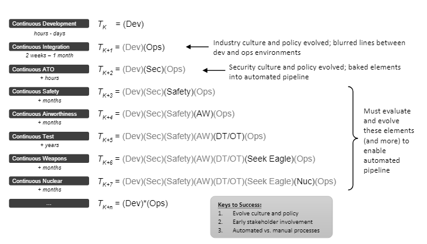
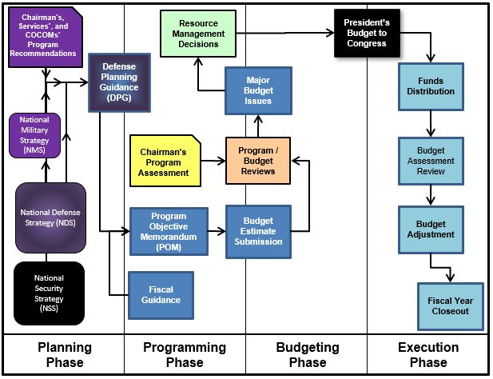
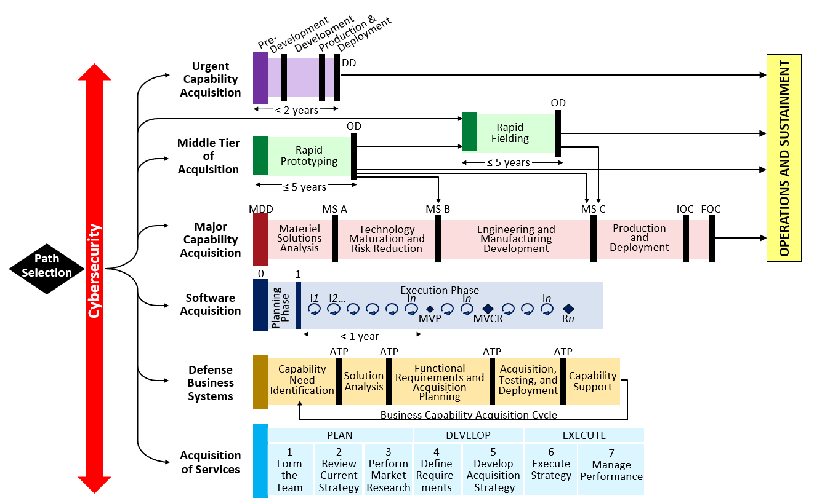

# Dev*Ops Workflow within DoD

## Learning Objectives

By the end of this lesson you will be able to:

* Understand how commercial DevOps can be applied within the DoD
* Understand the added constraints and validation required by some DoD systems
* Understand the nature of bureaucratic cycle times, and how they may impact development and delivery
* Understand the progress made by shortening cycle times at different parts of the acquisition chain
* Understand that more needs to be done, and that it's possible

## What is Dev*Ops?
Now that you have an understanding of the architecture, design patterns, technology stacks, development pipelines, etc. used by the commercial software industry, it's time to dive in and examine the question, “What’s different for me as an acquisitions professional, and the DoD?”

The commercial software industry has a wealth of roles and tools, from fully integrated software development and operations (Dev and Ops respectively), to rapid feedback, implementation and release cycles run by empowered teams. With the inclusion of security (Sec) in all aspects of design, development, and fielding, the industry has moved squarely to Dev+Sec+Ops, or DevSecOps.

So, what is this Dev*Ops (Dev “Star” Ops) thing? 

  
 Source:  [File:Death star1.png - Wikipedia](https://en.wikipedia.org/wiki/File:Death_star1.png) 

No, not Death Star Ops, but Dev\*Ops.  In computer programming the asterisk (\*) is used to designate a [wildcard character](https://en.wikipedia.org/wiki/Wildcard_character), or simply put, a substitute for any characters.  For example, industry has added Sec, or Security, in the middle to demonstrate its importance in developing and fielding high quality software. But there’s more that is part of DevOps - the asterisk implies the myriad aspects of the field.

In DoD, as in some highly regulated software industries like banking and healthcare, there are a number of other considerations that need to be addressed when discussing software development and fielding.  This leads us to Dev*Ops.  Consider the following image from Dr. Michael Tanner (Major, USAF):   
  
 Source: [DevStar | Office of the Chief Software Officer, U.S Air Force (af.mil)](https://software.af.mil/dsop/dsop-devstar/) 

Much of the DoD's software is employed in potentially dangerous situations.  This leads us to include Safety as a primary consideration, and we are not alone in this thinking.  Many commercial industries have critical safety requirements to satisfy when fielding software-derived capability, most notably the commercial aviation industry and [DO-178B/C](https://en.wikipedia.org/wiki/DO-178B).  

The DoD has additional requirements that include Air Worthiness, hence DevSecSafetyAWOps…where does it end?  We aren't completely sure, but in the DoD context, at a minimum we have statutory requirements, including:

* Developmental Testing (DT)
* Operational Testing (OT)
* For any systems that yields deadly force with weapons, we must also include something akin to the AF Seek Eagle certification.

Some systems are so critical that they _require_ separate evaluation and certification for Nuclear Certification like those outlined in [AFI 63-125](https://static.e-publishing.af.mil/production/1/saf_aq/publication/afi63-125/afi63-125.pdf). And there's more, but we still stop there for now.
### !challenge

* type: paragraph
* id: 0210bd8d-43a8-401c-999e-f121766e40ac
* title: Your Program specifics
<!-- * points: [1] (optional, the number of points for scoring as a checkpoint) -->
<!-- * topics: [python, pandas] (optional the topics for analyzing points) -->

##### !question

What other program specifics are you required to adhere to for your SW Intensive Program?

##### !end-question

##### !placeholder

##### !end-placeholder

<!-- other optional sections -->
<!-- !hint - !end-hint (markdown, hidden, students click to view) -->
<!-- !rubric - !end-rubric (markdown, instructors can see while scoring a checkpoint) -->
<!-- !explanation - !end-explanation (markdown, students can see after answering correctly) -->

### !end-challenge

Is it even possible for a DoD software program to adopt modern Dev*Ops practices, move fast, iterate, and get to Continuous Integration and Continuous Development (CI/CD)? 

The answer to this must be Yes!

While much progress has been made, there is, and likely always will be, more to do.  For example, the DoD has made great strides in recent years by working with the security accreditation community and the Defense Security Accreditation Working Group (DSAWG) to completely transform how security accreditation for software is approached.  The ability to have a “continuous Authority to Operate” or cATO was only a distant dream just a few years ago.  Now it exists and is becoming more commonplace.

This is significant progress.

### !challenge

* type: multiple-choice
* id: c61d8994-f0e6-4032-9ce3-f8765593d90b
* title: !DSAWG
<!-- * points: [1] (optional, the number of points for scoring as a checkpoint) -->
<!-- * topics: [python, pandas] (optional the topics for analyzing points) -->

##### !question

Are you aware of the work being done by the DSAWG?

##### !end-question

##### !options

* Yes
* No

##### !end-options

##### !answer

* *

##### !end-answer

<!-- other optional sections -->
<!-- !hint - !end-hint (markdown, hidden, students click to view) -->
<!-- !rubric - !end-rubric (markdown, instructors can see while scoring a checkpoint) -->
<!-- !explanation - !end-explanation (markdown, students can see after answering correctly) -->

### !end-challenge

#### !callout-info

##For more details about the cATO and DSAWG
[cATO Ask Me Anything with AF/CSO](https://us02web.zoom.us/rec/share/2VkZPpJTxijsgOiQh1SbpPxnVggYly0JkFSEYr_1QhfqKeJa8zLMjiq3trMj7eZ6.AHETm9PnBqKgWZjR?startTime=1606848985000) 
[DSAWG cATO brief](https://software.af.mil/oahotcha/2020/11/DoD-Enterprise-DevSecOps-Initiative-DSAWG-cATO-brief-v1.0.pptx)

#### !end-callout

Progress is also being made in developmental and operational testing.  In Section 231 of the 2020 National Defense Authorization Act (NDAA) Congress charged the DoD with developing a plan for maximal test automation and the integration of DT and OT into the DevOps cycle.  The Director of Operational Test and Evaluation (DOT&E) in partnership with the DT team in Research and Engineering (R&E) is moving out on this action.  Integrating testing more fully into the DevOps or DevSecOps cycle is often referred to as “shift left testing”.  This recognizes the need to include testing as early (left of a typical schedule) and often as possible.

Balanced DevOps teams should include support from testing professionals.  A technique that speeds up cycle time, in addition to including testers on your balanced development teams, is encouraging developmental and operational testers to share test results and digital artifacts.  _The key is to fully appreciate the different roles that DT and OT professionals must play._  In short, this is the difference between [Verification and Validation (V&V)](https://en.wikipedia.org/wiki/Verification_and_validation), and typically should be performed by agencies that are “independent” from the developers.

### !challenge

* type: checkbox
* id: 91413a75-1666-4916-9b05-398b89bd1c85
* title: Shifting Left
<!-- * points: [1] (optional, the number of points for scoring as a checkpoint) -->
<!-- * topics: [python, pandas] (optional the topics for analyzing points) -->

##### !question

____________________ should be integrated as early in the process as possible.

##### !end-question

##### !options

* Security
* Validation (in V&V)
* Test
* Verification (in V&V)

##### !end-options

##### !answer

* Security
* Validation (in V&V)
* Test
* Verification (in V&V)

##### !end-answer

<!-- other optional sections -->
<!-- !hint - !end-hint (markdown, hidden, students click to view) -->
<!-- !rubric - !end-rubric (markdown, instructors can see while scoring a checkpoint) -->
<!-- !explanation - !end-explanation (markdown, students can see after answering correctly) -->

### !end-challenge

## Verification & Validation (V&V), Development Testing (DT), Operational Testing (OT), Etc.

The Goal of Developmental Testing is to verify the system.

**Verification** in this context means:
* Does the system, as built, meet the design specifications, regulatory requirements, non-functional requirements, etc. that have been agreed upon
* Often referred to as “did I build the system right?”
  
Contrast this to the goal of **Operational testing**.  OT’s goal is to **Validate** the system.  In a commercial sense, validation means:
* “Did I build the right system?” Meaning, does it help the user accomplish what was intended.
* In DoD verbiage, this translates to [“is the system operationally effective, suitable, and survivable”](https://acqnotes.com/acqnote/careerfields/operational-test-and-evaluation-ote).
  
Understanding these differences is one key to encouraging DT and OT to share test results, design information, digital artifacts, etc.  From there, you might secure certification and accreditation for airworthiness, potential weapons effectiveness and safety, even nuclear certification!  Start this as early as possible and include these stakeholders early and often in your program.  If you don’t, they’ll be waiting at the end, and they will be much more inclined to say “NO” rather than “YES”.

### !challenge

* type: multiple-choice
* id: bb683d0f-302b-4fd4-99f5-b1b44dc8b196
* title: Validation or Verification
<!-- * points: [1] (optional, the number of points for scoring as a checkpoint) -->
<!-- * topics: [python, pandas] (optional the topics for analyzing points) -->

##### !question

Did I build the system right is:

##### !end-question

##### !options

* validation/development
* verification/development
* validation/operational
* validation/development

##### !end-options

##### !answer

* validation/operational

##### !end-answer

<!-- other optional sections -->
<!-- !hint - !end-hint (markdown, hidden, students click to view) -->
<!-- !rubric - !end-rubric (markdown, instructors can see while scoring a checkpoint) -->
<!-- !explanation - !end-explanation (markdown, students can see after answering correctly) -->

### !end-challenge

## The Rest of the Story[*](https://en.wikipedia.org/wiki/The_Rest_of_the_Story)

Now that you’ve mastered certifying your system for use, we must discuss the [DoD’s Planning, Programming, Budgeting, and Execution cycle, or PPBE](https://acqnotes.com/acqnote/acquisitions/ppbe-overview) for short.  The traditional way of building a DoD capability or weapon system is:
* Identify the warfighter’s need or capability gap
* Propose a “Program of Record” into the PPBE cycle
* Work like crazy justifying it to everyone, including Congress, with the hopes of getting funding and started two to three years later.  

Depending on what you’re building, this might be inevitable, but there are options.  Consider one of the alternative acquisition pathways:  
* The [Adaptive Acquisition Framework (AAF)](https://aaf.dau.edu/) like [Middle Tier](https://aaf.dau.edu/aaf/mta/)
* The [Software Acquisition Pathway](https://aaf.dau.edu/aaf/software/).

These pathways can help you go from concept to implementation in much less time and they will be covered much more fully in future lessons.  

So, what’s the whole cycle look like?  Something like this:

* Warfighter / Capability Gap → Requirements Community → PPBE → Acquisitions PMO → Strategy Approvals →  Contracting Actions → Contractor (hopefully some form of DevSecOps) → DT → OT → Certification → Warfighter

This lesson is about all these processes, but it's also about the mis-match between their cycle and feedback times.  Acquisitions professionals must need to be cognizant of these mis-matches in order to creatively achieve speed and get meaningful capability to your end users as quickly, securely and efficiently as possible.  Every aspect is defensible, and oftentimes it is supported by statute- looking at the aspects, consider typical cycle times and feedback loops.  Well-run modern software development can provide cycle times and feedback loops in minutes, days, or worst case weeks.  Contracting and an approved acquisition strategy can take months or sometimes a year or more.  Requirements can drag out years if not done in an Agile way, and the PPBE cycle can take multiple years.

## So, What’s a PM To Do?
This is just the beginning of our DoD journey to more rapidly deliver capability at the speed of relevance, but we’ve already uncovered many ways to go faster.  Here’s a few suggestions to consider:
1. Get creative with your choice of acquisition pathway and contracting approaches
1. Start small and iterate
1. Partner closely with real operational users
1. Don’t be afraid to try things out, prototype, learn, and iterate again
1. Ruthlessly automate everything, from design, to integration, testing, and deployment
1. Integrate as many of your stakeholders (DT, OT, certification, etc.) onto your balanced teams as early and often as possible
1. Identify the minimal set of metrics you need to measure progress, quality, and delivery, and automate them if possible
1. Ensure a healthy culture that performs blame-free root cause analysis and correction when things inevitably don’t go to plan
1. Infuse and support a continuous learning culture in your workforce
1. Embrace change. Don’t sacrifice good enough delivered today, for perfect that never comes

These are just a few things that can help.  Based on your learning so far, and also on future lessons, many more should come to mind for you.

<!-- >>>>>>>>>>>>>>>>>>>>>> BEGIN CHALLENGE >>>>>>>>>>>>>>>>>>>>>> -->
<!-- Replace everything in square brackets [] and remove brackets  -->

### !challenge

* type: paragraph
* id: 3ca3e90d-baed-4d8c-90ab-790222c1dc3f
* title: Ways to iterate faster
<!-- * points: [1] (optional, the number of points for scoring as a checkpoint) -->
<!-- * topics: [python, pandas] (optional the topics for analyzing points) -->

##### !question

What other ways can you think of to iterate faster, decrease cycle times, and gain more relevant feedback faster?

##### !end-question

##### !placeholder

##### !end-placeholder

<!-- other optional sections -->
<!-- !hint - !end-hint (markdown, hidden, students click to view) -->
<!-- !rubric - !end-rubric (markdown, instructors can see while scoring a checkpoint) -->
<!-- !explanation - !end-explanation (markdown, students can see after answering correctly) -->

### !end-challenge

<!-- ======================= END CHALLENGE ======================= -->

## Final Tip
There is a well known phenomenon known as Conway’s Law attributed to computer programmer Melvin Conway that states: 

> Any organization that designs a system (defined broadly) will produce a design whose structure is a copy of the organization's communication structure.

Take some time to ponder that, and perhaps read up on the implications on line...  Think about the incredibly complex weapon systems created at massive expense over decades that the DoD and Services traditionally produce, and then consider the incredibly complex, massive, and slow bureaucracies that build these systems.  In many ways, they are a mirror of each other.  

We <strong>must</strong> do better

There is a corollary to Conway’s Law, called, the [“Inverse Conway Maneuver”](http://betica.com/blog/2016/06/17/transform-your-organization-with-the-inverse-conway-maneuver/).  The Inverse Conway Maneuver states don’t accept the bureaucracy and system you’ve been given, and don’t expect it to produce radically different outcomes than it has for decades.  
* If you have the control and authority to change things, change your organization in ways that best support and mirror the system you’re building.  
* If you want to obtain the elegance of minimal complexity to deliver the capability, aggressively cut complexity out of your bureaucracy.  
* If you want to increase quality and decrease scrap and rework, integrate and automate testing with development.  
* Create small balanced teams with streamlined internal communication dedicated to specific aspects of your design or system.  
* Organize those teams in a way that minimizes one depending on another to the greatest extent possible to allow fast independent capability delivery.  

If you want different results, don’t keep doing things the way you’ve always done them.  As someone once said, **“thinking is not optional here”**.  Get creative, start small, iterate, try things out, learn from failure, and most importantly, [“Keep Calm and Carry On”](https://en.wikipedia.org/wiki/Keep_Calm_and_Carry_On).

### !challenge

* type: multiple-choice
* id: 934f2409-e7d4-4707-89eb-a03a2e848781
* title:  Inverse Conway Maneuver
<!-- * points: [1] (optional, the number of points for scoring as a checkpoint) -->
<!-- * topics: [python, pandas] (optional the topics for analyzing points) -->

##### !question

I can impact a system regardless of the role I play within it:

##### !end-question

##### !options

* Yes
* No

##### !end-options

##### !answer

* *

##### !end-answer

<!-- other optional sections -->
<!-- !hint - !end-hint (markdown, hidden, students click to view) -->
<!-- !rubric - !end-rubric (markdown, instructors can see while scoring a checkpoint) -->
<!-- !explanation - !end-explanation (markdown, students can see after answering correctly) -->

### !end-challenge

### !challenge

* type: paragraph
* id: da123d4f-3df4-4dec-a905-e2de6ade062e
* title: Explained Inverse Conway Maneuver
<!-- * points: [1] (optional, the number of points for scoring as a checkpoint) -->
<!-- * topics: [python, pandas] (optional the topics for analyzing points) -->

##### !question

Regardless of Yes or No to the previous question, please explain.

##### !end-question

##### !placeholder

##### !end-placeholder

<!-- other optional sections -->
<!-- !hint - !end-hint (markdown, hidden, students click to view) -->
<!-- !rubric - !end-rubric (markdown, instructors can see while scoring a checkpoint) -->
<!-- !explanation - !end-explanation (markdown, students can see after answering correctly) -->

### !end-challenge

### !callout-success
## Key Takeaways: 
* Why Dev\*Ops? To emphasize that DevOps is not merely Developers and Operators, there are significantly more functions and roles that are incorporated in a DevOps team to deliver valuable capability as required by users for defense business and weapon systems. This “\*” is a tribute to all the other roles and functions--it’s the entire team! 
* Capability cannot be delivered without the support of many different communities and stakeholders. It is the Program Management Office (PMO) responsibility to work with stakeholders--testing, security, funding, requirements, etc.--to establish buy-in and advocacy. Remember it is best to have many supporting and defending your program--it makes a powerful statement! 
* Don’t forget about Conway’s Law and the powerful influence communication and organizational structures have on software architecture. Use the Inverse Conway’s Maneuver to help combat. 
### !end-callout

<!-- >>>>>>>>>>>>>>>>>>>>>> BEGIN CHALLENGE >>>>>>>>>>>>>>>>>>>>>> -->
<!-- Replace everything in square brackets [] and remove brackets -->

### !challenge

* type: paragraph
* id: 8ae9819a-fc4e-11eb-9a03-0242ac130003
* title: !Opt. Lesson Feedback: Dev\*Ops Workflow
<!-- * points: [1] (optional, the number of points for scoring as a checkpoint) -->
<!-- * topics: [python, pandas] (optional the topics for analyzing points) -->

##### !question

Do you have any specific feedback, positive or constructive, regarding the content of this lesson? 

##### !end-question

##### !placeholder

Remember, this is optional - this is a way for you to provide input while working through the lesson content. 

##### !end-placeholder

### !end-challenge

<!-- ======================= END CHALLENGE ======================= -->

## Resources:
* **Book:** [_Team Topologies_](https://teamtopologies.com/book)
* **DAU Resources:**
     * [Adaptive Acquisition Framework](https://aaf.dau.edu/) 
     * [Middle Tier of Acquisition (MTA)](https://aaf.dau.edu/aaf/mta/)
     * [Software Acquisition Pathway](https://aaf.dau.edu/aaf/software/)
* **DoD Publications/Resources:**
     * [Defense Security Accreditation Working Group (DSAWG)](https://software.af.mil/dsop/dsawg/)
     * [DevStar](https://software.af.mil/dsop/dsop-devstar/)
     * [Operational Test & Evaluation (OT&E)](https://acqnotes.com/acqnote/careerfields/operational-test-and-evaluation-ote)
     * [PPBE Process Overview](https://acqnotes.com/acqnote/acquisitions/ppbe-overview)
     * Video: [Continuous Authority to Operate (cATO)](https://us02web.zoom.us/rec/play/EJlDdXMFg-f2DWn5AbKPkl5qz6KqV1T-DlMUZLii_FeApu0JLsf8wCqmfqqiRTc8nqBPrf3pqbt_G15S.hOuBDZmhwHyxSiSL?startTime=1606848985000&_x_zm_rtaid=927T8-C6Tr2K5ZPfNbInig.1624461556429.68aa403c51c683071427ec6304f540cd&_x_zm_rhtaid=391), cATO Ask Me Anything with AF/CSO, _approximately 2 hours_

