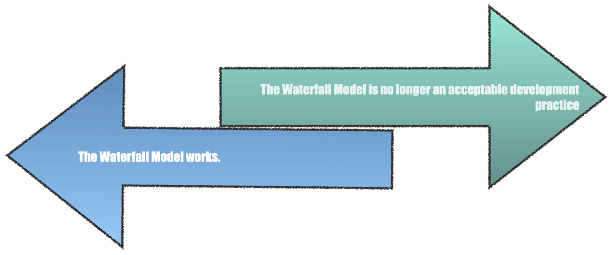
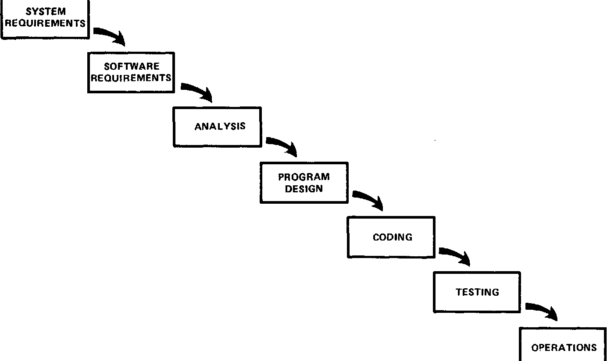
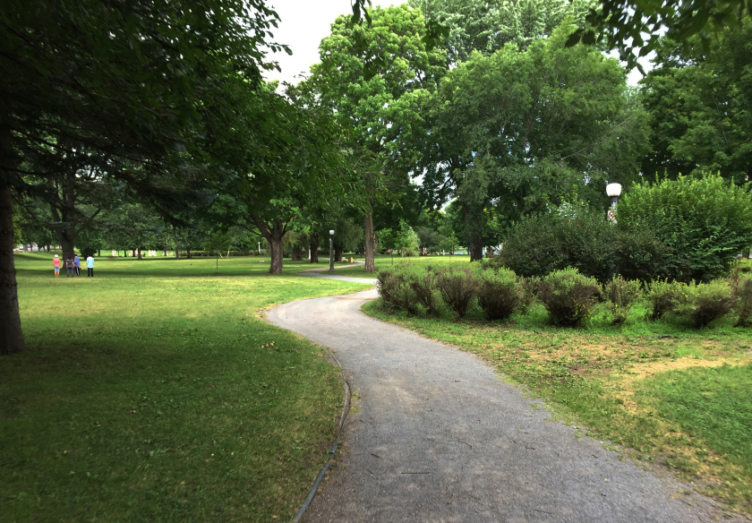

# The Waterfall Method - Debunking the Myth

### Learning Objectives:
* Identify key flaws in the waterfall approach to software development
* Analyze the waterfall approach within software/IT acquisitions

## Introduction

When discussing software development and the waterfall model is mentioned, reactions tend to diverge:

Wherever you stand on the issue, using the waterfall model can be polarizing.   

But where did this concept come from? When was the waterfall model introduced as a software methodology?

## The Origin of the Waterfall Model
Although Dr. Winston Royce didn’t introduce the term ‘waterfall’, he did introduce the concept. In 1970, Dr. Royce published Managing the Development of Large Software Systems, in which he includes the figure below which led to term ‘waterfall’:

_Immediately_ following this graphic, Dr. Royce stated:

> “I believe in this concept, but the implementation described above is **risky** and **invites failure**.” Source: [Managing the Development of Large Software Systems - Dr. Winston W Royce](http://www-scf.usc.edu/~csci201/lectures/Lecture11/royce1970.pdf)  

The rest is history. Despite the warning, time and again the waterfall approach has been applied to software development projects.

<!-- >>>>>>>>>>>>>>>>>>>>>> BEGIN CHALLENGE >>>>>>>>>>>>>>>>>>>>>> -->
<!-- Replace everything in square brackets [] and remove brackets  -->

### !challenge

* type: checkbox
* id: fce790dd-1978-4917-b58a-4dd78dfcf647
* title: Reasons Waterfall is still used
<!-- * points: [1] (optional, the number of points for scoring as a checkpoint) -->
<!-- * topics: [python, pandas] (optional the topics for analyzing points) -->

##### !question

Despite clear evidence that Waterfall is not effective, why do you think organizations go back to it again and again?

##### !end-question

##### !options

* Progress from stage to stage is easier to see
* The steps in waterfall create a clear designation of duties
* Provides a straight-forward way to communicate deadlines, even when these deadlines turn out to be wrong
* It’s what we have always done
* We love the idea that we can build the perfect plan ahead of time
* Waterfall projects have a clear end-state: done is done

##### !end-options

##### !answer
* Progress from stage to stage is easier to see
* The steps in waterfall create a clear designation of duties
* Provides a straight-forward way to communicate deadlines, even when these deadlines turn out to be wrong
* It’s what we have always done
* We love the idea that we can build the perfect plan ahead of time
* Waterfall projects have a clear end-state: done is done

##### !end-answer

##### !explanation
These are *all* reasons organizations return to waterfall, and there are certainly others. Oftentimes the people doing the work feel most comfortable with a system they've seen before, and executives _sponsoring_ the work like the seemingly clear-cut neatness of waterfall.  
##### !end-explanation
<!-- other optional sections -->
<!-- !hint - !end-hint (markdown, hidden, students click to view) -->
<!-- !rubric - !end-rubric (markdown, instructors can see while scoring a checkpoint) -->
<!-- !explanation - !end-explanation (markdown, students can see after answering correctly) -->

### !end-challenge

<!-- ======================= END CHALLENGE ======================= -->

As the challenge above insinuates, people gravitate toward the waterfall method because there are several attractive, face-value reasons to use it- and because it’s used so frequently, it's become a habit for many companies to use it when developing.  

Habits can be hard to break - and the waterfall method has been used by the DoD for decades.  

**Let's look at an example**

It’s the first day of your diet, and you have committed to giving up donuts. You feel optimistic, and determined to achieve a healthier lifestyle. On your way to work, you easily avoid the donut shop.

But as the week progresses, your self-control starts to thin every time you pass by your favorite carb purveyor. Friday morning comes, and you cave. You enjoy your strawberry frosted donut- but you also crashed your diet within a week.  

So what’s the alternative? How do you stick to your diet and not be tempted? Take a different route to work where instead you pass a park.

**The takeaway**: habits are hard to break, and self-control is a depleting resource.

***

## Two Key Flaws: The Waterfall Method
### !callout-danger
## #1 Testing at the end of the process
“The testing phase, which occurs at the end of the development cycle, is the first event for which timing, storage, input/output transfers, etc., are experienced as distinguished from analyzed.”
### !end-callout

### !callout-danger
## #2 Flaws Are Not identified Until the End of the Process
“The required design changes are likely to be so disruptive...either the requirements must be modified, or a substantial change in the design is required. _In effect, the development process has returned to the origin and one can expect up to a 100-percent overrun in schedule and/or costs.”_
### !end-callout

With the following modifications, the waterfall model starts to become less linear and sequential.   

**Note:** In the initial paper published in 1970, there were five recommendations that were made. Because we have the benefit of more data, two no longer apply. These three align to proven best practices in modern software development.  

## Three Necessary Mitigations: The Waterfall Model
### !callout-success
## #1 Do it twice
To paraphrase, ‘do it twice’ is the idea that you will be wrong at least some of the time- this is a normal part of creative problem solving. At minimum, you need to be prepared to update your product based on what you learn through building and fielding. Royce goes on to state that you do ‘miniature’ cycles of the whole project - start small and field fast.  
### !end-callout

### !callout-success
## #2 Plan, Control, and Monitor Testing
* Testing at the end of the process is the greatest risk to dollars and schedule, because it leaves you with few alternatives to pivot. Building and fielding early in the process as described in the first mitigation and including testing avoids the risk of testing the whole system at the end.

* Furthermore, **testing logic and code functionality should be performed by a third party, and easily understood.** If the original software developer/team are the only people who can understand the functionality of the code and corresponding tests, that is a sign of poor documentation and poses significant risk if the team changes over.
### !end-callout

### !callout-success
## #3 Involve the customer

* “Involve the customer – the involvement should be formal, in-depth, and continuing.” And, “To give the contractor free rein between requirement definition and operation is inviting trouble.”

* Involving the customer, or user-centered design, is critical. It establishes a feedback loop that validates the usability and functionality of software. Recall our goal: “providing the best product or service to the customer.” [FAR 1.102(a)]

### !end-callout

<!-- >>>>>>>>>>>>>>>>>>>>>> BEGIN CHALLENGE >>>>>>>>>>>>>>>>>>>>>> -->
<!-- Replace everything in square brackets [] and remove brackets  -->

### !challenge

* type: multiple-choice
* id: 0d4a62e4-3b01-4781-8991-ac12f8298482
* title: Procurement Scenario
<!-- * points: [1] (optional, the number of points for scoring as a checkpoint) -->
<!-- * topics: [python, pandas] (optional the topics for analyzing points) -->

##### !question

Recently, you’ve been assigned to a Program Management Office (PMO) tasked with developing and fielding a software-intensive system to support the ground operations of 8th Gen Fighters.   

The Capability Development Document (CDD) is nearing approval by the Joint Requirements Oversight Council (JROC), and the PMO has had little involvement to date. Requirements have been developed solely by the AF as lead service, then verified by JROC. Your PM informs you that a single contract award will support the effort. The plan is to award the contract next year, with work commencing immediately afterward.   

The contractor must deliver by Fiscal Year (FY) 2026. Due to the vast number of users, the contractor is unable to work with the customer (user). Furthermore, the Government requires independent testing. Due to lack of resources, the earliest testing can begin is FY24. The first test of the system will occur in FY25.   

Is this an example of a “waterfall system”?

##### !end-question

##### !options

* Yes
* No

##### !end-options

##### !answer

* Yes

##### !end-answer

<!-- other optional sections -->
<!-- !hint - !end-hint (markdown, hidden, students click to view) -->
<!-- !rubric - !end-rubric (markdown, instructors can see while scoring a checkpoint) -->
<!-- !explanation - !end-explanation (markdown, students can see after answering correctly) -->

### !end-challenge

<!-- ======================= END CHALLENGE ======================= -->

<!-- >>>>>>>>>>>>>>>>>>>>>> BEGIN CHALLENGE >>>>>>>>>>>>>>>>>>>>>> -->
<!-- Replace everything in square brackets [] and remove brackets  -->

### !challenge

* type: checkbox
* id: 3fcff4e4-98c9-4557-a220-76d3e60a8609
* title: Flaws in scenario
<!-- * points: [1] (optional, the number of points for scoring as a checkpoint) -->
<!-- * topics: [python, pandas] (optional the topics for analyzing points) -->

##### !question

From the scenario above, where do you see the “key flaws” of waterfall?

##### !end-question

##### !options

* Testing does not occur until the end of the process
* The PMO has not been involved in the process until very recently
* Users are not involved early or often
* The plan as outlined requires work to commence immediately after awarding the contract

##### !end-options

##### !answer

* Testing does not occur until the end of the process
* The PMO has not been involved in the process until very recently
* Users are not involved early or often

##### !end-answer

##### !explanation: The plan as outlined requires work to commence immediately after awarding the contract
There's nothing wrong with beginning work immediately awarding the contract.   
##### !end-explanation

##### !explanation-not: Testing does not occur until the end of the process
Remember, testing should occur frequently throughout the process.  
##### !end-explanation
<!-- other optional sections -->
<!-- !hint - !end-hint (markdown, hidden, students click to view) -->
<!-- !rubric - !end-rubric (markdown, instructors can see while scoring a checkpoint) -->
<!-- !explanation - !end-explanation (markdown, students can see after answering correctly) -->

### !end-challenge

<!-- ======================= END CHALLENGE ======================= -->

<!-- >>>>>>>>>>>>>>>>>>>>>> BEGIN CHALLENGE >>>>>>>>>>>>>>>>>>>>>> -->
<!-- Replace everything in square brackets [] and remove brackets  -->

### !challenge

* type: checkbox
* id: 43011069-e617-46c7-a9ed-ec83c9975c74
* title: Process Improvement
<!-- * points: [1] (optional, the number of points for scoring as a checkpoint) -->
<!-- * topics: [python, pandas] (optional the topics for analyzing points) -->

##### !question

What would improve this process?

##### !end-question

##### !options

* Engaging users earlier and more often
* Contracting with a third party to begin testing sooner in the process
* Breaking up the contract into smaller contracts to alleviate dependency on one contractor
* Creating environments to mirror operational environments to support testing sooner without impacting current systems.

##### !end-options

##### !answer

* Engaging users earlier and more often
* Contracting with a third party to begin testing sooner in the process
* Breaking up the contract into smaller contracts to alleviate dependency on one contractor
* Creating environments to mirror operational environments to support testing sooner without impacting current systems.

##### !end-answer

<!-- other optional sections -->
<!-- !hint - !end-hint (markdown, hidden, students click to view) -->
<!-- !rubric - !end-rubric (markdown, instructors can see while scoring a checkpoint) -->
<!-- !explanation - !end-explanation (markdown, students can see after answering correctly) -->

### !end-challenge

<!-- ======================= END CHALLENGE ======================= -->
