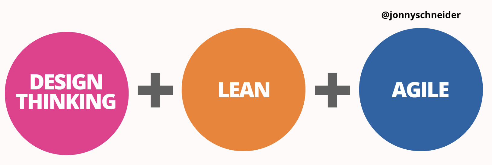
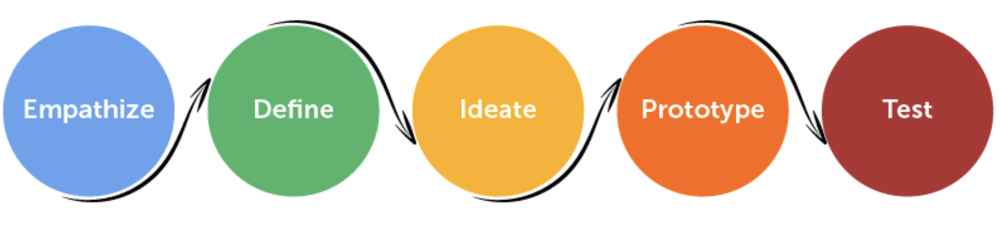
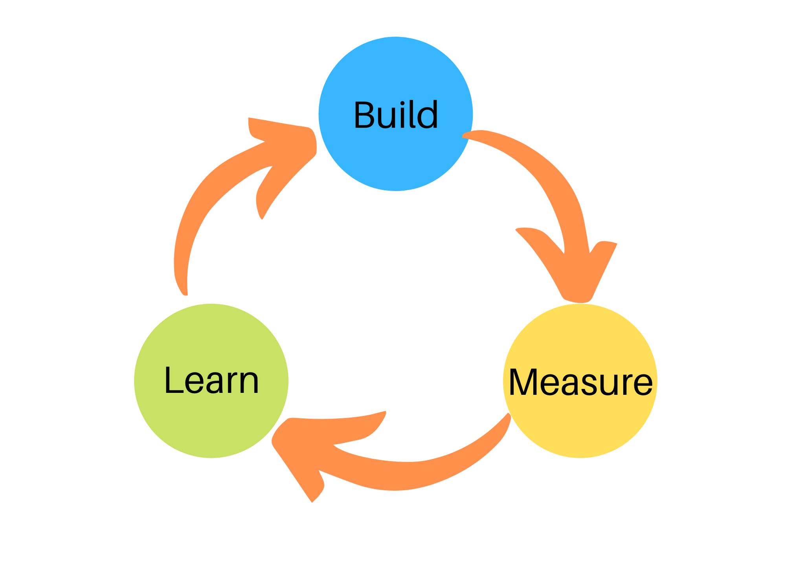
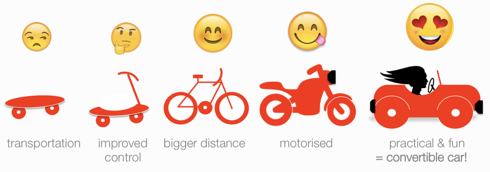
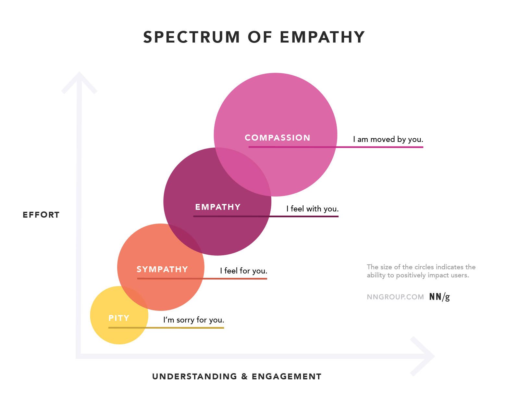

# How Design Thinking, Lean and Agile Work Together

### Learning Objectives
* Give a one-sentence definition of Design Thinking, Lean and Agile
* Identify common threads throughout Design Thinking, Lean and Agile

## Introduction

In the previous lesson, we shared that the waterfall method was never meant to be a methodology in the first place- but then, which methodologies should we use? There are three:   

### !callout-success
## Methodologies
* Design thinking
* Lean
* Agile  
### !end-callout

We often hear these terms used across the DoD, many times incorrectly.  Think of this course as an opportunity to build a common vocabulary so that when we progress to more complex concepts, we use a common language. For now, we will familiarize you with the terms and encourage you to explore their similarities.

## Design Thinking
Design thinking is a human-centered process for creative problem solving. It encourages focus on the people you’re creating for, which leads to better products, services, and internal processes.

When you sit down to create a solution for a business need, the first question should always be “What's the human need behind it?” (Source: []'What is Design Thinking?'](https://www.ideou.com/blogs/inspiration/what-is-design-thinking))

Popularized in the late 1990s by [IDEO](https://www.ideo.com/), the concept of design thinking teaches us to empathize with the users themselves, their mission, and their business needs to ensure that the product or service being built serves its need or intended purpose.  

<!-- >>>>>>>>>>>>>>>>>>>>>> BEGIN CHALLENGE >>>>>>>>>>>>>>>>>>>>>> -->
<!-- Replace everything in square brackets [] and remove brackets  -->

### !challenge

* type: checkbox
* id: 7ed57dfc-a0d7-4300-b5b7-ab006dc79aff
* title: User-centered
<!-- * points: [1] (optional, the number of points for scoring as a checkpoint) -->
<!-- * topics: [python, pandas] (optional the topics for analyzing points) -->

##### !question

Why is being "user-centered" or "human-centered" important?
##### !end-question

##### !options

* It increases the likelihood of executive sponsorship
* It increases the likelihood of user adoption
* Keeping the end-users in mind at every step ensures your solution doesn't drift away from the problem you're trying to solve

##### !end-options

##### !answer

* It increases the likelihood of user adoption
* Keeping the end-users in mind at every step ensures your solution doesn't drift away from the problem you're trying to solve

##### !end-answer

<!-- other optional sections -->
<!-- !hint - !end-hint (markdown, hidden, students click to view) -->
<!-- !rubric - !end-rubric (markdown, instructors can see while scoring a checkpoint) -->
<!-- !explanation - !end-explanation (markdown, students can see after answering correctly) -->

### !end-challenge

<!-- ======================= END CHALLENGE ======================= -->

## Lean

“The core idea [of Lean] is to maximize customer value while minimizing waste. Simply, lean means creating more value for customers with fewer resources.

A lean organization understands customer value and focuses its key processes to continuously increase it. The ultimate goal is to provide perfect value to the customer through a perfect value creation process that has zero waste.” (Source: [Lean Enterprise Institute](https://www.lean.org/whatslean/))

Lean uses a fairly cut and dry approach to defining “waste”:

> If it’s not value-added, it’s waste.  

Building quality up front is another key Lean principle - developers often devote more attention to early testing in order to provide this quality.

<!-- >>>>>>>>>>>>>>>>>>>>>> BEGIN CHALLENGE >>>>>>>>>>>>>>>>>>>>>> -->
<!-- Replace everything in square brackets [] and remove brackets  -->

### !challenge

* type: checkbox
* id: be358637-bfbf-4d35-86c4-2fdeaf1fcc76
* title: Lean principles
<!-- * points: [1] (optional, the number of points for scoring as a checkpoint) -->
<!-- * topics: [python, pandas] (optional the topics for analyzing points) -->

##### !question

There are principles that support Lean’s mission of reducing waste and providing value. Based on what you've seen so far, which of the principles listed below would you guess align with Lean philosophy?

##### !end-question

##### !options

* Define value
* Map the value flow
* Work in large groups
* Communicate vertically, not horizontally
* Pursue perfection

##### !end-options

##### !answer
* Define value
* Map the value flow
* Pursue perfection

##### !end-answer

##### !explanation-not: Define Value

Don't forget: Understanding what value means is a key part of the Learn system.

##### !end-explanation

##### !explanation-not: Map the value flow
Remember: Understanding how value moves throughout a system is a key part of the Lean system. We refer to this as "value flow" or "value stream mapping."

##### !end-explanation

##### !explanation-not: Pursue perfection

"Pursue perfection" is a tricky one that a lot of people miss, but this is a Lean principle. It makes sense if you think about it: slowly eating away at waste in the system is the pursuit of the perfect, "zero waste" ideal.

##### !end-explanation
<!-- other optional sections -->
<!-- !hint - !end-hint (markdown, hidden, students click to view) -->
<!-- !rubric - !end-rubric (markdown, instructors can see while scoring a checkpoint) -->
<!-- !explanation - !end-explanation (markdown, students can see after answering correctly) -->

### !end-challenge

<!-- ======================= END CHALLENGE ======================= -->

## Agile

Agile shifts your mindset by empowering teams, promoting learning and continuous improvement, and delivering in short iterative cycles, delivering maximum value to the customer.  

“Agile software development refers to software development methodologies centered around the idea of iterative development, where requirements and solutions evolve through collaboration between self-organizing cross-functional teams.

The ultimate value in Agile development is that it enables teams to deliver value faster, with greater quality and predictability, and greater aptitude to respond to change.” (Source: [What is Agile? What is Scrum?](https://www.cprime.com/resources/what-is-agile-what-is-scrum/))

<!-- >>>>>>>>>>>>>>>>>>>>>> BEGIN CHALLENGE >>>>>>>>>>>>>>>>>>>>>> -->
<!-- Replace everything in square brackets [] and remove brackets  -->

### !challenge

* type: checkbox
* id: cc837a78-3273-4660-bdcd-a420d0df174f
* title: Release early and often
<!-- * points: [1] (optional, the number of points for scoring as a checkpoint) -->
<!-- * topics: [python, pandas] (optional the topics for analyzing points) -->

##### !question

Agile practitioners often say “release early and often,” i.e. publish work in small, tested increments rather than release a large piece of work all at once. Thinking ahead, why might this be a productive way to work?

##### !end-question

##### !options

* It decreases infrastructure costs because you're supporting smaller applications
* The risk is smaller: You don't need to wait until the entire thing is complete in order to start validating your solution
* You can start recognizing value sooner by releasing smaller things earlier in the process
* There's less to measure and report on when you work with smaller pieces of work

##### !end-options

##### !answer

* The risk is smaller: You don't need to wait until the entire thing is complete in order to start validating your solution
* You can start recognizing value sooner by releasing smaller things earlier in the process

##### !end-answer

<!-- other optional sections -->
<!-- !hint - !end-hint (markdown, hidden, students click to view) -->
<!-- !rubric - !end-rubric (markdown, instructors can see while scoring a checkpoint) -->
<!-- !explanation - !end-explanation (markdown, students can see after answering correctly) -->

### !end-challenge

<!-- ======================= END CHALLENGE ======================= -->

### !callout-warning
## Question
Do I Pick Agile, Lean, or Design Thinking??
 
**Answer:** It’s a matter of ‘AND’, not ‘or’. Use whatever tools necessary!
### !end-callout

The user, business, and/or mission needs do not care about internal processes, practices, or methods. They simply care about receiving a useful product that solves a meaningful problem.

## A Note about Empathy
You'll frequently hear the word "empathy" interwoven with all three of the above methodologies. Gut check: what are your thoughts when you hear the word “empathy”?

Most people think of “empathy” as a vaguely uncomfortable feeling, and an “empathetic” person as being weak, or overly emotional.  

But here’s the thing about empathy- It’s the best tool in your toolbox for building and procuring effective tools.   

Think of products as solutions to problems. Your job is to build or buy a product to solve a user’s problem- without empathy informing you of how the person experiences that problem, you cannot effectively solve it.   

**Takeaway**: Empathy is not the art of feeling emotions about people. It’s the rigorous science of understanding a person’s physical, emotional, psychological experience so that you can solution effectively.

<!-- >>>>>>>>>>>>>>>>>>>>>> BEGIN CHALLENGE >>>>>>>>>>>>>>>>>>>>>> -->
<!-- Replace everything in square brackets [] and remove brackets  -->

### !challenge

* type: paragraph
* id: bdc5cd13-9e7c-464c-8710-6e12238440a4
* title: Applying Design Thinking, Lean, and Agile
<!-- * points: [1] (optional, the number of points for scoring as a checkpoint) -->
<!-- * topics: [python, pandas] (optional the topics for analyzing points) -->

##### !question

Based on what you’ve seen, how can you imagine applying Design Thinking, Lean, and Agile methodologies to your program role?

##### !end-question

##### !placeholder

Note: We’ll be compiling and discussing your responses during the in-person session. Eventually, we’ll use your responses to tune this course more finely to your experience.

##### !end-placeholder

<!-- other optional sections -->
<!-- !hint - !end-hint (markdown, hidden, students click to view) -->
<!-- !rubric - !end-rubric (markdown, instructors can see while scoring a checkpoint) -->
<!-- !explanation - !end-explanation (markdown, students can see after answering correctly) -->

### !end-challenge

<!-- ======================= END CHALLENGE ======================= -->

<!-- >>>>>>>>>>>>>>>>>>>>>> BEGIN CHALLENGE >>>>>>>>>>>>>>>>>>>>>> -->
<!-- Replace everything in square brackets [] and remove brackets  -->

### !challenge

* type: checkbox
* id: b1da26f0-d7d5-4e1e-b0a2-59c6a5b1cc8b
* title: Common themes
<!-- * points: [1] (optional, the number of points for scoring as a checkpoint) -->
<!-- * topics: [python, pandas] (optional the topics for analyzing points) -->

##### !question

Which of the following are common “themes”  seen in these three systems?

##### !end-question

##### !options

* User-centricity
* Automation wherever possible
* Top-down management structure
* Focus on delivering value

##### !end-options

##### !answer

* User-centricity
* Focus on delivering value

##### !end-answer

<!-- other optional sections -->
<!-- !hint - !end-hint (markdown, hidden, students click to view) -->
<!-- !rubric - !end-rubric (markdown, instructors can see while scoring a checkpoint) -->
<!-- !explanation - !end-explanation (markdown, students can see after answering correctly) -->

### !end-challenge

<!-- ======================= END CHALLENGE ======================= -->

<!-- >>>>>>>>>>>>>>>>>>>>>> BEGIN CHALLENGE >>>>>>>>>>>>>>>>>>>>>> -->
<!-- Replace everything in square brackets [] and remove brackets  -->

### !challenge

* type: paragraph
* id: 6d69b959-1171-4326-b719-535fafd00839
* title: In your own words
<!-- * points: [1] (optional, the number of points for scoring as a checkpoint) -->
<!-- * topics: [python, pandas] (optional the topics for analyzing points) -->

##### !question

Imagine you're explaining these concepts to a non-technical friend. How would you define Design Thinking, Lean, and Agile?

##### !end-question

##### !placeholder

Your answer here...

##### !end-placeholder

<!-- other optional sections -->
<!-- !hint - !end-hint (markdown, hidden, students click to view) -->
<!-- !rubric - !end-rubric (markdown, instructors can see while scoring a checkpoint) -->
<!-- !explanation - !end-explanation (markdown, students can see after answering correctly) -->

### !end-challenge

<!-- ======================= END CHALLENGE ======================= -->
