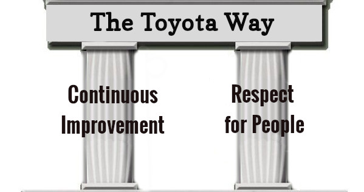

# Lean

### Learning Objectives
* Recognize that Lean methodology has applications outside of software
* Explain how Lean manufacturing principles apply to modern digital systems

## Software vs. Hardware
Is software really that different from hardware? Would it surprise you to learn that modern software practices were inspired by manufacturing cars? Even if you are familiar with the Toyota Way and Lean- stick with this lesson. These concepts and practices have applications outside of software, and there is precedent that we can apply them to the Defense Acquisition System.  

## Hardware Focus: Manufacturing and The Toyota Way
In the early 1980s, Toyota was breaking into the U.S. market and establishing a Toyota manufacturing plant. This resulted in a joint GM/Toyota factory--GM graciously offered one of their worst plants, and Toyota offered one of their worst cars as part of a technology sharing deal. To make a long story short, the factory ended up being successful - and that success has been attributed to the “Toyota process”, or The Toyota Way.  

## The Toyota Way Leads to Lean
Lean is a concept that emerged around 1990. It is important to note the dates these and other concepts became popular- they are all interconnected, and show the field’s progression to the proven practices (Agile, Scrum, and DevSecOps, etc.) we use today.

>“Lean is a management philosophy for improving any system that produces value—that is, any organization. Persistent improvement, high quality, and reduction in waste are some common characteristics of Lean management.” -- [Understanding Design Thinking, Lean, and Agile, Jonny Schneider](https://www.oreilly.com/library/view/understanding-design-thinking/9781491998410/ch01.html)

**Watch [this video](https://www.youtube.com/watch?v=F5vtCRFRAK0) to learn more**
<iframe width="560" height="315" src="https://www.youtube.com/embed/F5vtCRFRAK0" frameborder="0" allow="accelerometer; autoplay; clipboard-write; encrypted-media; gyroscope; picture-in-picture" allowfullscreen></iframe>

<!-- >>>>>>>>>>>>>>>>>>>>>> BEGIN CHALLENGE >>>>>>>>>>>>>>>>>>>>>> -->
<!-- Replace everything in square brackets [] and remove brackets  -->

### !challenge

* type: paragraph
* id: 1fad87ac-a580-4dd9-ae49-b9c6624ac61a
* title: Toyota values
<!-- * points: [1] (optional, the number of points for scoring as a checkpoint) -->
<!-- * topics: [python, pandas] (optional the topics for analyzing points) -->

##### !question

Notice how the video above emphasizes the environment that facilitated these revolutionary concepts. After World War II, Toyota could not compete with U.S. manufacturers by mirroring their practices- they had to adapt.   

How were the values of Toyota exemplified in the video? Give one example for each: continuous improvement and respect for people.

##### !end-question

##### !placeholder

Continuous Improvement:

Respect for people:

##### !end-placeholder

#### !hint
Focus on Toyota’s constant search for ways to optimize workflow.
#### !end-hint

#### !hint
 Remember the cord installed at each workstation to stop the assembly line - how is this exemplifying respect for people and preventing rework at the end of the process (waterfall method)?
#### !end-hint
<!-- other optional sections -->
<!-- !hint - !end-hint (markdown, hidden, students click to view) -->
<!-- !rubric - !end-rubric (markdown, instructors can see while scoring a checkpoint) -->
<!-- !explanation - !end-explanation (markdown, students can see after answering correctly) -->

### !end-challenge

<!-- ======================= END CHALLENGE ======================= -->
<!-- >>>>>>>>>>>>>>>>>>>>>> BEGIN CHALLENGE >>>>>>>>>>>>>>>>>>>>>> -->
<!-- Replace everything in square brackets [] and remove brackets  -->

### !challenge

* type: paragraph
* id: 4bf6a313-a223-4230-ac0d-26ccfd151898
* title: Application to acquisitions
<!-- * points: [1] (optional, the number of points for scoring as a checkpoint) -->
<!-- * topics: [python, pandas] (optional the topics for analyzing points) -->

##### !question

How could you apply these principles to your job?

##### !end-question

##### !placeholder
Your response here

##### !end-placeholder
#### !explanation
* In lean manufacturing, each workstation serves a purpose within the overall assembly line. In Government acquisitions, the flow of information and documents leading up to a solicitation release or contract award is not much different than an assembly line. Value-added and non-value added activities by each functional should be examined, and only the value-added work should continue moving forward. This streamlines and improves the speed and quality of work supporting acquisition awards.   

* Following lean manufacturing principles, you can see a strong reliance and trust among workers at different workstations. In acquisitions, it becomes easy to work in silos and share work products with other functionals only at the end of the process (otherwise known as following a waterfall method). Applying lean manufacturing principles, teams should work more closely together, sharing and collaborating on work products earlier and more frequently. 

#### !end-explanation
<!-- other optional sections -->
<!-- !hint - !end-hint (markdown, hidden, students click to view) -->
<!-- !rubric - !end-rubric (markdown, instructors can see while scoring a checkpoint) -->
<!-- !explanation - !end-explanation (markdown, students can see after answering correctly) -->

### !end-challenge

<!-- ======================= END CHALLENGE ======================= -->
