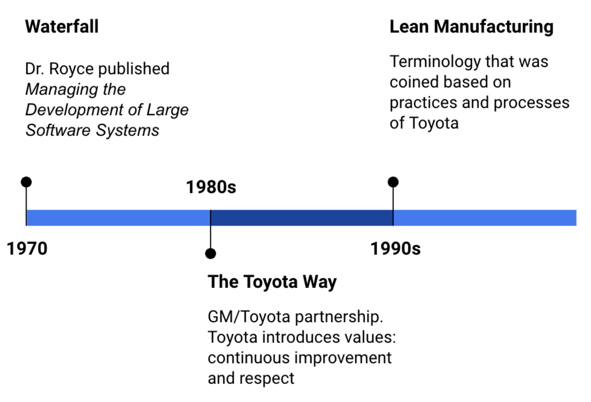
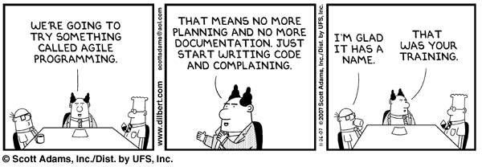
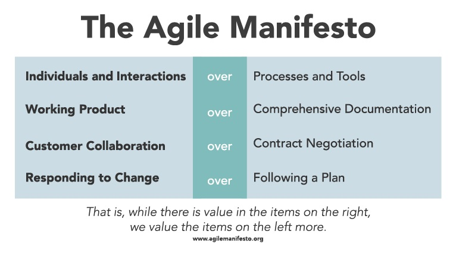

# Agile

### Learning Objectives

* Describe why common Agile misunderstandings are incorrect
* Apply Agile principles to acquisitions
* Adopt a willingness to change as you learn

## Introduction

You had a brief introduction to Agile in 1.B.2 - How Design Thinking, Lean and Agile Work Together. As we dive deeper into Agile, we will debunk some common misconceptions and provide examples of how these practices can be applied to DoD Acquisitions.   

Recall the timeline we showed you earlier:   

Agile emerged as a practice in software in the early 2000s. Again, these concepts have been used in the manufacturing setting for approximately 20 years at this point. So, what is Agile software development? When in doubt, turn to Dilbert.   

Jokes aside, this is a perfect opportunity to debunk some common misconceptions about Agile.  

## What Agile is Not

Here are the top misconceptions about Agile:

**1. “Don’t worry, we’re utilizing DevOps, not Agile.”**
The timeline shows DevOps (and therefore DevSecOps) comes in later (spoiler alert: it emerged in 2009). But it's important to remember that these concepts build on each other:
* Fast Feedback
* Ongoing Collaboration
* Attention to Quality

Each new emergence of a best practice is incorporating lessons learned and new technology, enabling better performance. Don’t sell yourself short- when you apply one, you're applying several concepts and methodologies.

**2. "Agile is only for software developers.”**

At this point, you should not need much convincing. Think of it this way: Agile is a **mindset** or **philosophy.**

Both are more encompassing and focus on values and goals, specifically:

**3.“We don’t need a plan, we’re Agile”, or “Agile means no planning.”**

Planning remains a critical process when using an Agile mindset- the difference is, it's no longer a prolonged event that drags for months or years. Instead, it’s “time-boxed”- assumptions are documented, work is prioritized, and teams focus on working software (or capability) and iteration. Through the document-prioritize-iteration process, the plan changes, and the team is already set up to to break down additional work into smaller increments based on user need.  

### !callout-danger
## CAUTION
This common misconception is often said in the DoD. Don’t fall into this trap. Be careful with what language you use. Agile and planning go together like peanut butter and jelly- and the planning cycles are shorter, allowing us to adapt to our ever-changing environment.
### !end-callout

**4.“Agile means no documentation.”**

The manifesto states, _“Working Software **over** Comprehensive Documentation,”_ not **NO** documentation. Documentation is required to support a team’s ability to respond to change. If only one person understands the code and functionality, then you cannot respond very quickly. You are at the mercy of that person, which at best creates a bottleneck and at worst a gap in knowledge if that person ever leaves, neither of which is ideal. Think of it as someone writing directions for how to bake a cake in Greek- and not including the translation.  

<!-- >>>>>>>>>>>>>>>>>>>>>> BEGIN CHALLENGE >>>>>>>>>>>>>>>>>>>>>> -->
<!-- Replace everything in square brackets [] and remove brackets  -->

### !challenge

* type: checkbox
* id: b6462f6f-73e3-4796-b553-9cd3868ee020
* title: Responding to change
<!-- * points: [1] (optional, the number of points for scoring as a checkpoint) -->
<!-- * topics: [python, pandas] (optional the topics for analyzing points) -->

##### !question

Valuing responsiveness to change over following a plan is a counterintuitive idea for many people. In an acquisition setting, why is it essential to be able to respond to change?

##### !end-question

##### !options

* ensures you're delivering the most relevant solution to a problem   
* simplifies the contracting process
* avoids waste

##### !end-options

##### !answer

* ensures you're delivering the most relevant solution to a problem  
* avoids waste

##### !end-answer

#### !hint
If the context or requirements of a project change and your project plan does not change accordingly, you'll end up spending time and money completing a solution that doesn't satisfy the user problem.
#### !end-hint
<!-- other optional sections -->
<!-- !hint - !end-hint (markdown, hidden, students click to view) -->
<!-- !rubric - !end-rubric (markdown, instructors can see while scoring a checkpoint) -->
<!-- !explanation - !end-explanation (markdown, students can see after answering correctly) -->

### !end-challenge

<!-- ======================= END CHALLENGE ======================= -->

## How to Apply Agile to DoD Acquisitions
There are 12, but our goal is to highlight a few of Agile’s key principles here, and provide one of the ways you can apply them in context to DoD acquisitions. We say ‘one of’, because there are infinitely more ways to creatively apply this knowledge.   

### Agile Principle: Our highest priority is to satisfy the customer through early and continuous delivery of valuable software.

The customer comes first. A product isn't valuable if it doesn’t satisfy customer need or demand- early and continuous delivery of valuable software is how you fulfill that requirement. In other words: To ensure that the capability provides value, a feedback loop must exist between the team and the customer.  

  

**Acquisition Application**
Consider this- what can teams within a PMO build/measure/learn to provide more value to the DoD?  

Whether or not you have talented software developers organically, additional support is almost always needed in terms of talent/services (additional technical expertise) and products. Which leads us to contracts, and how personnel can reduce cycle time and risk.

THE ANSWER   

FAR Part 39.103, 39.1-1 (Modular Contracting for Information Technology) states,
> “modular contracting is intended to reduce program risk and incentivize contractor performance while meeting the Government’s need for timely access to rapidly changing technology…agencies should to the maximum extent practicable, use modular contracting to acquire major systems.”  

This is reinforced in both [U.S. Code 41, U.S. Code § 2308](https://www.law.cornell.edu/uscode/text/41/2308) as well.  

Adhering to this guideline:
* Prevents dependency on a single contractor → reduces risk
* Allows ability to test contracting language and incentives → reduces risk
* Allows opportunity to quickly change with industry market → reduces risk  

Finally, one of the reasons software is delivered in small increments is so that a release is a non-event--meaning it is easily achieved, a well-defined process that all developers can easily execute. The same should be said for contracting- it should be a process that is easily achieved, allowing for the ability to integrate the best tools and services into our systems.  

### Agile Principle: Welcome changing requirements, even late in development.

Agile processes harness change for the customer's competitive advantage. This principle is possible when considering the process of software development from delivery to implementation due to the build → measure → learn model, and established processes that enable the ability to change quickly.  

**Acquisition Application:** Continuing with the example of contracting, there are a few ways for contracts to be structured in order to support change:
* Modular contracting
* Structure contracts to support additional surge
* Contracts that accept multiple colors of funding
* Constant market research

Additionally, we can apply the concepts to how we fund projects and efforts:
* Incrementally funding contracts
* Trade space is unobligated funds  

### Agile Principle:  Business people and developers must work together daily throughout the project.

In order to deliver software at the speed of minutes/days/weeks, this is essential.  

**Acquisition Application:** This principle can be applied directly. Whether the developers are organic (military/civilian) or contractors, applying this concept is critical. Referring back to Dr Royce’s paper that was published in 1970, “to give the contractor free rein between requirement definition and operation is inviting trouble.” This has been a known requirement for some time. This principle also builds on the importance of the inherent value of an entire team working together, instead of a single individual within that team.

### Agile Principle: The most efficient and effective method of conveying information to and within a development team is face-to-face conversation    

**Acquisition Application:**
Nothing beats open, valuable communication across the team. The fact that this ideal is referenced twice in the last two principles is no mistake.  

    

### Agile Principle: Working software is the primary measure of progress.

Not plans, not mock-ups, not PowerPoint presentations - working software is the primary measure.  

**Acquisition Application:** At times it can be easy to lose sight of the forest for the trees. While plans, mock-ups, and PowerPoint presentations are an important part of software development, especially for collaboration, we are acquisitions professionals must support working software provided to users as the sole measurement of progress.  

<!-- >>>>>>>>>>>>>>>>>>>>>> BEGIN CHALLENGE >>>>>>>>>>>>>>>>>>>>>> -->
<!-- Replace everything in square brackets [] and remove brackets  -->

### !challenge

* type: checkbox
* id: 21d09a51-5f2d-4e7d-9b88-9e0ac66108b8
* title: Feedback loops
<!-- * points: [1] (optional, the number of points for scoring as a checkpoint) -->
<!-- * topics: [python, pandas] (optional the topics for analyzing points) -->

##### !question

A commonly heard Agile phrase is related to “tightening feedback loops,” meaning decreasing the amount of time it takes to go through the entire Build → Measure → Learn cycle. What are the benefits of short feedback loops?

##### !end-question

##### !options

* You need to think less about training your team
* You're able to change course more quickly when necessary
* Since you're only building in small increments, you waste less if you learn that the thing you built is not right and you need to throw it out
* Your project requires less planning

##### !end-options

##### !answer

* You're able to change course more quickly when necessary
* Since you're only building in small increments, you waste less if you learn that the thing you built is not right and you need to throw it out

##### !end-answer

<!-- other optional sections -->
<!-- !hint - !end-hint (markdown, hidden, students click to view) -->
<!-- !rubric - !end-rubric (markdown, instructors can see while scoring a checkpoint) -->
<!-- !explanation - !end-explanation (markdown, students can see after answering correctly) -->

### !end-challenge

<!-- ======================= END CHALLENGE ======================= -->

<!-- >>>>>>>>>>>>>>>>>>>>>> BEGIN CHALLENGE >>>>>>>>>>>>>>>>>>>>>> -->
<!-- Replace everything in square brackets [] and remove brackets  -->

### !challenge

* type: paragraph
* id: 2cc194e9-02ff-44b4-bdfa-f6f8ee15418b
* title: Measures of progress
<!-- * points: [1] (optional, the number of points for scoring as a checkpoint) -->
<!-- * topics: [python, pandas] (optional the topics for analyzing points) -->

##### !question

“Working software is the primary measure of progress” is a powerful statement.   

Contrast this statement with what you’ve seen in your role as an acquisition professional: What is currently used as a measure of progress? What sort of reporting or behavioral changes would it take for working software to become that primary measure?

##### !end-question

##### !placeholder

(Note: We’ll be compiling and discussing your responses during the in-person session. Eventually, we’ll use your responses to tune this course more finely to your experience.)

##### !end-placeholder

<!-- other optional sections -->
<!-- !hint - !end-hint (markdown, hidden, students click to view) -->
<!-- !rubric - !end-rubric (markdown, instructors can see while scoring a checkpoint) -->
<!-- !explanation - !end-explanation (markdown, students can see after answering correctly) -->

### !end-challenge

<!-- ======================= END CHALLENGE ======================= -->
