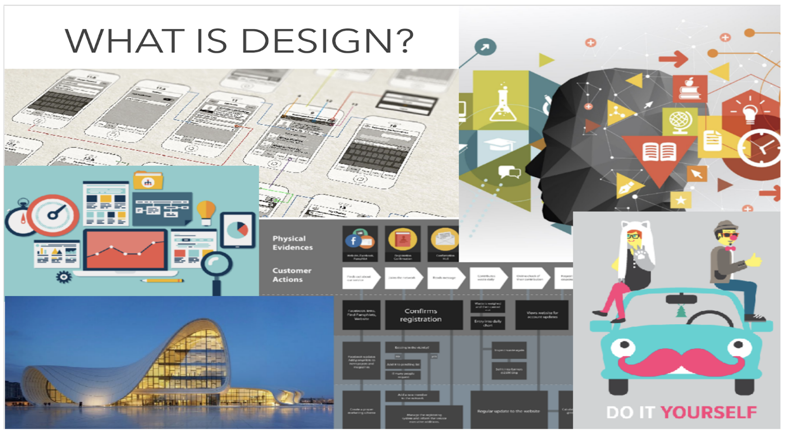
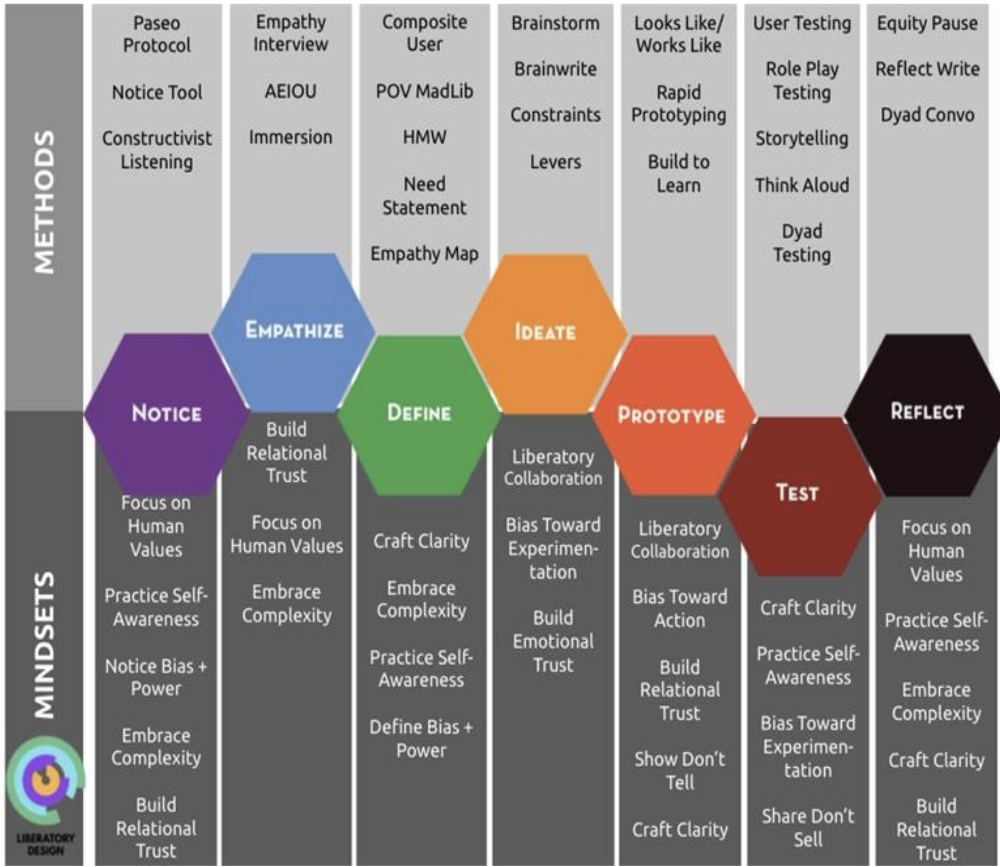
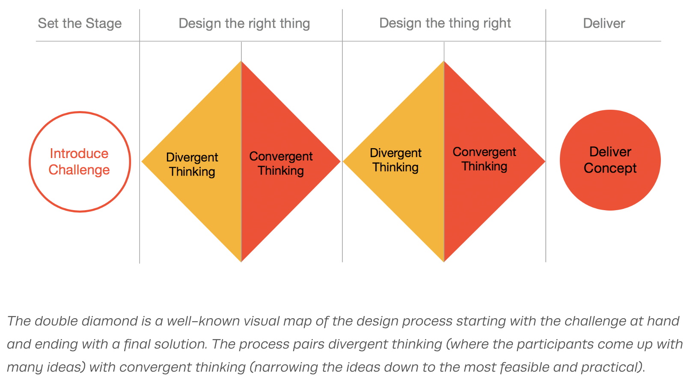

# Design Thinking

###  Learning Objectives

* Define design thinking
* Embody the mentality that designing for users is the best way to approach problems
* Use the design thinking framework to solve a user problem

Design Thinking requires us to maintain a mindset that is:
* Human-centered, with a focus on the user
* Willing to explore problems before jumping to solutions
* Testing assumptions through prototyping

> Designers don’t search for a solution until they have determined the real problem, and even then, instead of solving that problem, they stop to consider a wide range of potential solutions. Only then will they converge upon their proposal. This process is called Design Thinking.
-- Donald Norman, Author of The Design of Everyday Things  

What makes design thinking so difficult? Many times, we do not realize how biased we are. It can be easy to jump straight to solutionizing- remember to always think of ways that you can test your assumptions. Some questions to consider:
* **What is the goal?**
* **How will we know if we are on the right path?**
* **Do we have supporting data that supports or can inform action?**  

   

 Look at the chart above. The hexagons show us the design thinking tenets. You may be familiar with some of them: Empathize, Define, Ideate, Prototype and Test.

All of these practices are constantly being refined. Two _newish_ tenets include:
* **Notice** - designers develop a self and social-emotional awareness before entering any context or practice of empathy.
* **Reflect** - you and your team take the time to notice, focus, and reflect on your actions, emotions, insights, and impact as designer(s) and human(s) within your user's context.  

## Design Thinking Applied
Our guess is many of you have been in a meeting or review with a senior leader and they say something to the effect of:   

>“Don’t bring me problems, bring me solutions!”

If you manage other people or are a team lead, you might have even said this to someone.  

Instead, we should invert this statement - ask your team to bring problems to the table, and study those problems together to determine which one most needs a solution next.  There are many techniques available to facilitate problem investigation, for example:

 

 For those that have not seen this before, the idea is to “cast a wide net” (divergent thinking) and then narrow (convergent thinking) and repeat, hence double diamond.  

 More specifically:
 * **Divergent thinking** - Many ideas and broad thinking - divergent thinking benefits from diversity of thought, so be sure to include new and varied team members who can help everyone think outside of the box.
 * **Convergent Thinking** - here you’ll focus on reducing, prioritizing, and eliminating many options into one. This is where your team will converge.   

 You can go through this process as many times as your team needs, just remember these are two distinct processes, each with different goals:  

### !callout-info
##  “Designing the right thing”
“Designing the right thing” means defining the problem well.
### !end-callout

### !callout-info
##  “Designing the thing right”
“Designing the thing right” means converging on a solution that is written as a testable hypothesis.
### !end-callout  

## An Important Practice in all Contexts

A recurring and key practice: **Reflection.**  

We previously mentioned that Agile instills the practice of _regularly reflecting on how to improve_.    

Take some time to reflect upon your team meetings:  
* Are there team members in the meeting that stay quiet?  
* Do they come up to you afterward and share an idea they were not comfortable sharing with everyone?  If so, help them and help yourself.  
* Does the team spend time together thinking about how they can improve?  

***

Bringing these practices into your current team has an immediate impact: it’s fun, it improves morale for your team, results in better communication, and creates efficiency in your ever-busy schedule.    

Design thinking should be a regular part of the modern workplace. Think about how the design thinking process could help you in the development of your acquisition strategy.   

<!-- >>>>>>>>>>>>>>>>>>>>>> BEGIN CHALLENGE >>>>>>>>>>>>>>>>>>>>>> -->
<!-- Replace everything in square brackets [] and remove brackets  -->

### !challenge

* type: checkbox
* id: 2d7d1c64-e7c6-41e4-82dc-a2793c3c49ad
* title: Phase 1
<!-- * points: [1] (optional, the number of points for scoring as a checkpoint) -->
<!-- * topics: [python, pandas] (optional the topics for analyzing points) -->

##### !question

(Select the two correct answers) In the first phase you are:

##### !end-question

##### !options

* Designing the right thing
* Designing the thing right
* Diverging and Converging
* Testing and Reflecting

##### !end-options

##### !answer

* Designing the right thing
* Diverging and Converging

##### !end-answer

<!-- other optional sections -->
<!-- !hint - !end-hint (markdown, hidden, students click to view) -->
<!-- !rubric - !end-rubric (markdown, instructors can see while scoring a checkpoint) -->
<!-- !explanation - !end-explanation (markdown, students can see after answering correctly) -->

### !end-challenge

<!-- ======================= END CHALLENGE ======================= -->

<!-- >>>>>>>>>>>>>>>>>>>>>> BEGIN CHALLENGE >>>>>>>>>>>>>>>>>>>>>> -->
<!-- Replace everything in square brackets [] and remove brackets  -->

### !challenge

* type: multiple-choice
* id: 42554d26-b5a4-468b-ad70-1b50531b0ddc
* title: Application to programs
<!-- * points: [1] (optional, the number of points for scoring as a checkpoint) -->
<!-- * topics: [python, pandas] (optional the topics for analyzing points) -->

##### !question

True or False: Design thinking is only for Software Programs

##### !end-question

##### !options

* True
* False
##### !end-options

##### !answer

* False

##### !end-answer

<!-- other optional sections -->
<!-- !hint - !end-hint (markdown, hidden, students click to view) -->
<!-- !rubric - !end-rubric (markdown, instructors can see while scoring a checkpoint) -->
<!-- !explanation - !end-explanation (markdown, students can see after answering correctly) -->

### !end-challenge

<!-- ======================= END CHALLENGE ======================= -->

<!-- >>>>>>>>>>>>>>>>>>>>>> BEGIN CHALLENGE >>>>>>>>>>>>>>>>>>>>>> -->
<!-- Replace everything in square brackets [] and remove brackets  -->

### !challenge

* type: paragraph
* id: 9d6050da-fd90-4f41-a11b-a8f22635a710
* title: On-the-job
<!-- * points: [1] (optional, the number of points for scoring as a checkpoint) -->
<!-- * topics: [python, pandas] (optional the topics for analyzing points) -->

##### !question

What is one area that you could apply design thinking in your job?

##### !end-question

##### !placeholder

(Note: We’ll be compiling and discussing your responses during the in-person session. Eventually, we’ll use your responses to tune this course more finely to your experience.)

##### !end-placeholder

<!-- other optional sections -->
<!-- !hint - !end-hint (markdown, hidden, students click to view) -->
<!-- !rubric - !end-rubric (markdown, instructors can see while scoring a checkpoint) -->
<!-- !explanation - !end-explanation (markdown, students can see after answering correctly) -->

### !end-challenge

<!-- ======================= END CHALLENGE ======================= -->
