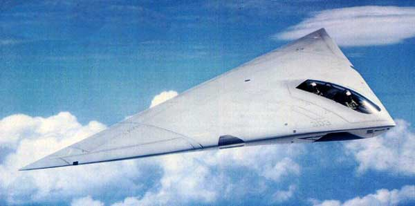
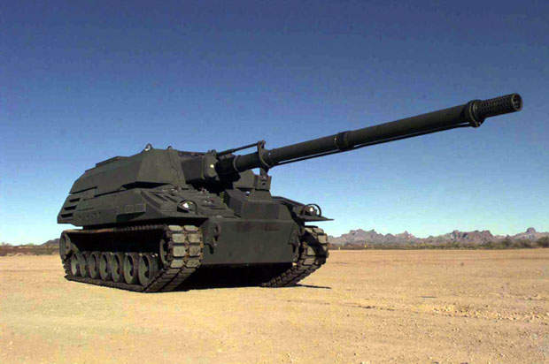
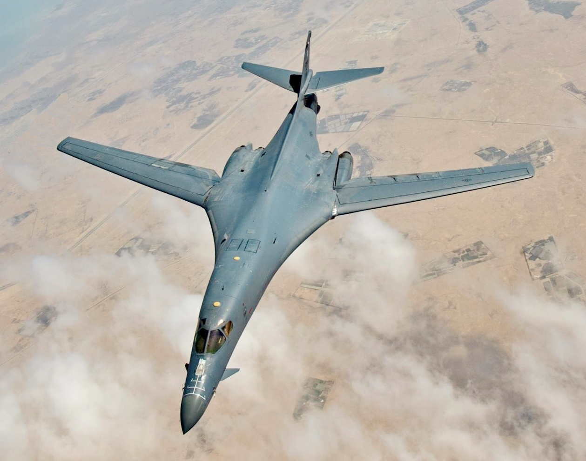
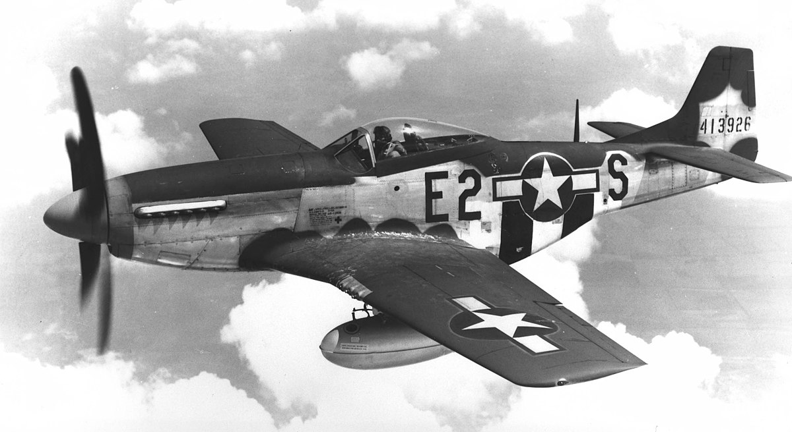
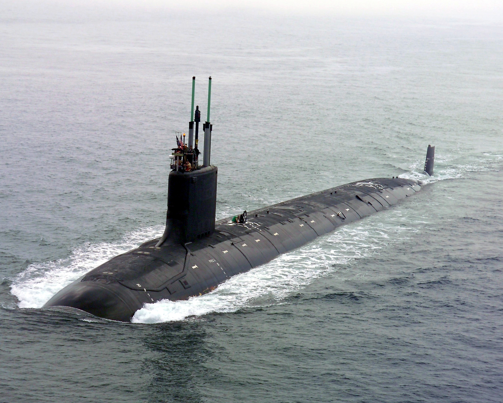
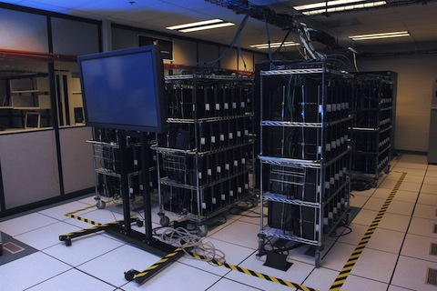
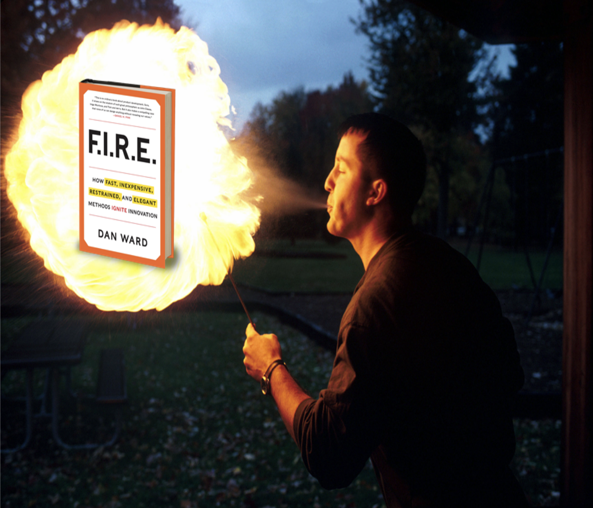

# Learning From Past Successes and Failures

### Learning Objectives
* Recap our past stories that have failed to deliver, and also those that have delivered true capability
* Understand how Speed, Thrift, and Simplicity can propel us forward  

> “Reading is an honor and a gift from a warrior or historian who—a decade or a thousand decades ago—set aside time to write.”
-Gen. James Mattis  

## History
Agile, Lean, and design thinking will play a big part in our journey forward. Before we jump in, let’s take a look at some of the DoD’s history. As Gen. Mattis, a man with a personal library of over 7,000 books and half a century of dedicated service to his country has demonstrated, there is immeasurable value to reading and acquiring knowledge.  

### 1.   Complexity is Costly and Reduces Reliability
Complexity is expensive and can reduce a system’s reliability, because increasing complexity also increases possible failure modes.  

**A-12 Concept:  
Time = 8 years  
Cost = $3B  
Total Produced: 0**

  

### 2. “With a little more time and money we can fix this.”
The amount of time, money and complexity inherent in our acquisitions is starting to reduce our national security.    

**Comanche Concept:  
Time = 20 years  
Cost = $7B  
Total Produced: 0**

  

### 3. Complexity is Cost
Simpler systems are more reliable, and when they go down, they’re also generally easier to fix.  

**Crusader Artillery Concept:  
Time = 7 years  
Cost = $11B  
Total Produced: 0**  

   

### 4.“Simplicity Scales, Complexity Doesn’t”  

Software modelers tell us that the number of possible states in a system grows exponentially with the number of program variables or modules. This is called the _State Explosion Problem_. It basically means that scaling up a complex system introduces a lot of uncertainty and unpredictability.  

**B-1 Concept:  
Time = 20years  
Cost = $265B    
Produced: 104 Aircraft**   

     
_“The world’s most expensive airplane” c. 1987_  

> The B-1 was cancelled, then restarted, then cancelled, then restarted…
WoW... At one point, it was $3.5B over budget – that’s 74% - 1984 Bulletin of Atomic Scientists  

### 5. Don’t focus solely on outcomes that satisfy a Program Manager. What outcomes satisfy the warfighter?   

When we say “satisfied,” it doesn’t mean we squeak by and do the minimum. It means we deliver _world-class_, _unmatched_, _completely dominant_ capabilities… at a lower cost.  

**Bazooka Concept:  
Time = 30 days  
Cost = $19 each**

  

General Eisenhower listed the Bazooka as one of the four weapons that won WWII for the allies. Compared to: 155-mm howitzer which cost $25,000.

### !callout-success
## How is that possible?
* Speed: They set a firm delivery date AND they meant it. They did NOT try to solve problems by adding time or money
* Thrift: They used existing munitions and components. They took pride in doing the MOST with the LEAST
* Simplicity: They simplified the design and the process. They did NOT view complexity as a sign of sophistication
### !end-callout  

<!-- >>>>>>>>>>>>>>>>>>>>>> BEGIN CHALLENGE >>>>>>>>>>>>>>>>>>>>>> -->
<!-- Replace everything in square brackets [] and remove brackets  -->

### !challenge

* type: checkbox
* id: 8a2e0e36-698d-4004-8e78-db9ce4bfd12a
* title: Simplicity and Complexity
<!-- * points: [1] (optional, the number of points for scoring as a checkpoint) -->
<!-- * topics: [python, pandas] (optional the topics for analyzing points) -->

##### !question

The above examples point out reasons we should strive for simplicity. Which of the following are reasons simplicity is usually a better choice than complexity?

##### !end-question

##### !options

* Simple systems have fewer failure modes
* Simple systems are easier to fix, when they do go down
* Simple systems are more intuitive for the warfighter to adopt
* Complex systems do not scale well
* Complex systems look worse for the DoD to use in the eyes of the public

##### !end-options

##### !answer

* Simple systems have fewer failure modes
* Simple systems are easier to fix, when they do go down
* Simple systems are more intuitive for the warfighter to adopt
* Complex systems do not scale well

##### !end-answer
##### !explanation: Complex systems look worse for the DoD to use in the eyes of the public
The public cares that solutions work; they're less interested in the technical details of a solution and are more interested in the overall success or failure.  
##### !end-explanation

##### !explanation-not: Simple systems have fewer failure modes
Remember: the more parts of a system there are, the more places there are for it to break.
##### !end-explanation

##### !explanation-not: Complex systems do not scale well
Remember: If your base solution is complicated on its own, imagine what happens when you double the amount of users on it, or double the number of integrations on it. Something that works with a small audience or a small set of systems might fall down when it needs to handle larger scale.   
##### !end-explanation
<!-- other optional sections -->
<!-- !hint - !end-hint (markdown, hidden, students click to view) -->
<!-- !rubric - !end-rubric (markdown, instructors can see while scoring a checkpoint) -->
<!-- !explanation - !end-explanation (markdown, students can see after answering correctly) -->

### !end-challenge

<!-- ======================= END CHALLENGE ======================= -->

### 6. People only know what they know.  

It’s easy to look at “the way things are” and mistake it for “the way things must be.” Let’s explore the hypothetically possible -- “what’s been done once can be done again”.

**P51 Mustang Concept:  
Time = ~200 days  
Built: ~15,000  
Executed 213,000 combat sorties**  

   

### !callout-success
## How is that possible?
* Ever-changing combat requirements drove us to create a single basic design that could be inexpensively modified depending on need.  That’s a design approach we could use today.

* The designers bragged that the Mustang “does not to any extent embody previously unknown engineering features.” In other words, the components weren’t new – but the capability was.

### !end-callout

### 7. Constraints Foster Creativity
Constraints force us to think differently. We sometimes overestimate the importance of time and money- but while having a lot of time and money to do something might sound nice, it can actually stifle innovation.    

**Virginia Class Sub Concept:  
Time = Delivered Ahead of Schedule  
Cost: $1.75B each**    

    

Compared to:  its predecessor the “Seawolf” cost $4.4B each.  

### !callout-success
## How is that possible?
* It was a strategy that focused on speed, thrift, and simplicity.

* A culture where speed, thrift, and simplicity are embraced & rewarded was established- this is easier than it sounds. Any culture is going to pursue and reward something. But all too often, we treat budgets as a sign of prestige and complexity as a sign of sophistication.
This program didn’t.

* “...designed with cost effectiveness in mind...In order to reduce costs on this program, we have to change the way we build submarines, and that’s what we’re doing with the program.” -RADM Hilarides

### !end-callout

### !callout-warning
## Wait, there's more to the story!
* Imagine replacing a $38,000 periscope controller with a $30 Xbox controller! Savings: $37,970 per sub  
* Why? It’s easier to use, the crew likes it better, and you can find a replacement at any port in the world.
* That’s the kind of decision we can make when we say: “It is good to quickly deliver a simple, inexpensive solution.”
### !end-callout  

### 8. Reward the Right Things  

It is important to incentivize and reward underruns as well.

**MC-12W (Project Liberty) Concept:  
Time = 7 months (Contract to Combat)  
Cost: $17M each (cost is per unit including aircraft and all communications equipment modifications)**  

  

SECDEF Gates said this proves that the best is not always the fanciest.  

### 9. Constraints foster creativity, part 2  
>“Gentlemen, we are out of money. Now we have to think.” -- Winston Churchill  

When the obvious solution is off the table, when we can’t simply maintain the status quo and take the easy way out (like buying a standard-issue supercomputer), we are forced to explore other approaches. Let’s look at one more example:   

You might ask what the fastest supercomputer in the DoD and PlayStations have in common?    

**Condor Cluster Concept:  
Used 1760 PlayStation 3’s  
Cost: $2M** (This is five to 10 percent cost of an equivalent system. It will also consume one-tenth the power of other comparably powered supercomputers).  

  
The  Condor Cluster **outperformed** every other supercomputer in the Pentagon’s inventory.  

### 10. Minimize Team Size, Maximize Team Talent  
>Take a small, intensely focused team and impose an unreasonable time frame on it. - Alan Naumann, CEO & President Calico Commerce, Inc  

The _actionable recommendations_ are to embrace constraints:
* Build small teams with tight budgets and short schedules.
* Emphasize simplicity in our processes and our requirements documents.
* Resist the temptation to spend more time or money, or to add new features.
* Say no to “good ideas.”  

## Conclusion
Acquisitions is a decision-making business, and decisions often involve choosing between something that is:
* more expensive or less expensive
* faster and slower options
* making things a bit simpler or a bit more complicated.   

Sometimes it’s stark and obvious. Other times we have to dig a little to find the option.  

<!-- >>>>>>>>>>>>>>>>>>>>>> BEGIN CHALLENGE >>>>>>>>>>>>>>>>>>>>>> -->
<!-- Replace everything in square brackets [] and remove brackets  -->

### !challenge

* type: paragraph
* id: 559d31b7-76e2-42de-8fc3-bf5897be14cf
* title: Constraints, thrift, innovation
<!-- * points: [1] (optional, the number of points for scoring as a checkpoint) -->
<!-- * topics: [python, pandas] (optional the topics for analyzing points) -->

##### !question

In many of the above _positive_ examples, people were asked to prioritize things like thrift, speed, reuse of existing technology, and repurposing of existing tools **and still create innovative solutions.**   

In your current acquisitions position, do you see those same principles being encouraged? What would it take to bring those principles (even) further into the forefront of our values?

##### !end-question

##### !placeholder

(Note: We’ll be compiling and discussing your responses during the in-person session. Eventually, we’ll use your responses to tune this course more finely to your experience.)

##### !end-placeholder

<!-- other optional sections -->
<!-- !hint - !end-hint (markdown, hidden, students click to view) -->
<!-- !rubric - !end-rubric (markdown, instructors can see while scoring a checkpoint) -->
<!-- !explanation - !end-explanation (markdown, students can see after answering correctly) -->

### !end-challenge

<!-- ======================= END CHALLENGE ======================= -->

***

These stories were brought to you by the author of F.I.R.E. - Mr. Dan Ward from MITRE. Dan shares with us that: One of the key elements of each one of those stories is the **values** that drove the development teams.

### !callout-success
## Values
* **Values** =  desirable attributes the project leaders pursued, the signs of sophistication and goodness they looked for.

* In every case, the people involved expressed the values that it is important and good to be fast, inexpensive, simple and tiny – not just from a political or financial perspective, but from an engineering point of view. In the projects I just mentioned, speed, thrift and simplicity were all desirable technical attributes…  
### !end-callout

There are more stories and more action recommendations in this book. We invite you to read it.    

